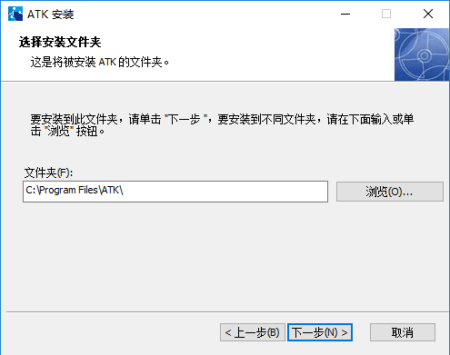
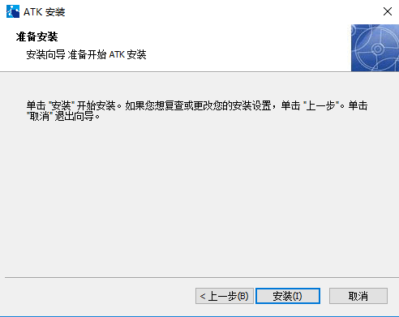
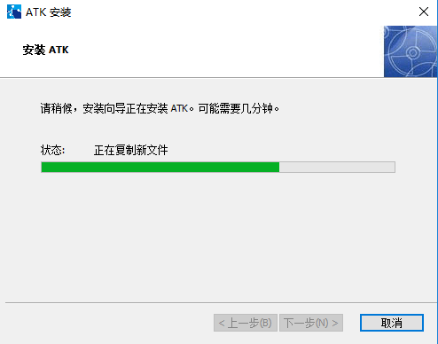
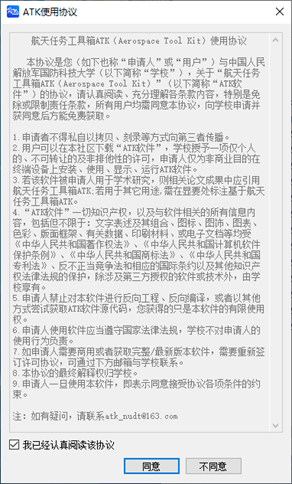
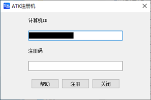

# 安装向导
本文档详细介绍ATK软件的安装流程、注册步骤、兼容性设置及绿色版相关说明，助力快速完成软件的部署与使用。

## 安装ATK
> [!WARNING]
> 若您使用的是ATK绿色版，可直接跳过本步骤。
>
> 以下为ATK的安装操作说明，若本文档未解决您的安装问题，可联系**国防科大空天学院技术支持**。

ATK安装全程由安装程序引导，按以下步骤操作即可完成部署：

1. 双击启动ATK安装程序，进入【ATK安装向导】起始页

2. 进入安装位置选择环节，可直接使用默认的「Program Files」路径，也可点击<kbd>浏览</kbd>自定义其他安装位置

3. 确认安装路径等信息无误后，点击<kbd>开始安装</kbd>，启动文件解压与部署流程

4. 等待安装程序自动完成文件解压、组件部署等操作，此过程请不要关闭安装窗口

5. 安装进度完成后，点击界面中的<kbd>完成</kbd>按钮，结束整个ATK安装流程

## 注册ATK
ATK为**免费使用模式**，但**初次使用必须完成注册操作**，未注册将无法正常使用软件功能，具体注册步骤如下：

1. 双击打开ATK.exe，系统将自动弹出【ATK使用协议】对话框，仔细阅读协议并点击<kbd>同意</kbd>后，进入ATK注册机界面；

   

2. 注册机界面首行将**自动生成计算机ID**，点击界面中的<kbd>帮助</kbd>按钮，在弹出的表单中填写【ATK序列号申请表】；

   

3. 携带填写完成的申请表，联系**国防科技大学空天科学学院**，由开发者为您的计算机ID生成专属序列号；

4. 将获取的序列号准确填入注册机界面的对应输入框，点击<kbd>注册</kbd>，完成软件注册后即可正常使用ATK所有功能。

> [!TIP]
> 温馨提示：当前ATK最新版本新增**软件注册二维码**，可直接扫描二维码完成注册，操作更便捷。

## 兼容性设置
ATK软件默认适配**27寸显示器、1920*1080像素分辨率**，若您的计算机分辨率与默认配置接近，可实现完美适配；若计算机配置高于默认配置（该情况常见于笔记本电脑），易出现界面显示异常，需按以下步骤进行兼容性调整：

1. 在电脑桌面找到ATK软件快捷图标，右键单击图标，在弹出的右键菜单中选择<kbd>属性</kbd>；
2. 在弹出的【属性】对话框中，切换至「兼容性」选项卡；
3. 在「兼容性」设置界面向下滑动，找到并点击<kbd>更改高DPI设置</kbd>选项；
4. 在弹出的【高DPI设置】对话框中，勾选「替代高DPI缩放行为」，在下方的「缩放执行」下拉框中进行操作；
5. 将下拉框中原默认的「应用程序」选项，修改为「系统」或「系统增强」，点击<kbd>确定</kbd>保存所有设置即可。

## 绿色版说明
ATK绿色版为免安装版本，无需执行上述安装、注册步骤，解压后即可直接使用，具体说明如下：
1. 下载ATK绿色版压缩包后，解压至电脑任意文件夹，解压完成后可看到各类**ATKInput文件**及ATK启动图标；
2. 绿色版与安装版的核心区别：
   - 绿色版：无安装包，解压即用，无文件部署过程；
   - 安装版：为`.exe`格式安装包，文件名称明确标注「ATKInstall」，需按步骤完成安装。

> [!NOTE]
> 绿色版与安装版功能完全一致，可根据自身使用需求选择对应版本。