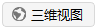
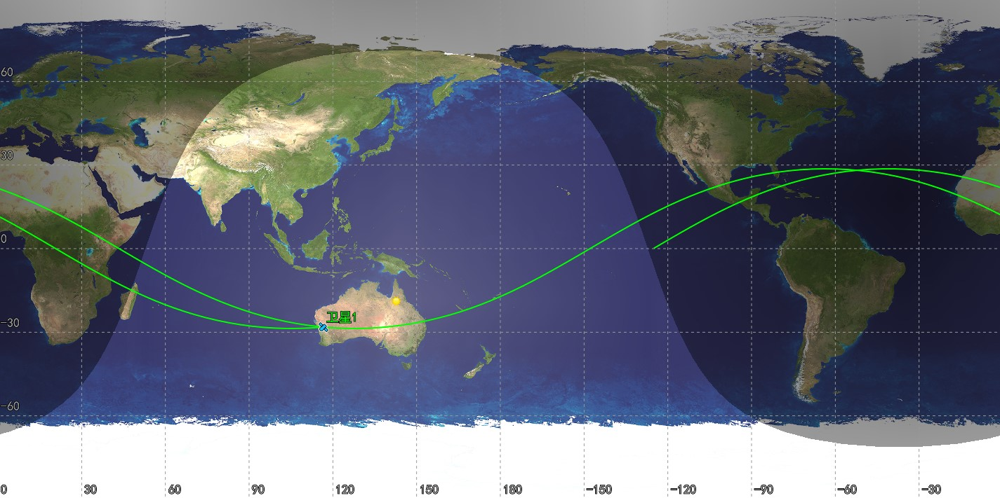
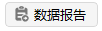

# 入门案例

本案例介绍如何创建任务场景和对象、生成报告并加以保存。

## 创建任务场景

1. 运行 ATK.exe，点击【**新建一个想定文件**】；

2. 在“新建想定向导”中设置场景“名称”为“SimpleExample”；

3. 设置场景时段（可自由选择时间段，不必与教程相同）

| 开始历元(UTCG)          | 结束历元(UTCG)          |
| ----------------------- | ----------------------- |
| 2026-03-06 00:00:00.000 | 2026-03-06 00:00:00.000 |

4. 点击【**确定**】完成场景建立。

## 创建卫星对象

1. 点击工具栏【开始】中的【】，创建对象；

2. 选择“想定对象”—“卫星”，“选择插入方式”—“插入默认类型”；

3. 点击【插入...】，插入一颗卫星；

4. 点击【关闭】，关闭插入对象弹窗。

## 修改卫星对象属性

1. 选中“卫星1”，右键单击选择【属性】或左键双击直接打开“属性设置页面”；

2. “坐标系统”选择“ICRF”或者“J2000”，“坐标类型”选择“轨道根数”，修改轨道根数为：

| 轨道根数        | 数值        |
| --------------- | ----------- |
| 半长轴(m)       | 6878137.000 |
| 偏心率          | 0.0         |
| 轨道倾角(deg)   | 45.0        |
| 升交点赤经(deg) | 0           |
| 近拱点角距(deg) | 0           |
| 真近点角(deg)   | 0           |

3. 点击【应用】，保存修改结果；

4. 点击【轨道生成向导】，选择“轨道类型”为“圆轨道”；

5. 选中“卫星1”，点击其右侧颜色按钮可快捷修改标签颜色。

## 查看二维场景和三维场景

1. 打开二维与三维视图窗口：

  点击【视图】，选择【】可显示二维视图；

  点击【视图】，选择【】可显示三维视图；

2. 点击【开始】，在二维和三维视图中随时间历元显示轨道；

3. 拖动“时间视图”黄色滑块，查看特定时间的轨道场景。

## 查看输出报告

1. 点击【输出】，选择【】，左上方“对象类型”选择“卫星”，右上方“报告类型”下拉列表选择“数据报告”，在下方“预定义”参数中选择“经纬高”，点击【生成】生成报告；

2. 点击【输出】，选择【】，左上方“对象类型”选择“卫星”，右上方“报告类型”下拉列表选择“曲线图表”，在下方“预定义”参数中选择“升交点赤经”，点击【生成】生成报告；

3. 在“数据报告”或“曲线图表”的“变量选择页面”，可点击“样式”—【新建】，根据需要自定义报告内容或图表类型；

4. 点击【另存为】，保存输出报告；

5. 点击【关闭】。

## 保存场景

点击【开始】—【保存】，保存已有场景；如需要再次加载当前场景可点击【打开】，打开已保存的场景。
