# 区域覆盖案例

## 案例想定

本案例模拟卫星群组对某指定区域的覆盖分析。覆盖区域范围：纬度-20°~20°，经度 150°~180°。卫星选择星链卫星进行分析。

## 创建任务场景与对象

1. 新建想定

运行 ATK.exe，点击【新建一个想定文件】新建一个想定 “AreaCoverage” 。

2. 设置仿真时间

   - 在“ATK：新建想定向导”弹窗中设置时间段

   | 开始历元                | 结束历元                 |
   | ----------------------- | ----------------------- |
   | 2025-04-08 00:00:00.000 | 2025-04-09 00:00:00.000 |

   - 点击【确定】完成场景建立

3. 创建及编辑覆盖对象

   - 点击工具栏【开始】中的【插入】创建覆盖定义对象。
   - 选择“想定对象”——“覆盖定义”，“选择插入方式”——“插入默认类型”，点击【插入…】，点击【关闭】。
   - 右键点击对象浏览器中“覆盖定义1-属性”，出现覆盖定义的属性设置页面。
   - 选择“基本-网格”，“网格区域配置参数”中的“最小纬度(deg)”设置为-20、“最小经度(deg)”设置为150、“最大纬度(deg)”设置为20，“网格定义”中的“经纬度(deg)”设置为5，参数设置如图所示。点击【确定】关闭属性窗口，区域定义在场景中展示如图所示。
   - “属性”的“可视化-显示”中的“点大小”设置为35。

   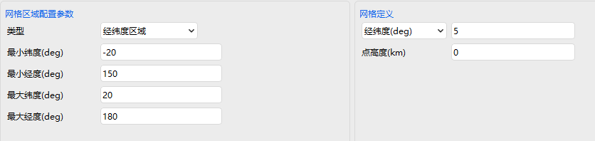

   

   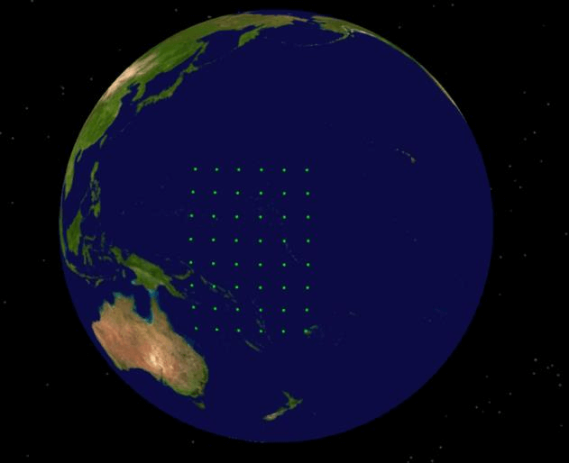

4.	创建及编辑品质因子对象
   - 点击工具栏【开始】中的【插入】创建品质因子对象。
   - 选择“附加对象”——“品质因子” ，“选择插入方式”——“插入默认类型”，点击【插入…】，出现窗口，“选择对象”选择“覆盖定义1”，点击【确定…】。
   - 右键点击对象浏览器中“品质因子1-属性”，出现品质因子的属性设置页面。
   - 品质因子基本定义中，选择品质因子“类型”为“覆盖时间”，“计算”为“每日最大“，有效条件勾选”启动“。

5. 创建卫星对象

   - 点击工具栏【开始】中的【插入 】创建卫星对象。

   - 选择“想定对象”——“卫星” ，选择插入方式”——“插入默认类型”，点击【插入…】。

   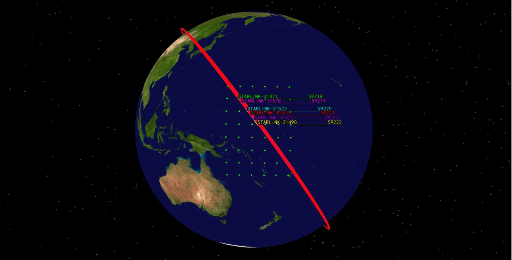

## 区域覆盖分析及结果查看

1. 区域覆盖分析

   - 点击“工具-区域覆盖分析”出现区域覆盖分析功能窗口。
   - 点击【选择对象】，在“选择对象”窗口中选择“覆盖定义1”，点击确定。
   - 计算时间选择默认的场景仿真时间。
   - 选择所有“卫星1“，点击【计算…】，如图所示。

   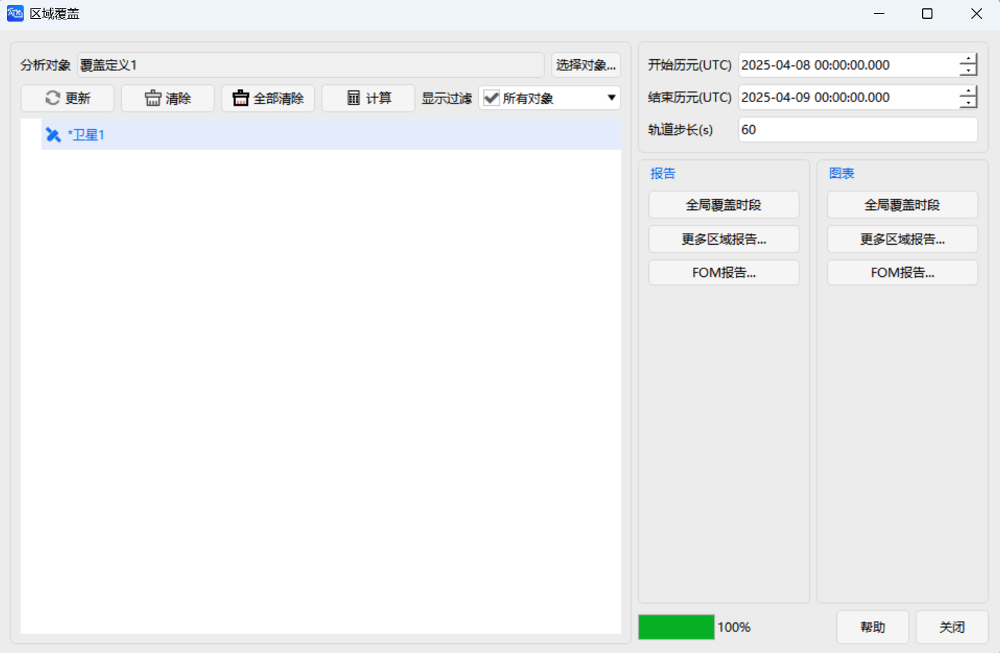
   

2. 区域覆盖报告结果查看

   计算结束后，在右侧“报告”/“图表”区域可查看区域覆盖分析结果，如图所示。
   
   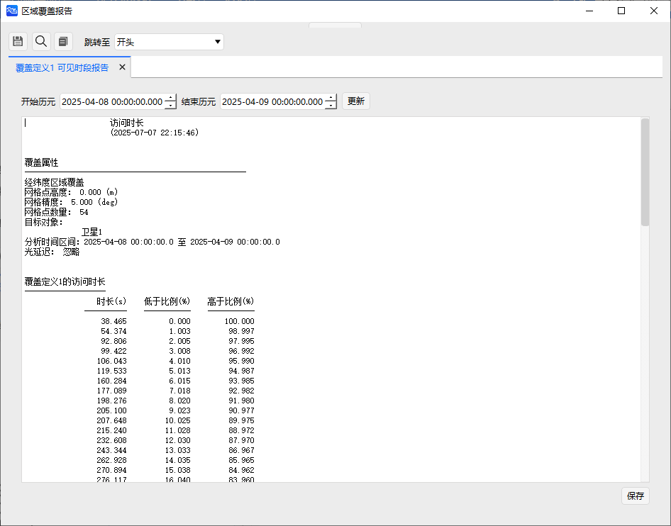

   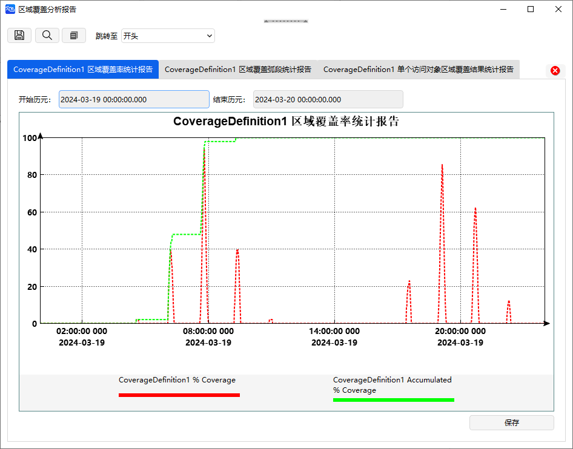

   更多区域覆盖“报告”和“图表”，如图所示。

   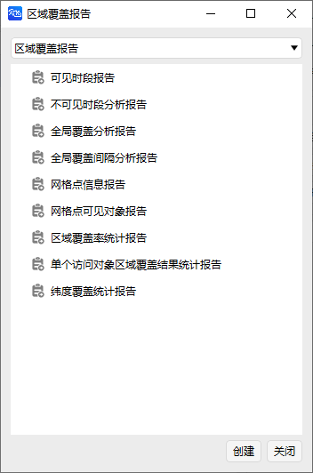

   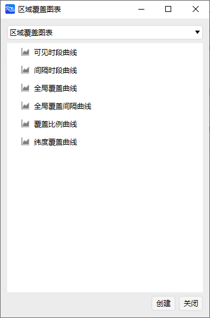

3. 覆盖品质报告结果查看

   “报告”-“FOM报告”下可选择品质因子，进而生成相关的报告和曲线。

   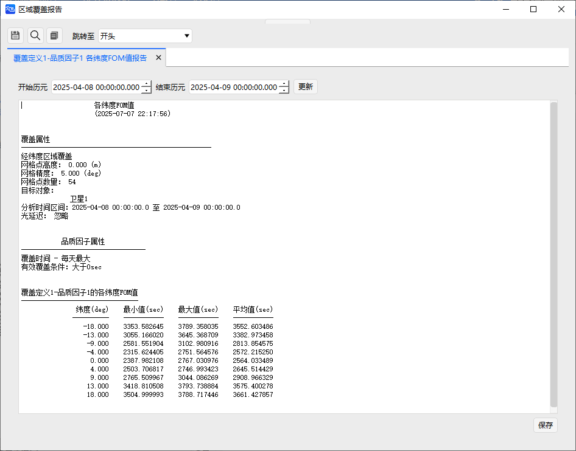

   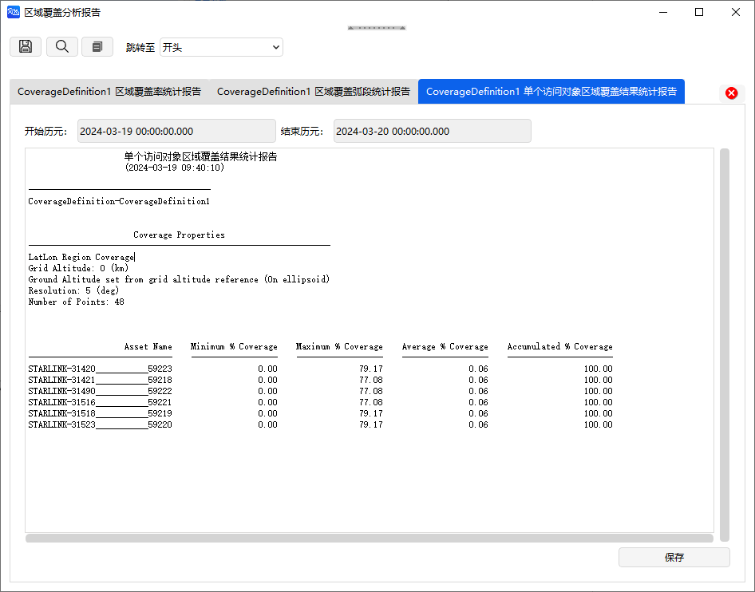

   更多覆盖品质“报告”和“图表”，如图所示。

   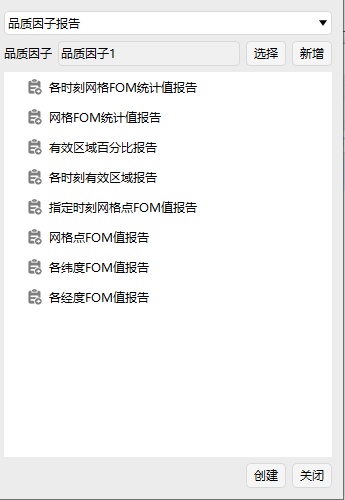

   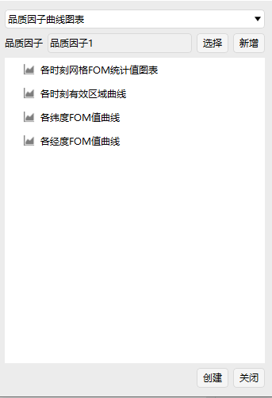

4. 网格检查工具

   点击“网格检查工具”，并在二维场景中选择覆盖定义1中的网格点，可以得到网格点的相关参数，如图所示；

   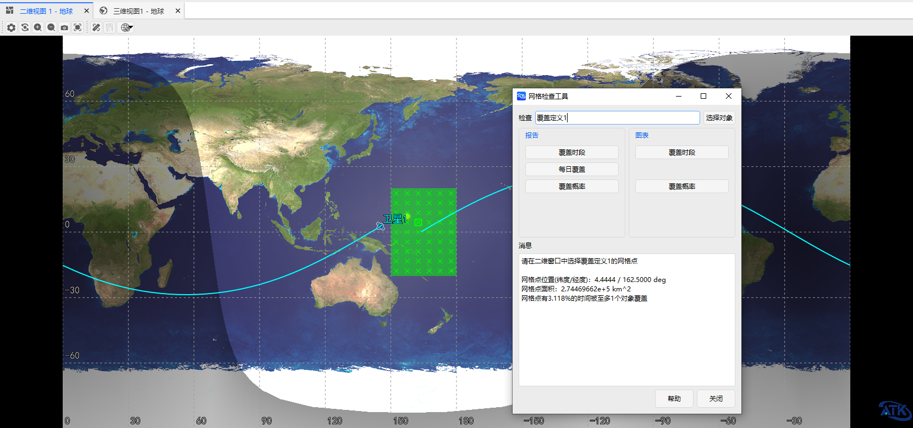
   
   点击“网格检查工具”中的“报告”和“图表”，可展示相关报告和曲线，如图所示。
   
   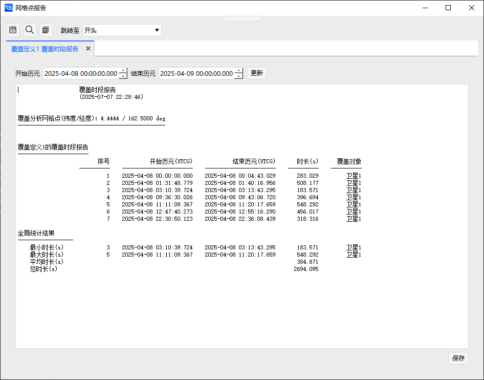

   

5. 品质因子的二维静态图像展示

   在“品质因子”-“属性”-“二维视图”-“静态”下可设置显示品质因子的静态图像，支持自定义分级区域，如图所示。

  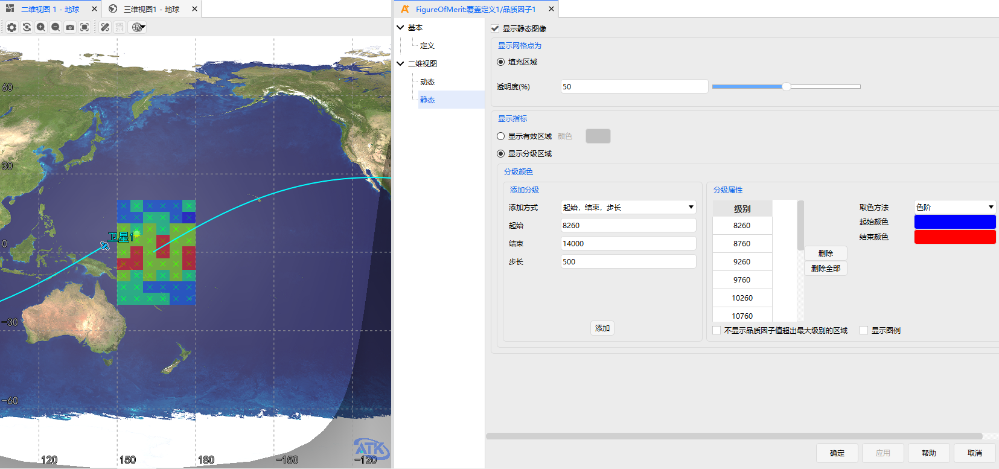