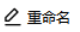
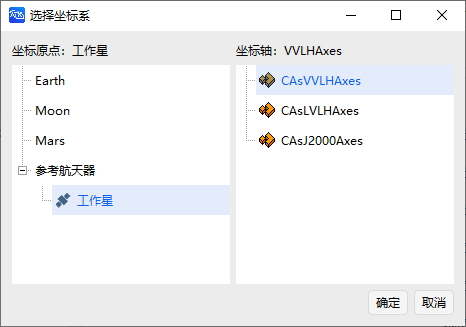
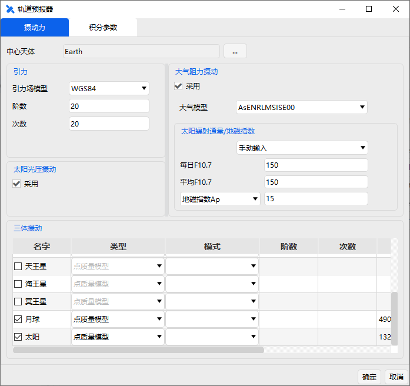
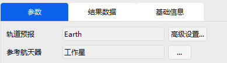
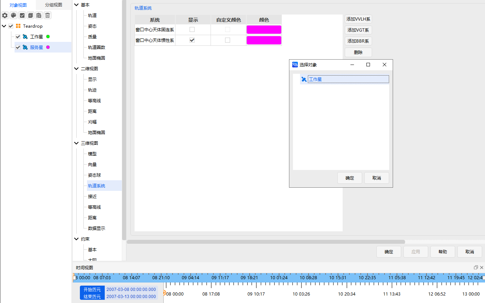

# RPO案例

## 案例想定

为了更好地为卫星提供服务（维修、加注燃料等），接触前的环绕观测必不可少。

本案例将模拟一次为地球同步轨道卫星在轨服务前的环绕观测任务，水滴绕飞模式。

## 任务控制序列说明

为了模拟该水滴绕飞任务过程，构建以下任务序列：

   - 一个初始状态段：包含工作卫星的一个初始状态段。
   
   - 一个水滴绕飞段：用于执行对目标的水滴绕飞任务。

## 创建任务场景与对象

1. 新建想定

运行 ATK.exe，点击【新建一个想定文件】新建一个想定 “Teardrop”。

2. 设置仿真时间

   - 在“ATK：新建想定向导”弹窗中设置时间段。

   | 开始历元                | 结束历元                |
   | ----------------------- | ----------------------- |
   | 2007-03-08 00:00:00.000 | 2007-03-13 00:00:00.000 |

   - 点击【确定】完成场景建立

3. 创建及编辑卫星对象

   - 点击工具栏【开始】中的【插入】创建卫星对象
   - 选择“想定对象”——“卫星” ，“选择插入方式”——“插入默认类型”，点击【插入…】，点击【关闭】。
   - 在左侧“对象”页面上，右键单击卫星“卫星1”和“卫星2”，选择【重命名】，将其命名为“工作星”和“服务星”。

## 设置工作星轨道参数

1. 预报模型设置

右键单击卫星“工作星”，选择【属性】，出现卫星参数设置界面，选择“轨道预报器”——“HPOP”。

2. 轨道历元设置

设置“轨道历元(UTCG_MM)”——“2007-03-08 00:00:00.000”。

3. 坐标相关设置

选择“坐标系”——“J2000”，“坐标类型”——“轨道根数”，设置轨道根数。

|                 |       |
| --------------- | ----- |
| 半长轴(km)      | 42164 |
| 偏心率          | 0     |
| 轨道倾角(deg)   | 0     |
| 升交点赤经(deg) | 0     |
| 近拱点角距(deg) | 0     |
| 真近点角(deg)   | 0     |

## 设置服务星初始状态和水滴绕飞段

1. 定义初始状态段

- 参照轨道机动规划中的[霍曼转移](../3.案例教程/3.4轨道机动规划工具案例/3.4.1霍曼转移.md)的初始段设置的方式定义服务星的初始状态。

- 或者采用相对于“工作星”的相对坐标系的方式定义初始状态段。

  这里使用相对坐标系定义服务星初始状态。InitialState初始段的坐标系选择工作星的VVLH坐标系，如图所示。

   

2. 水滴绕飞段的轨道预报器设置

   - 选择“新增”—“插入 RPO 段”— “伴飞”—“水滴绕飞段”。
   - 点击“轨道预报”——【高级设置…】。
   - 选择“中心天体”--“Earth”，“引力”中选择“模型”--“WGS84”，“三体引力”中选择“太阳、月球”--“点质量模型”，勾选“大气阻力摄动”--“采用”、“太阳光压”--“采用”，大气模型选取“NRLMSISE00”；其余不勾选。
   - 点击【确定】
   - 左侧【参考卫星】添加“工作星”；RPO参数下的参考航天器选择“工作星”。

   

   

3. 水滴受控绕飞的参数设置

在右侧设置“参考航天器”为“工作星”，并设置相关参数

| 参数名称           | 数值       |
| ------------------ | ---------- |
| 圈数               | 5          |
| 起始点距离          | -300m     |
| 机动点距离          | -800m    |
| 等待时间            | 21600      |
| 真近点角变化量最大值 | 5         |
| 求解算法            | 序列二次规划 |

## 运行任务控制序列

由于 RPO 段是预先构建好的，具有便于操作的特性，整个水滴饶飞任务控制序列构建仅由两部分构成，设置完毕后左侧的段节点操作区呈现为如图所示。

1. 运行结果显示

   - 点击【运行】按钮，任务控制序列开始计算。弹窗可以查看运行状态和计算时间。
     
     

   - 点击 “RPOTearDrop”右侧页面的“结果数据”，可查看任务控制序列中每一次脉冲施加的时刻与脉冲量大小。

2. 三维视图显示

   点击【视图】下的【三维视图】按钮，选择左上角的“局部视点”，然后依次选择“卫星”，“工作星”，即可将视角规定在“工作星”上。

   添加伴飞轨迹显示：点击服务星【属性】-【轨道系统】-【添加VVLH系】

   

   

   图中白色水滴形轨迹是“服务星”相对于“工作星”的水滴绕飞轨迹。

