# 偏差分析案例

## 案例想定

本案例使用偏差分析功能，考虑空间目标的初始状态偏差与机动误差，通过蒙特卡洛与多项式混沌方法，求解终端时刻的状态偏差分布特征以及灵敏度指标等结果。

## 创建任务场景与对象

1. 新建想定

运行 ATK.exe，点击【新建一个想定文件】新建一个场景。

2. 设置仿真时间

- 在“ATK：新建想定向导”弹窗中设置时间段。
  
| 开始历元(UTCG)          | 结束历元(UTCG)          |
| ----------------------- | ----------------------- |
| 2025-11-09 00:00:00.000 | 2025-11-10 00:00:00.000 |

- 选择中心天体为“地球”，确认场景“名称”与“目录”后，点击【确定】完成场景建立。

## 插入对象并进行偏差分析属性设置

插入一颗卫星，偏差分析模块位于卫星的“轨道预报器”属性中，如图所示。

1. 插入偏差分析段

值得注意的是，所有的偏差演化结果分析，都是基于偏差分析段完成的，因此,对于需要进行偏差分析的轨道序列段，先插入偏差分析段，再基于偏差分析段插入对应的轨道序列段。新增“偏差分析段”，如图所示。

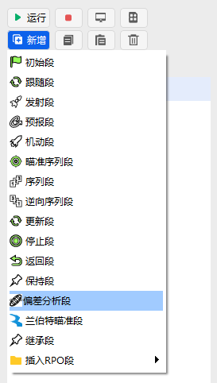

2. 定义初始状态

插入初始段，确定轨道初始状态，包括轨道历元、轨道坐标系以及轨道参数，并勾选输入偏差，如图所示。

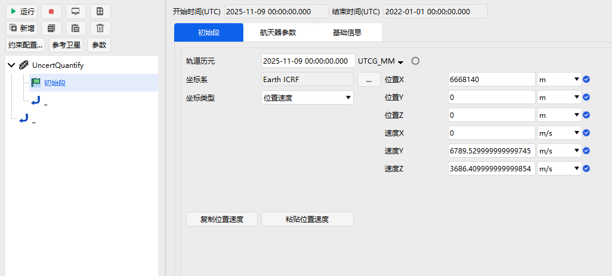

3. 设置预报段

插入预报段，设置停止条件，选择 CAsStopDuration，在触发值栏设置预报时间，如图所示。

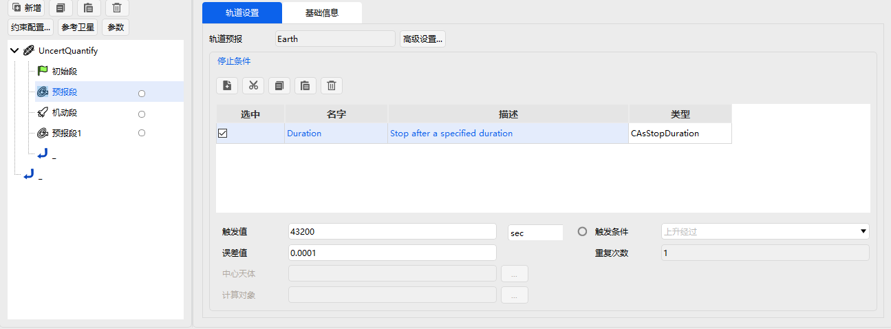

4. 设置机动量

插入机动段，选择机动类型与推力坐标系，设置速度增量参数并勾选所需分析的机动偏差，如图所示。

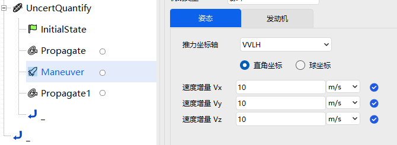

5. 设置机动后预报段

设置机动后的预报段，操作过程与参数值同步骤“3. 设置预报段”一致。在插入该预报段后，右键选择该预报段，选择“重命名”，将该预报段命名为“机动后预报段”，如图所示

6. 输出参数设置

选择“机动后预报段”，单击“约束配置…”，打开可选约束界面。打开“笛卡尔坐标”下拉栏，双击选择位置X、Y、Z与速度X、Y、Z，如图所示。

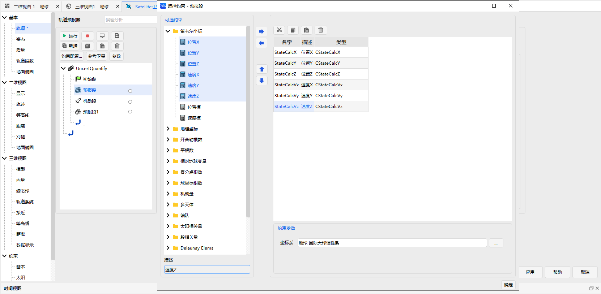

值得注意的是，选择右侧已选约束参数，在页面下方的“约束参数”栏，可以定义该输出参数的坐标系。

7. 偏差序列段界面设置

打开偏差序列段，界面如图所示。

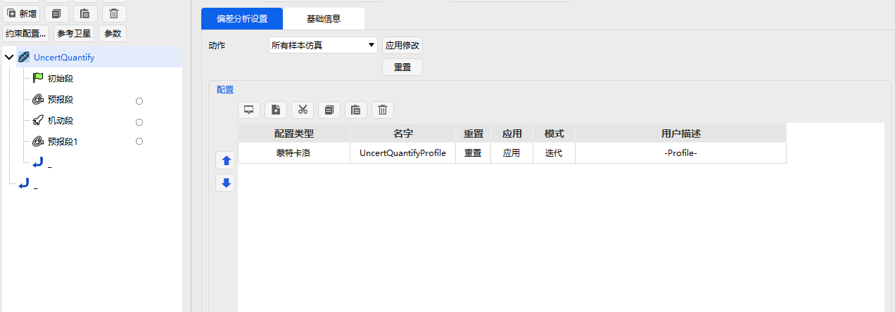

通过新增选项选择偏差演化方法并双击插入，如图所示。

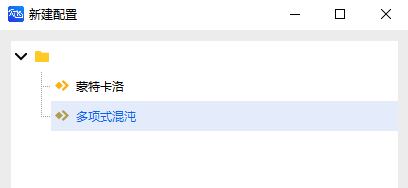

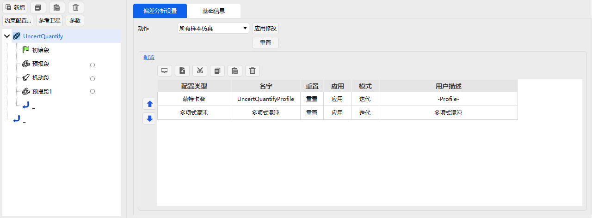

插入的偏差演化方法的启动状态默认开启，通过单击【模式】，选择迭代或不激活，确定该模块是否开启，如图所示。

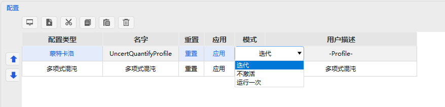

8. 偏差序列段输入输出设置

选中配置类型并打开，设置输入偏差与输出偏差，界面如图所示。

选择输入偏差的分布类型，如图所示。

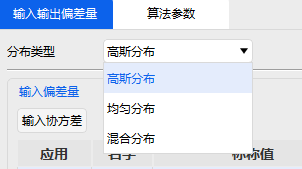

定义输入偏差量。在输入偏差量的应用栏下勾选输入参数，并设置对应的均值与方差，位置偏差均值为0m，标准差1m；速度偏差均值为0m/s，标准差为1m/s；机动速度偏差均值为0m/s，标准差为1m/s如图所示。

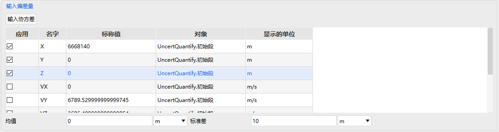

也可通过【初始协方差矩阵】按钮查看初始协方差矩阵。在输出偏差量下勾选输出参数，如图所示。

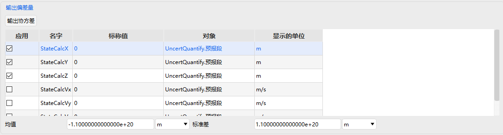

## 查看轨道偏差分析结果

1. 样本与统计参数

点击确定，关闭偏差参数设置窗口，回到偏差分析段页面，点击左上角运行按钮，计算完毕后在运行结果显示页面下分别选择“UncerQuanity”-“蒙特卡洛”与“UncerQuanity”-“多项式混沌”，可直接查看“样本”与“参数”结果。

2. 概率密度

在运行结果显示页面下，打开“UncerQuanity”-“多项式混沌”，设置样本量为1,000,000并【计算】。计算完毕后在“概率密度分布”页面的“X轴”栏中选择第一栏输出参数并点击【显示】，获得第一栏输出的概率密度分布，如图所示。

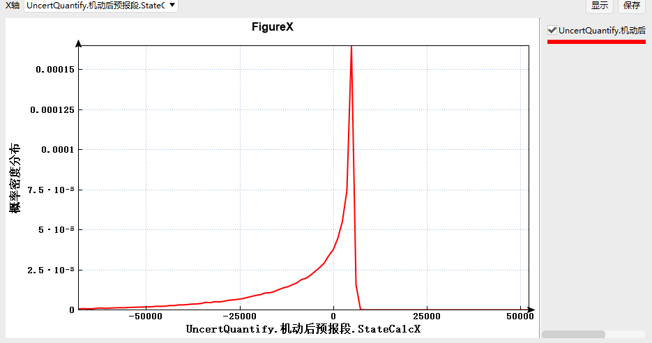

在运行结果显示页面下，打开“UncerQuanity”-“蒙特卡洛”，直接选择“概率密度分布”，在X轴栏下选择第一栏输出参数并点击显示，同样可以获得蒙特卡洛的概率密度分布。

3. 偏差分布

4. 灵敏度分析

打开“灵敏度分析”，通过【显示】获得总效应指数，如图所示。

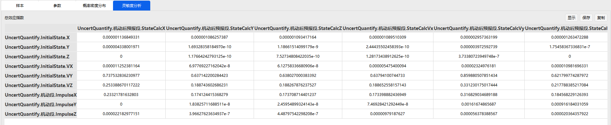