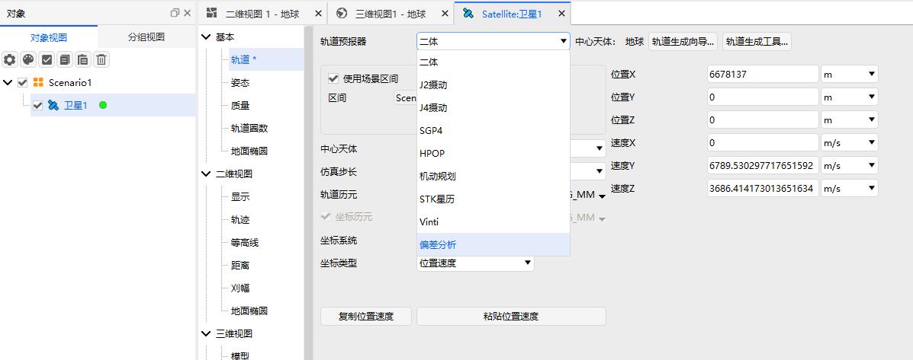
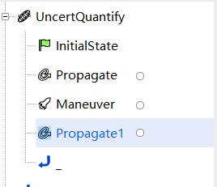
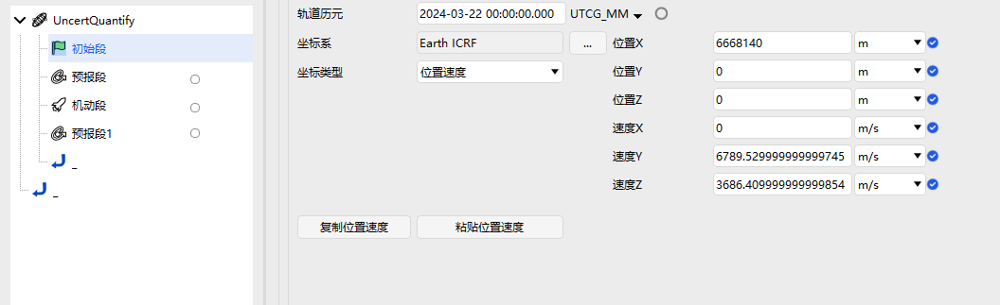
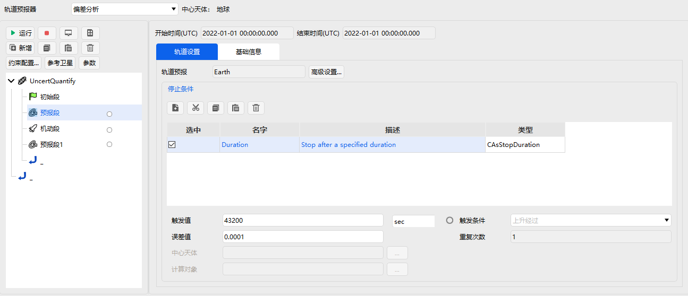
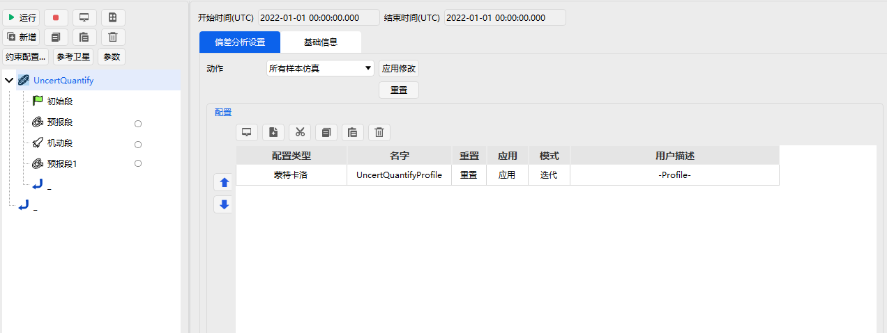
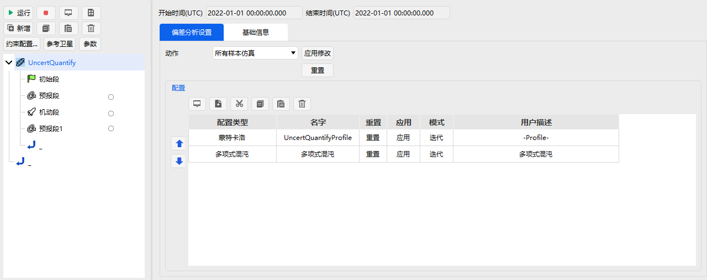
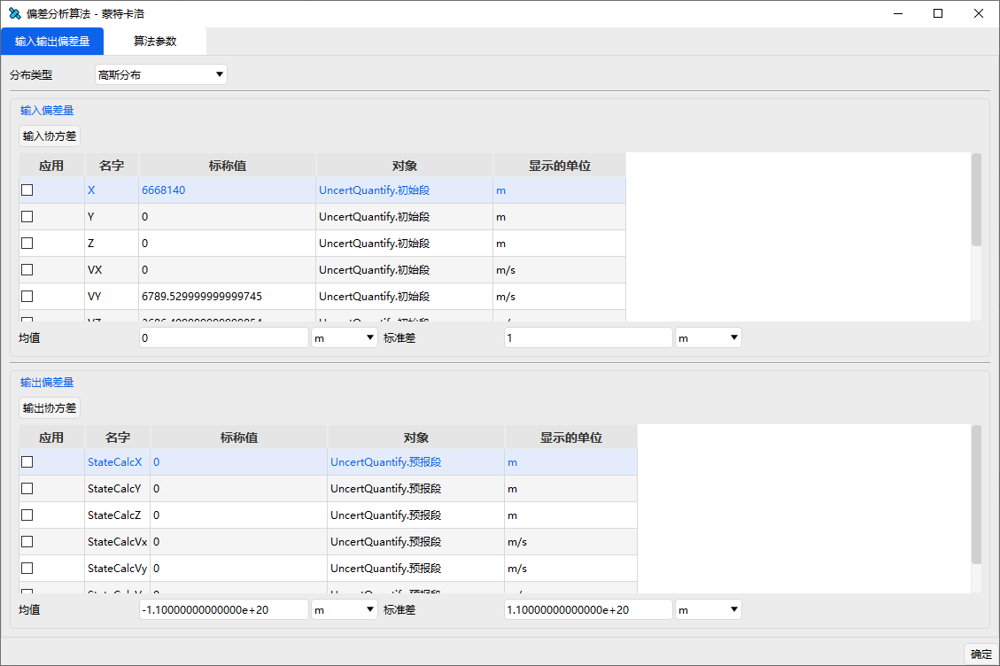
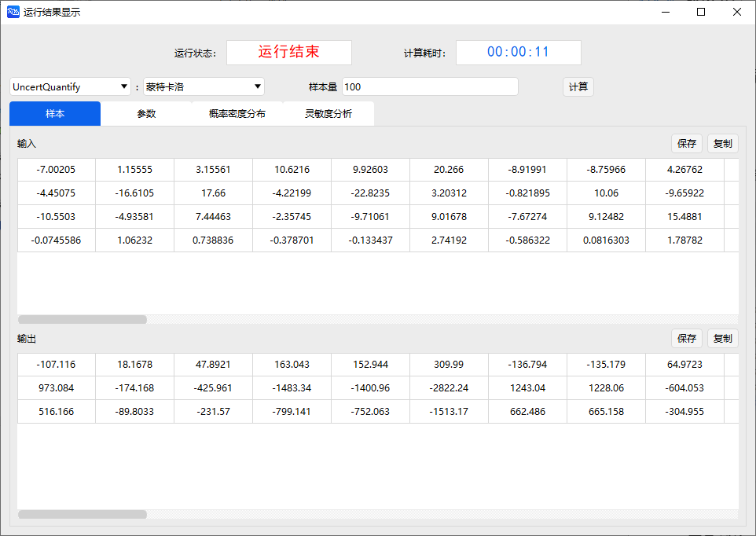
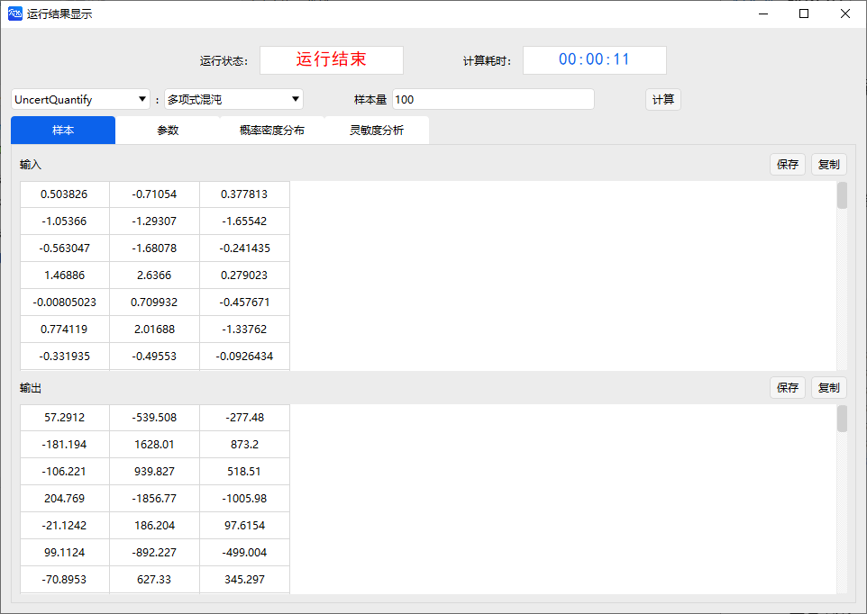
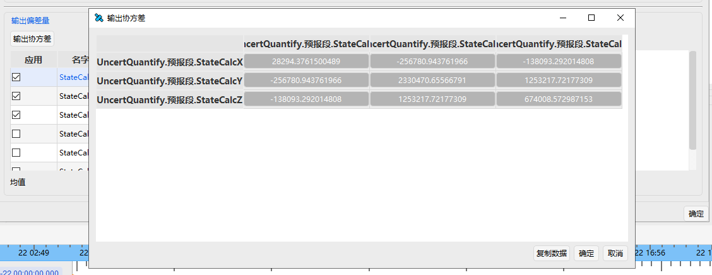

# 偏差分析案例

## 案例想定

本案例使用偏差分析功能，使用四种偏差演化方法，通过定义输入输出参数的坐标系、输入参数的偏差分布以及飞行轨道，通过偏差估计段分析出终端时刻的统计参数，即协方差与均值。

## 创建任务场景与对象

1. 新建想定

运行 ATK.exe，点击【新建一个想定文件】新建一个想定。

2. 设置仿真时间

- 在“ATK：新建想定向导”弹窗中设置时间段。
  
| 开始历元(UTCG)          | 结束历元(UTCG)          |
| ----------------------- | ----------------------- |
| 2024-03-22 00:00:00.000 | 2024-03-23 00:00:00.000 |

- 点击【确定】完成场景建立

## 插入对象并进行偏差分析属性设置

插入一颗卫星，偏差分析模块位于卫星的“轨道预报器”属性中，如图所示。

1. 插入偏差分析段

值得注意的是，所有的偏差演化结果分析，都是基于偏差分析段完成的，因此,对于需要进行偏差分析的轨道序列段，先插入偏差分析段，在基于偏差分析段插入对应的轨道序列段，如图所示。

2. 定义初始状态

插入初始段，确定轨道初始状态，包括轨道历元、轨道坐标系以及轨道参数，并勾选输入偏差。

3. 设置预报时间

插入预报段，设置停止条件，选择 CAsStopDuration，在触发值栏设置预报时间。

4. 设置机动量

插入机动段，选择机动类型与推力坐标系，设置速度增量参数并勾选所需分析的机动偏差，如图所示。

5. 输出参数设置

选择所需分析时刻对应的预报器，设置约束配置，如图所示。

输出参数设置页面

6. 偏差序列段界面设置

打开偏差序列段，界面如图所示

通过新增选项选择偏差演化方法并双击插入，如图所示

插入的偏差演化方法的启动状态默认开启，通过单击【模式】，选择迭代或不激活，确定该模块是否开启，如图所示。

7. 偏差序列段输入输出设置

选中配置类型并打开，设置输入偏差与输出偏差，界面如图所示。

选择输入偏差的分布类型，如图所示

定义输入偏差量。在输入偏差量的应用栏下勾选输入参数，并设置对应的均值与方差，如图所示。

也可通过【初始协方差矩阵】按钮查看初始协方差矩阵。在输出偏差量下勾选输出参数，如图所示。

## 查看轨道偏差分析结果

1. 计算结果

点击确定，关闭偏差参数设置窗口，回到偏差分析段页面，点击左上角运行按钮，分析终端时刻的轨道偏差演化结果，如图所示

2. 查看结果

关闭运算页面，打开偏差分析时使用的配置类型，点击输出偏差量的终端协方差矩阵，查看偏差演化结果，如图所示。

