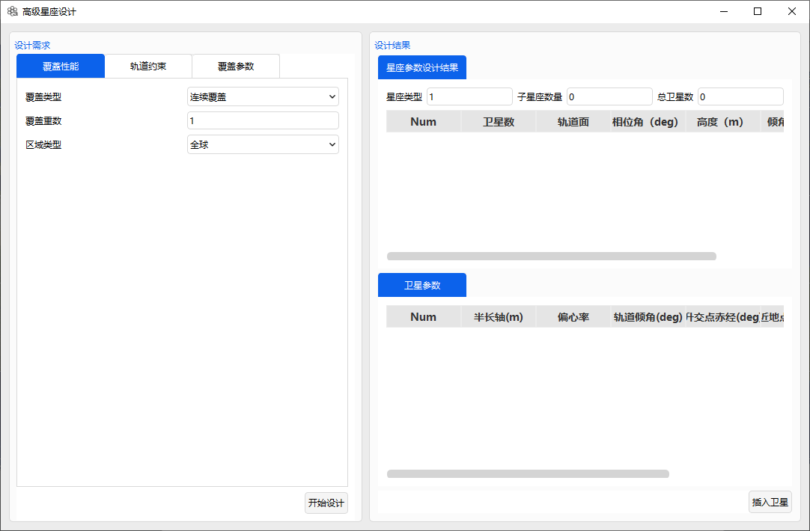
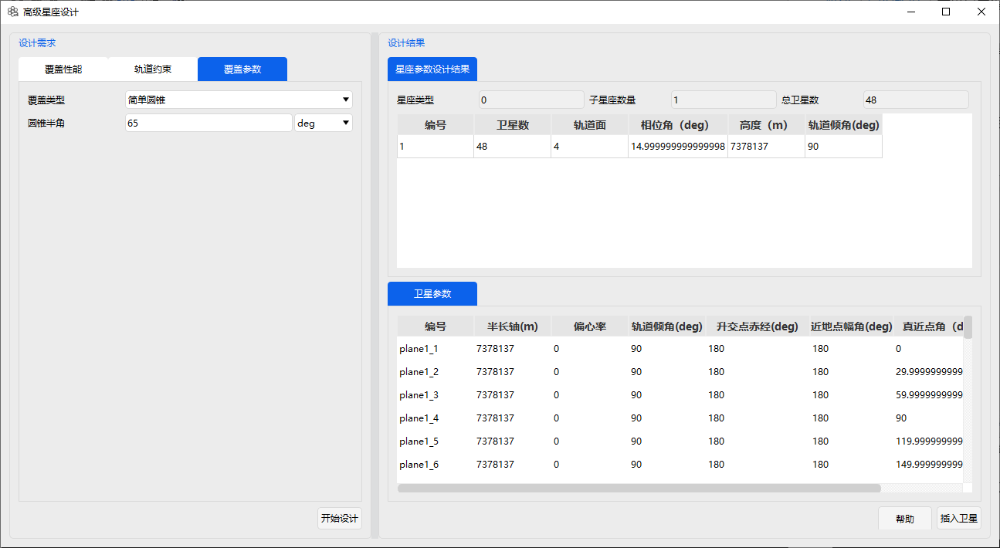
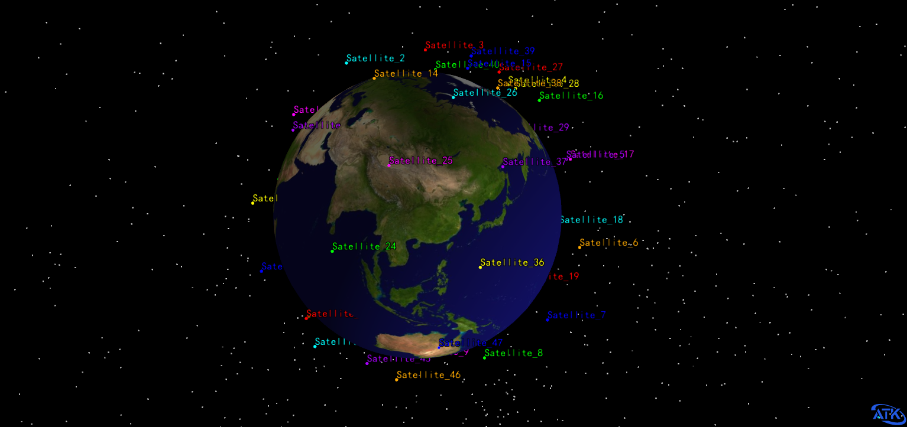

# 高级星座设计案例

## 案例想定

本案例设计一个对指定区域覆盖的有轨道参数和视角约束的星座。星座覆盖区域设置为全球。覆盖类型为简单覆盖，星上载荷半张角设置为 65 度。Walker 星座轨道高度为 0~2000km，升交点赤经和近地点辐角变化范围为 0~360 度。

## 创建任务场景

1. 新建想定

运行 ATK.exe，点击【新建一个想定文件】新建一个想定“AdvancedConstellation”。

2. 设置仿真时间

- 在“ATK：新建想定向导”弹窗中设置时间段。

| 开始历元(UTCG)      | 结束历元(UTCG)      |
| ------------------- | ------------------- |
| 2024-03-19 00:00:00 | 2024-03-20 00:00:00 |

- 点击【确定】完成场景建立

## 星座设计

点击“工具-高级星座设计”，出现如图所示星座设计功能窗口，星座设计约束有三种：覆盖性能、轨道约束、覆盖参数。

1. 覆盖性能设置

覆盖类型选择“连续覆盖”，覆盖重数设置为 1，区域类型选择为全球。

2. 轨道约束设置

轨道约束类型设置：星座类型为“Walker-Delta”，勾选半长轴、升交点赤经、近地点幅角。

3. 覆盖参数设置

覆盖参数设置：覆盖类型为简单圆锥，圆锥半角设置为 65 度。

## 创建星座

点击【开始设计…】，即可按照上述约束设计出符合要求的星座。如图所示。

按住 shift 键选择右下方区域所有 plane 后，点击【插入卫星…】。场景如图所示。

