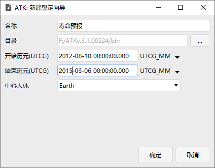
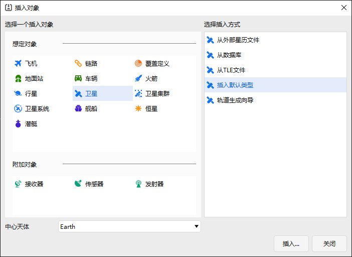
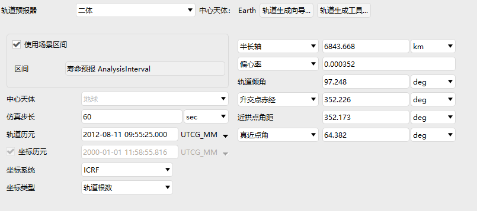
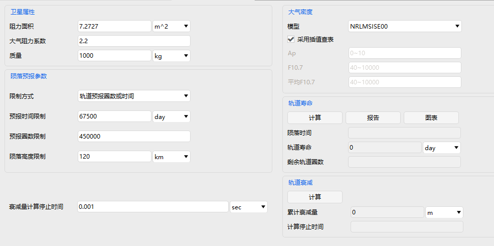
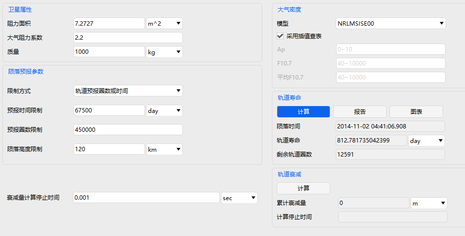
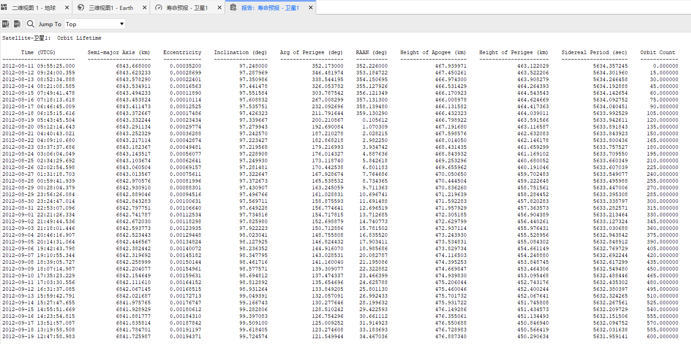
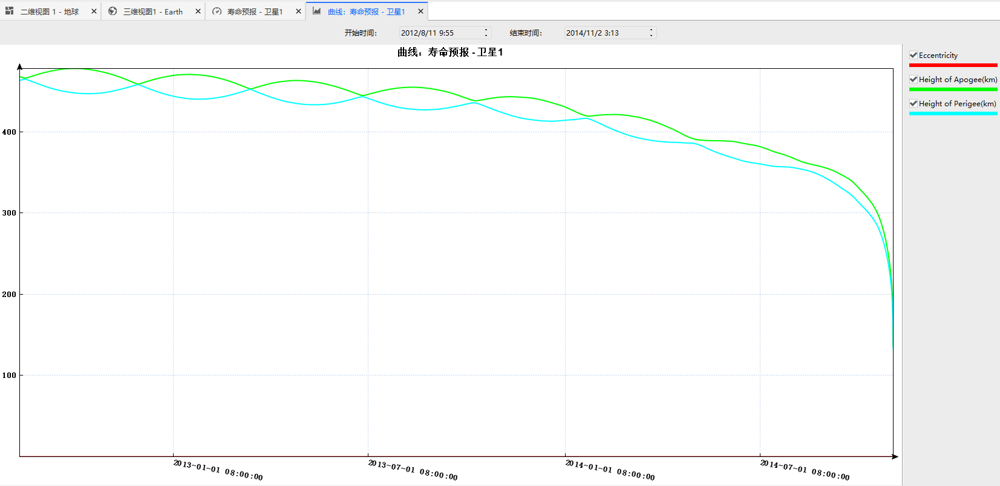

# 寿命预报案例

## 案例想定

本案例对一颗低轨卫星进行轨道寿命预报和轨道衰减量计算。

## 创建任务场景

1. 新建想定

运行 ATK.exe，点击【新建一个想定文件】新建一个想定“寿命预报”。

2. 设置仿真时间

- 在“ATK：新建想定向导”弹窗中设置时间段。

| 开始历元(UTCG)      | 结束历元(UTCG)      |
| ------------------- | ------------------- |
| 2012-08-10 00:00:00 | 2015-03-06 00:00:00 |

- 点击【确定】完成场景建立

## 插入卫星并进行属性设置

插入一颗卫星，卫星属性设置如图所示。

1. 选取轨道根数，其余参数设置如下：

|                 |       |
| --------------- | ----- |
|历元时间| 2012-08-10 09:55:25|
| 半长轴(km)      | 6843.668 |
| 偏心率          | 0.000352  |
| 轨道倾角(deg)   | 97.248   |
| 升交点赤经(deg) | 352.226   |
| 近拱点角距(deg) | 352.173   |
| 真近点角(deg)   | 64.382   |

## 轨道寿命预报

动态工具栏-卫星中选择“寿命预报”。

1.根据卫星的阻力面积设为7.2727 平方米，大气阻力系数2.2，质量1000 kg；

2.限制方式选择：轨道预报圈数或时间；预报时间限制：67500 day；预报圈数限制：450000；陨落高度限制：120km；

3.大气密度设置：NRLMSIS00模型，勾选采用插值查表；

4.点击轨道寿命预报中的计算按钮，可以得到当前卫星对象的陨落时间（陨落至120km稠密大气层）、轨道寿命、及剩余轨道圈数；

5.点击报告或图表，可以查看卫星陨落衰减的具体报告和图表曲线

## 轨道衰减量计算

前置操作步骤同轨道寿命预报计算一致，在衰减量计算停止时间处输入想要计算的轨道衰减天数（以30天为例），点击右侧轨道衰减的计算按钮，可以得到30天的累计衰减量。

