# 发射窗口接近分析案例

## 案例想定

本案例进行火箭发射窗口内的接近分析及结果展示介绍。

## 创建任务场景

1. 新建想定

运行 ATK.exe，点击【新建一个想定文件】新建一个想定“火箭发射窗口接近分析”。

2. 设置仿真时间

- 在“ATK：新建想定向导”弹窗中设置时间段。

| 开始历元(UTCG)      | 结束历元(UTCG)      |
| ------------------- | ------------------- |
| 2023-02-13 00:00:00 | 2023-02-18 00:00:00 |

- 点击【确定】完成场景建立。

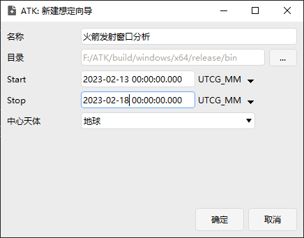

## 插入火箭并进行属性设置

插入一颗火箭，火箭属性设置如图所示。

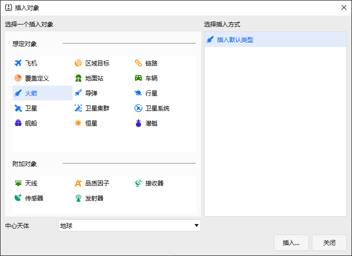

1. 将预报器选取为STK星历；

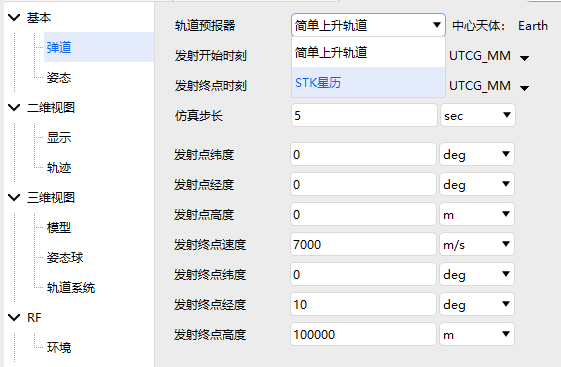

2. 选取火箭星历文件，目录为...\bin\AtkInput\CAT\LaunchVehicle.e；

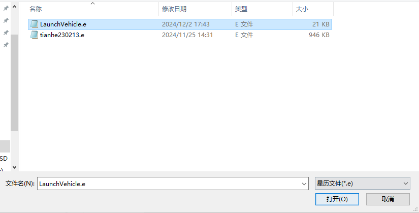

## 发射窗口接近分析

动态工具栏-火箭中选择“发射窗口接近分析”。

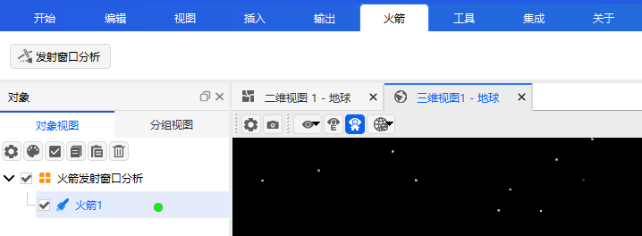

1. 设置需要分析的发射窗口时间段为：

| 开始历元(UTCG)      | 结束历元(UTCG)      |
| ------------------- | ------------------- |
| 2023-02-13 00:00:00 | 2023-02-18 00:00:00 |

2. 其他参数保持默认，导入待分析的空间目标数据库，文件目录为：...\bin\AtkInput\CAT\TLE20230212.txt;

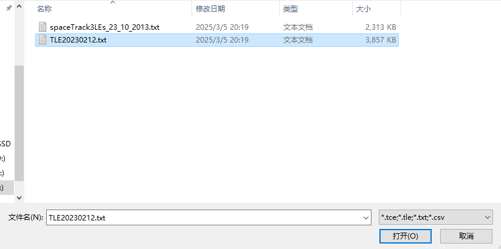

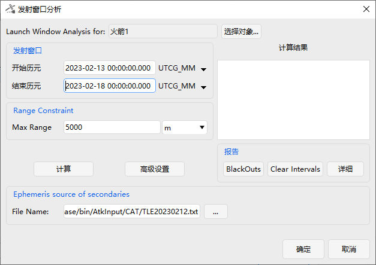

3. 点击计算；

## 结果分析

计算完成后，在“计算结果”下方展示区显示接近事件结果；

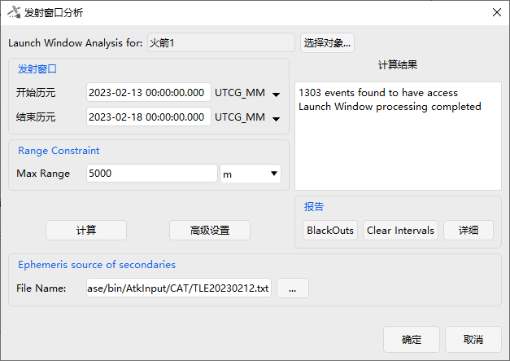

点击详细展示接近事件的详细信息；

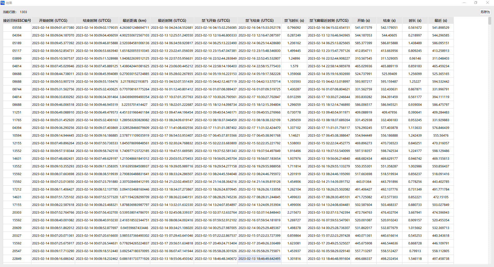

点击"Clear Intervals"；

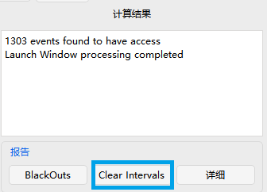

弹出文件保存窗口，将Clear Intervals.txt文件保存至需要的位置；

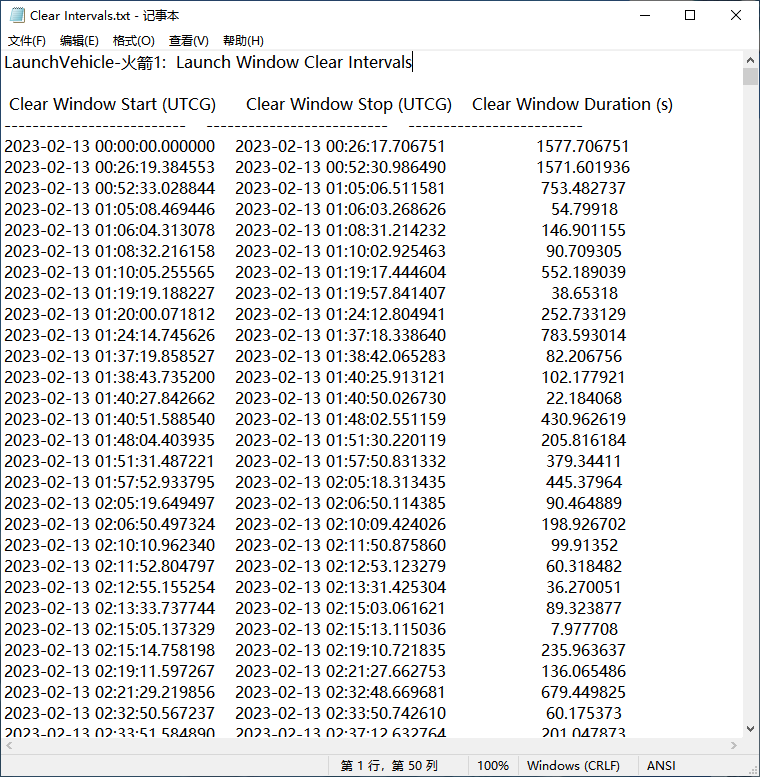