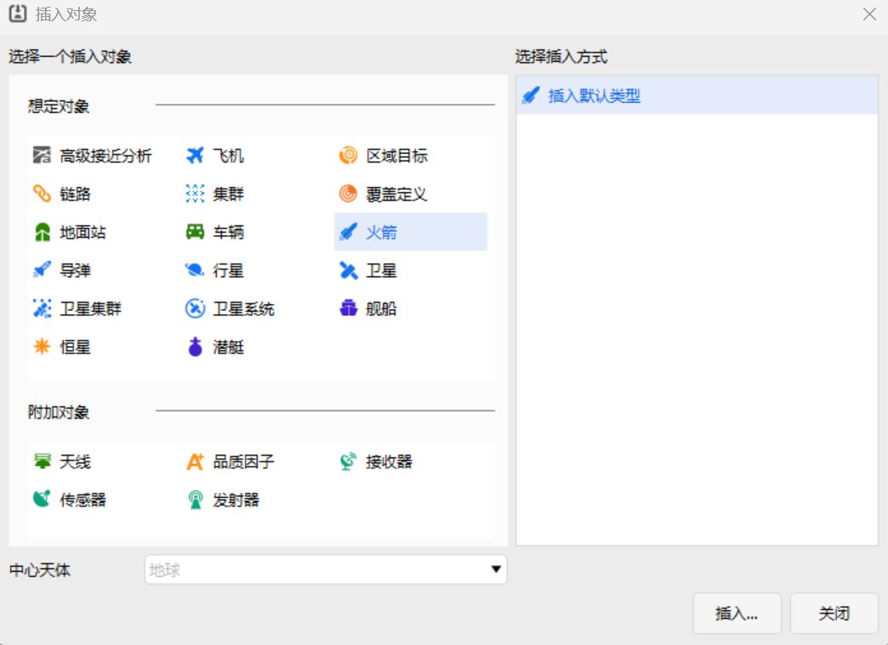
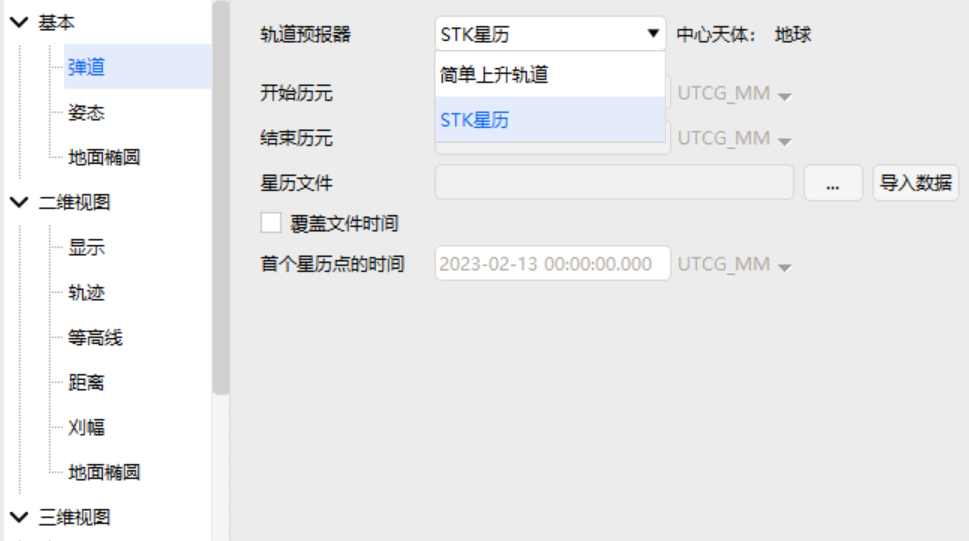
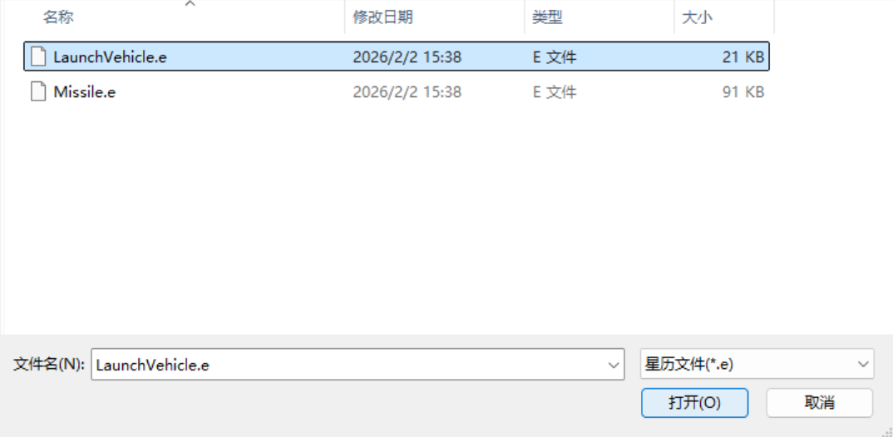
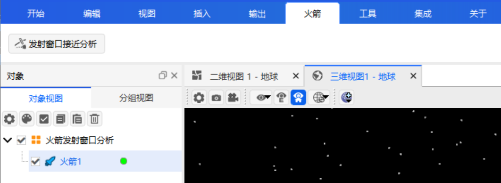
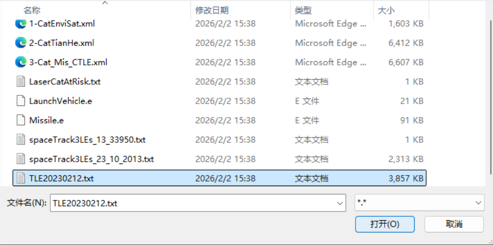
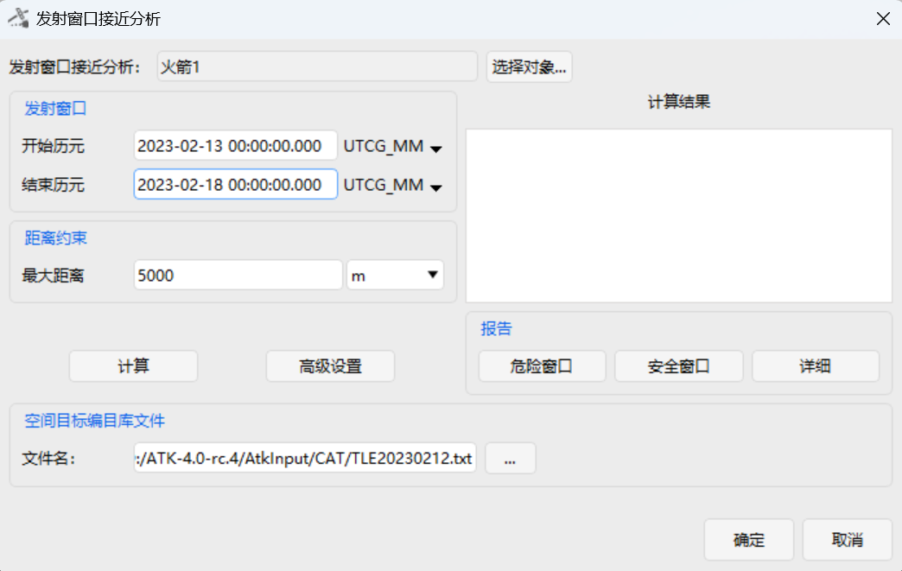

# 发射窗口接近分析案例

## 案例想定

本案例进行火箭发射窗口内的接近分析及结果展示介绍。

## 创建任务场景

1. 运行 ATK 软件，选择上方【开始】工具栏，点击【新建】按钮，创建一个想定文件“火箭发射窗口分析”。
2. 在【ATK: 新建想定向导】弹窗中设置【开始历元】与【结束历元】：

|    开始历元 (UTCG_MM)   | 结束历元 (UTCG_MM)      |
|:-----------------------:|-------------------------|
| 2023-02-13 00:00:00.000 | 2023-02-18 00:00:00.000 |

3. 点击【确定】完成场景创建。

<!--  -->

## 插入火箭并进行属性设置

1. 点击【开始】工具栏下的【插入】按钮，打开【插入对象】页面。
2. 选择【火箭】对象，再选择【插入默认类型】方式，点击【插入...】按钮，将对象插入场景。
3. 双击新插入的【火箭】对象，进入【属性】设置界面。
4. 点击【轨道预报器】下拉框，选择【STK星历】。
5. 点击【星历文件】右侧的【...】按钮，在系统文件管理器中选择“(ATK根目录)\AtkInput\ CAT\LaunchVehicle.e”文件，点击右下角【打开(O)】按钮，将其加载到ATK中。
6. 点击【属性】设置页面右下角的【应用】按钮，完成属性设置。

<!--  -->

<!--  -->

<!--  -->

## 发射窗口接近分析

1. 在左侧对象视图选中【火箭】对象，选择上方【火箭】工具栏，点击【发射窗口接近分析】。

<!--  -->

2. 将【发射窗口】一栏的【开始历元】和【结束历元】分别设置为：

| 开始历元 (UTCG_MM)      | 结束历元 (UTCG_MM)      |
| ------------------- | ------------------- |
| 2023-02-13 00:00:00.000 | 2023-02-18 00:00:00.000 |

3. 点击【空间目标编目库文件】下的【...】按钮，在系统文件管理器中选择“(ATK根目录)\ AtkInput\CAT\TLE20230212.txt”文件，点击右下角【打开(O)】按钮，将其加载到ATK中。其余参数保持默认设置即可；

<!--  -->

<!--  -->

4. 点击【计算】按钮；

## 结果分析

计算完成后，将在【计算结果】下方展示区显示接近事件结果；

点击【报告】一栏的【详细】按钮，将展示接近事件的详细信息；

点击【报告】一栏的【安全窗口】按钮，将弹出文件保存窗口，可将“Clear Intervals.txt”文件保存至需要的位置；

<!--  -->

