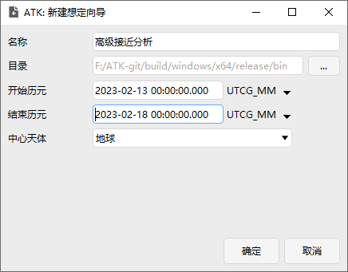
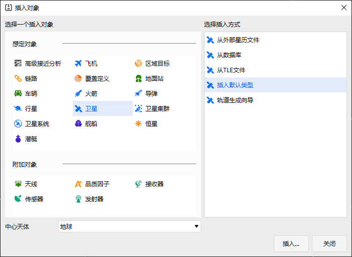
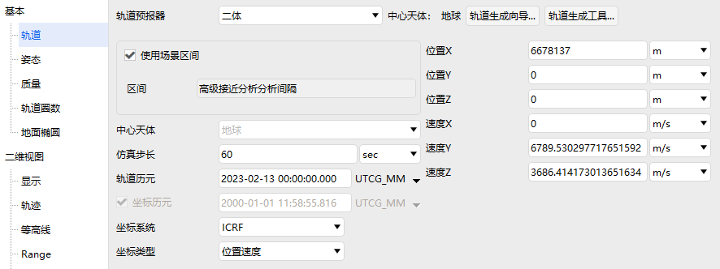
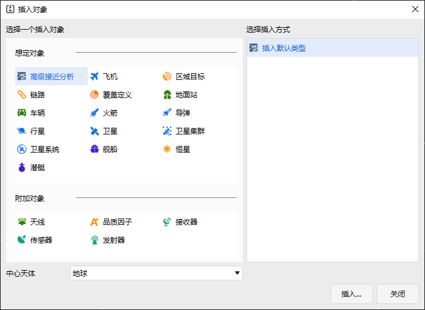
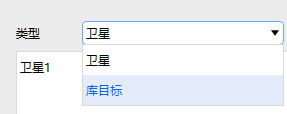
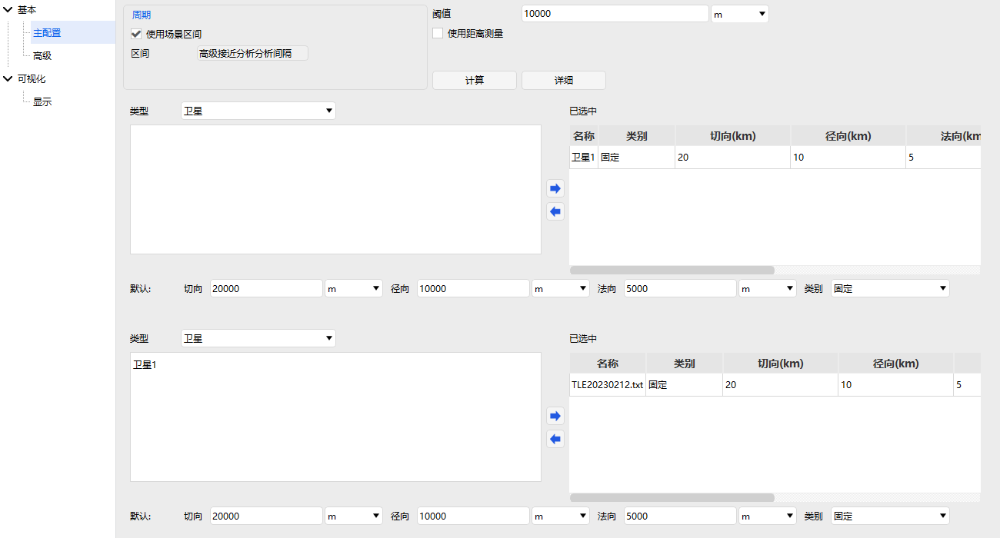
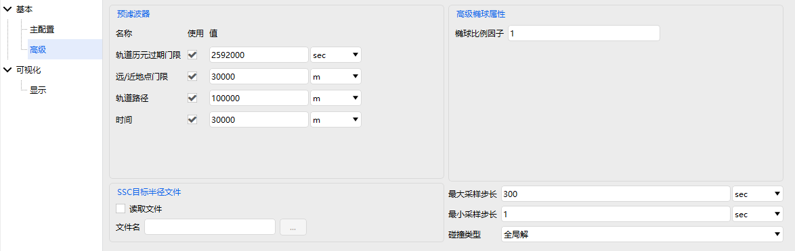
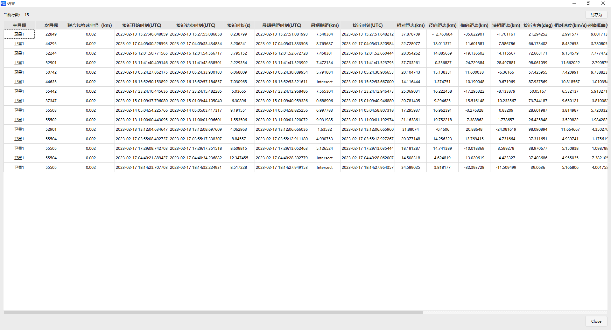
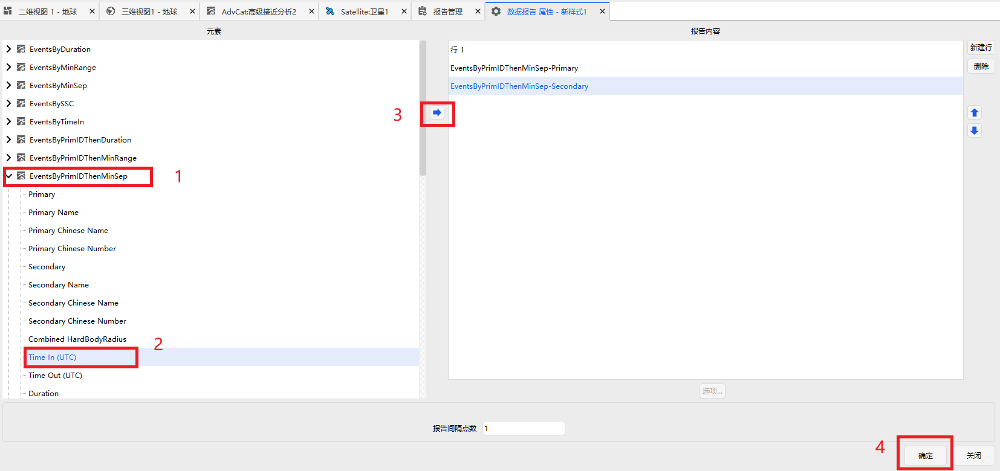

# 高级接近分析案例

## 案例想定

本案例进行一对多的高级接近分析及结果展示介绍。

## 创建任务场景

1. 新建想定

运行 ATK.exe，点击【新建一个想定文件】新建一个想定“高级接近分析”。

2. 设置仿真时间

- 在“ATK：新建想定向导”弹窗中设置时间段。

| 开始历元(UTCG)      | 结束历元(UTCG)      |
| ------------------- | ------------------- |
| 2023-02-13 00:00:00 | 2023-02-18 00:00:00 |

- 点击【确定】完成场景建立

## 插入卫星并进行属性设置

1. 插入一颗卫星到场景中，如图所示。

2. 双击卫星，打开卫星属性配置，将卫星的轨道预报器选为HPOP，其余基础属性设置如图所示。

3. 点击【协方差…】按钮，在弹出的页面中，**勾选**计算协方差，点击【确定】。

4. 点击应用。

## 插入高级接近分析对象并进行属性设置

1. 插入高级接近分析对象，如图所示。

2. 在左侧对象视图双击高级接近分析对象或右键选择“属性”，打开属性界面。

3. 设置需要分析的时间段，这里可不勾选使用场景区间，转而自行设置，此处使用默认的场景区间。

4. 设置主目标，如图所示，在主目标列表左边卫星列表中选中“卫星1”，在右下方【类别】点击下拉框选择**协方差**，点击向右箭头，放入已选中列表。

5. 设置次目标，在次目标列表左上方【类型】处，点击下拉框选择**库目标**，如图所示，点击新出来的【添加】按钮，导入待分析的空间目标数据库，文件目录为：...\bin\AtkInput\CAT\TLE20230212.txt；在方框目标列表中选中“TLE20230212.txt”，在右下方【类别】点击下拉框选择**二次曲线**，点击向右箭头，放入已选中列表。

6. 高级配置，将属性界面从“主配置”切换至“高级”，将“轨道历元过期门限”和“轨道路径”勾选。在【误差椭球数据库】中，分别点击【…】导入对应数据文件，文件目录为：...\bin\AtkInput\CAT\，配置完成的界面如同所示。

7. 其他参数保持默认，点击计算。

## 结果分析

计算完成后，点击【详细】展示计算结果，包括最近时刻、最近距离、碰撞概率等信息；

如果需要获取自定义条目数据的结果，右键高级接近分析对象，选择【数据报告】→【新建】→【属性】→在属性页内添加所需的结果条目，如图所示→【生成】。

[高级接近分析模块](../5.专业使用指南/20-高级接近分析模块.md)