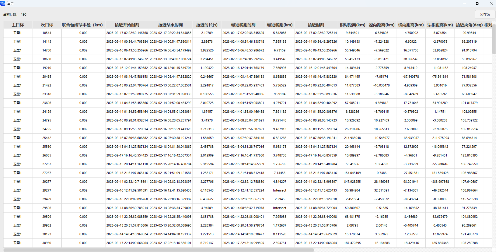

# 高级接近分析案例

## 案例想定

本案例进行一对多的高级接近分析及结果展示介绍。

## 创建任务场景

1. 运行 ATK 软件，选择上方【开始】工具栏，点击【新建】按钮，创建一个想定文件“高级接近分析”。
2. 在【ATK: 新建想定向导】弹窗中设置【开始历元】与【结束历元】：

|    开始历元 (UTCG_MM)   | 结束历元 (UTCG_MM)      |
|:-----------------------:|-------------------------|
| 2023-02-13 00:00:00.000 | 2023-02-18 00:00:00.000 |

3. 点击【确定】完成场景创建。

## 插入卫星并进行属性设置

1. 点击【开始】工具栏下的【插入】按钮，打开【插入对象】页面。
2. 选择【卫星】对象，再选择【插入默认类型】方式，点击【插入...】按钮，将对象插入场景。
3. 双击新插入的【卫星】对象，进入【属性】设置界面。
4. 点击【轨道预报器】下拉框，选择【HPOP】；点击【坐标类型】下拉框，选择【轨道根数】；对轨道根数进行设置：

|  轨道根数  |    数值   |
|:----------:|:---------:|
|   半长轴   | 7000137 m |
|   偏心率   |    0.01   |
|  轨道倾角  |  28.5 deg |
| 升交点赤经 |   0 deg   |
| 近拱点角距 |   0 deg   |
|  真近点角  |   0 deg   |

5. 点击【协方差…】按钮，在弹出的页面中，勾选【计算协方差】复选框，然后点击【确定】按钮，启用协方差计算。
6. 点击【属性】设置页面右下角的【应用】按钮，完成属性设置。

## 插入高级接近分析对象并进行属性设置

1. 点击【开始】工具栏下的【插入】按钮，打开【插入对象】页面。
2. 选择【高级接近分析】对象，再选择【插入默认类型】方式，点击【插入...】按钮，将对象插入场景。
3. 双击新插入的【高级接近分析】对象，进入【属性】设置界面。
4. 【分析时段】设置。用户可根据实际需要设置分析时段，本案例使用默认参数。
5. 【主目标列表】设置。选中左侧栏中的“卫星1”对象，点击右下方【类别】下拉框，选择【协方差】，点击“右箭头”按钮，将其放入已选中列表。

6. 【次目标列表】设置。点击左侧栏上方的【类型】下拉框，选择【库目标】，点击左侧栏右下方的【添加】按钮，在系统文件管理器中选择“(ATK根目录)\AtkInput\CAT\TLE20230212.txt”文件，将其导入到软件中，然后选中左侧栏中的“TLE20230212.txt”对象，点击右下方【类别】下拉框，选择【二次曲线】，点击“右箭头”按钮，将其放入已选中列表。

1. 高级设置。将【属性】设置界面从【基本 - 主配置】切换为【基本 - 高级】，勾选【轨道历元过期门限】和【轨道路径筛选器门限】复选框，参数设置保持默认。在【高级椭球属性 - 误差椭球数据库】设置中，点击【…】按钮依次为【时间二次曲线数据库】、【固定轨道类型数据库】、【二次/固定类型数据库】导入对应数据文件，文件路径为：

|       数据文件      | 路径 |
|:-------------------:|------------------------------------------------------------|
|  时间二次曲线数据库 | (ATK根目录)\AstroData\Database\Satellite\atkQuadDB.qdb     |
|  固定轨道类型数据库 | (ATK根目录)\AstroData\Database\Satellite\atkFxdOrbCls.foc  |
| 二次/固定类型数据库 | (ATK根目录)\AstroData\Database\Satellite\atkQuadOrbCls.qoc |

1. 将【属性】设置界面从【基本 - 高级】切换为【基本 - 主配置】，点击【计算】按钮。

## 结果分析

计算完成后，点击【报告】展示计算结果。

如果需要获取自定义数据报告，右键【高级接近分析】对象，点击【数据报告】，进入【报告管理】页面，点击右侧【样式 - 新建】按钮，创建新样式，选中“新样式1”，点击【样式 - 属性...】按钮，进入属性页，此时用户可自由选择所需的结果条目，点击“右箭头”添加到右侧【报告内容】栏，点击右下角【确定】按钮即可完成自定义数据报告的设置。回到【报告管理】页面，选中“新样式1”，点击右侧【显示 - 生成...】按钮，即可在新窗口查看自定义报告。

[高级接近分析模块](../5.专业使用指南/20-高级接近分析模块.md)