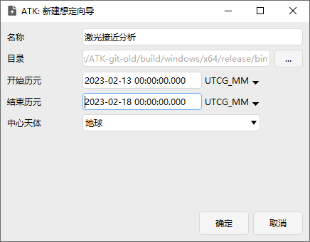
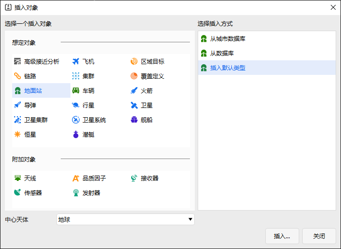
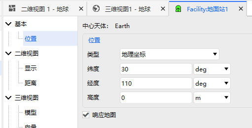
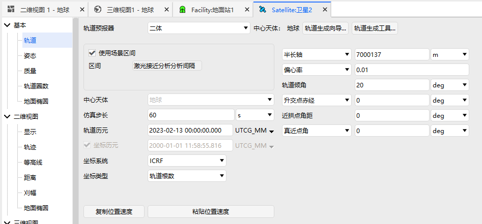
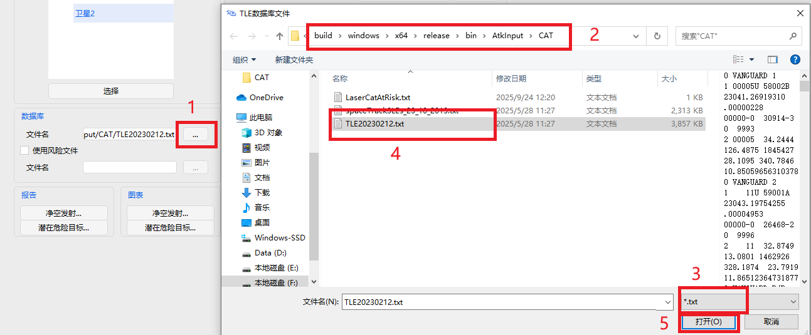
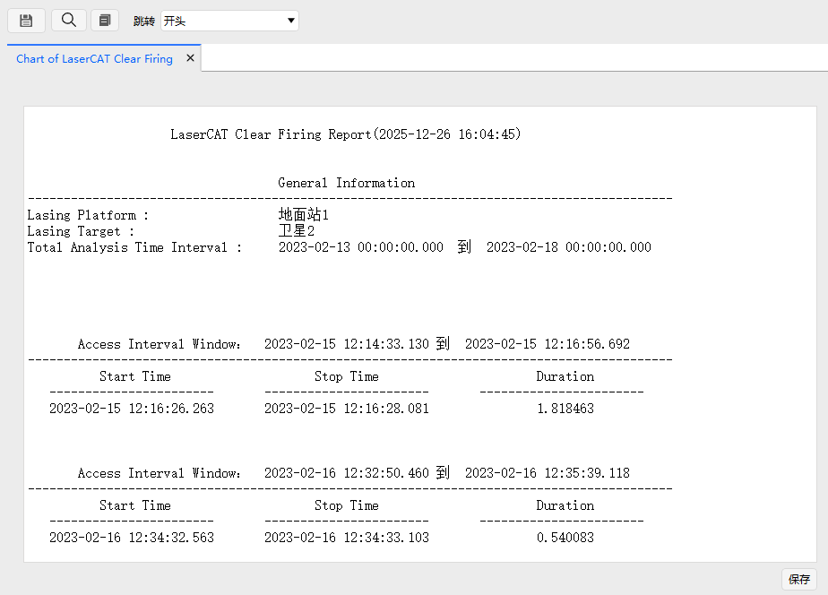
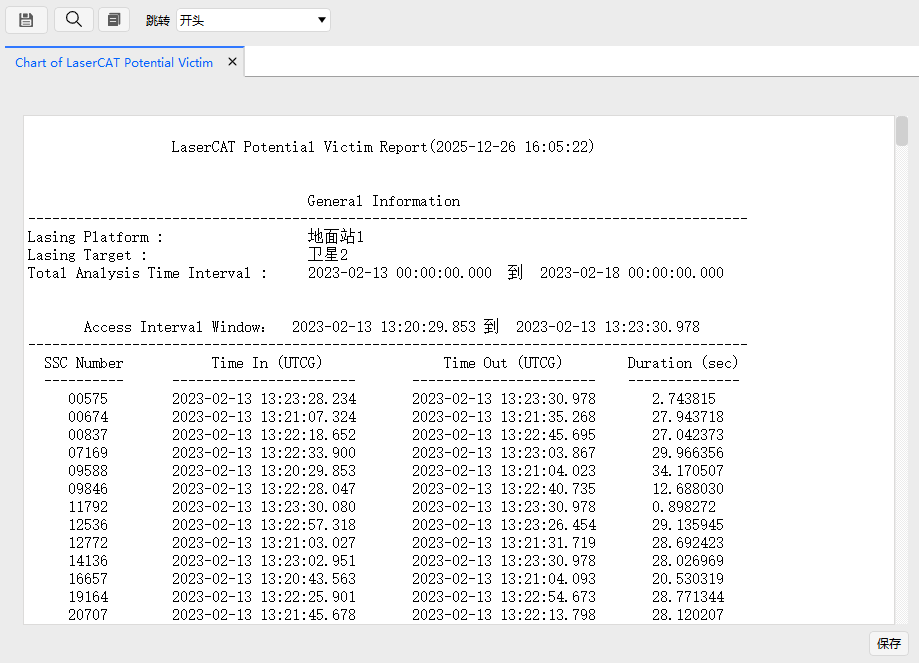

# 激光接近分析分析案例

## 案例想定

本案例进行地面激光站对跟踪目标过程的激光接近分析及结果展示介绍。

## 创建任务场景

1. 新建想定

运行 ATK.exe，点击【新建一个想定文件】新建一个想定“激光接近分析”。

2. 设置仿真时间

- 在“ATK：新建想定向导”弹窗中设置时间段。

| 开始历元(UTCG)      | 结束历元(UTCG)      |
| ------------------- | ------------------- |
| 2023-02-13 00:00:00 | 2023-02-18 00:00:00 |

- 点击【确定】完成场景建立

## 插入一个地面站并进行属性设置

插入一个地面站，右键地面站，选择【属性】，设置如图所示。

## 插入一个地卫星并进行属性设置

插入一个卫星，右键卫星，选择【属性】，设置如图所示。

## 激光接近分析

在左侧对象视图中选中地面站，在动态工具栏-地面站下选择“激光接近分析”。

1. 选择对象，点击【选择对象】，在弹窗内选中地面站，点击确定。

2. 选择跟踪目标，在【跟踪目标】框内，展开【跟踪目标】，选中卫星，点击【选择】。

3. 导入空间目标数据库，在【数据库】区域，点击【…】选择待分析的空间目标数据库，文件目录为：...\bin\AtkInput\CAT\TLE20230212.txt。

4. 设置激光属性，这里保持默认设置。

5. 设置筛选器，勾选【使用几何筛选器】，并在【根数集的最长时效】勾选【使用】。

6. 设置分析时段，这里保持默认设置。

7. 点击计算；

## 结果分析

计算完成后，在【报告】内点击【净空发射…】，查看跟踪期间不会意外照射其余空间目标的时段数据报告，在【图表】内点击【净空发射…】查看对应的图表报告。

在【报告】内点击【潜在危险目标…】，查看跟踪期间不会意外照射其余空间目标的时段数据报告，在【图表】内点击【潜在危险目标…】查看对应的图表报告。

[激光接近分析工具](../5.专业使用指南/21-激光接近分析工具.md)