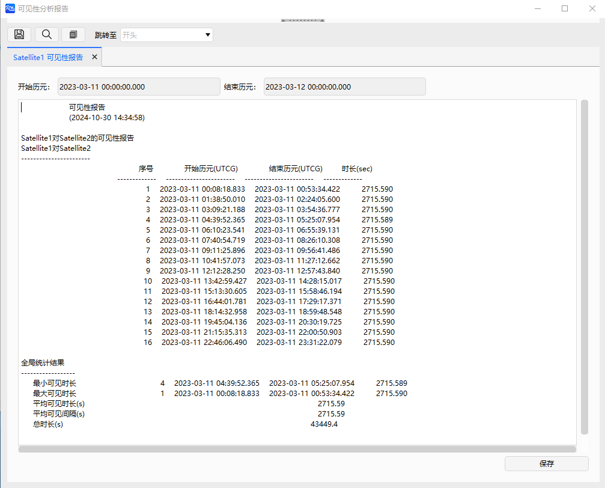
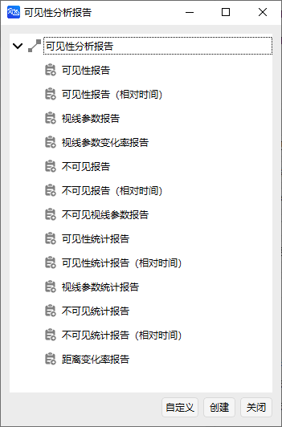
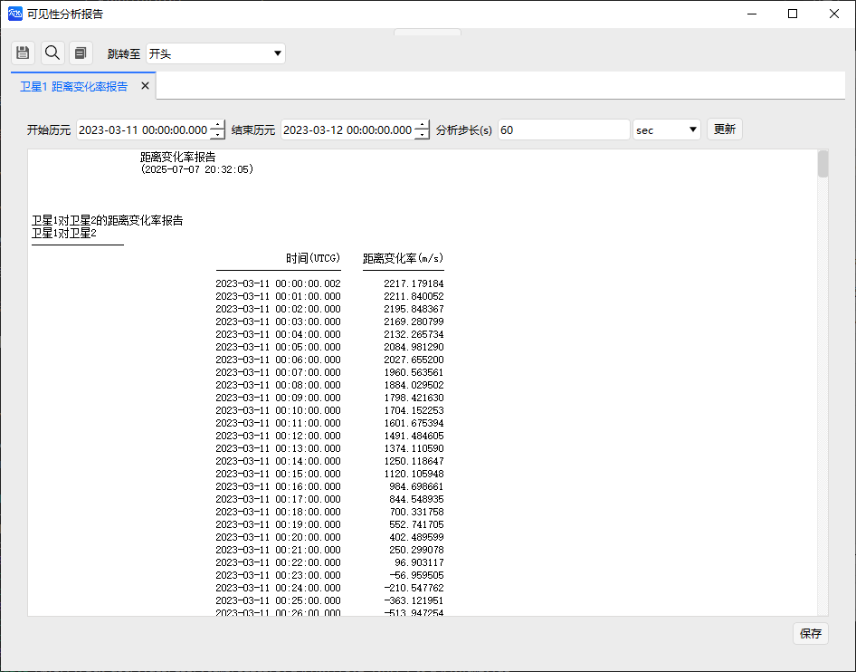
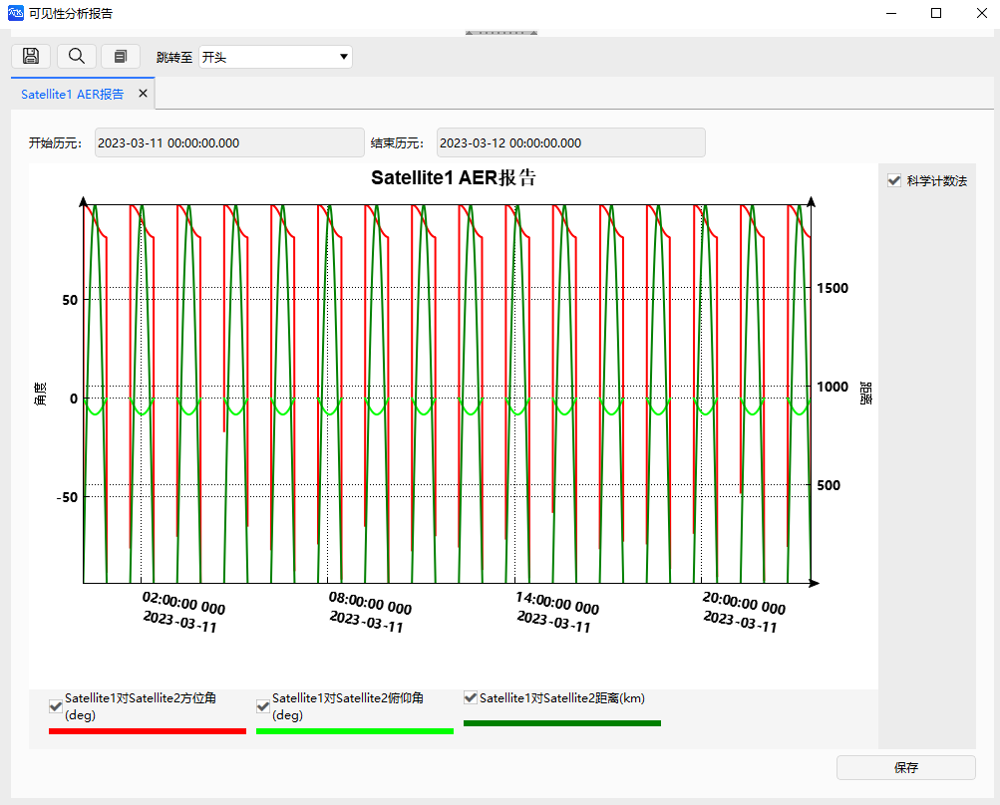

# 可见性工具案例

可见性工具用于判断在对象当前属性和参数约束的条件下，两对象之间是否能够建立联系（是否可见），可用于卫星的星间通信等任务的可视性分析。

本案例介绍如何计算两对象之间的可见时间、被视对象相对于分析对象的方位角、俯仰角，以及两对象间的距离等，并生成报告和可视化图表。

## 创建任务场景

1. 运行 ATK.exe，点击【新建一个想定文件】；

2. 在“新建想定向导”中设置场景“名称”为 “AccessExample”；

3. 设置场景时段

| 开始历元(UTCG)          | 结束历元(UTCG)          |
| ----------------------- | ----------------------- |
| 2023-03-11 00:00:00.000 | 2023-03-12 00:00:00.000 |

4. 点击【确定】完成场景建立。

## 创建对象

1. 点击工具栏【开始】中的【】，创建对象；

2. 选择“想定对象”—“卫星”，“选择插入方式”—“插入默认类型”；

3. 点击两次【插入...】，插入两颗卫星；

4. 点击【关闭】，关闭插入对象弹窗。

## 修改对象属性

1. 选中“卫星1”，右键单击选择【属性】或左键双击直接打开“属性设置页面”；

2. “坐标系统”选择“ICRF”或者“J2000”，“坐标类型”选择“轨道根数”，修改轨道根数为：

    | 轨道根数        | 数值        |
    | --------------- | ----------- |
    | 半长轴(m)       | 6878137.000 |
    | 偏心率          | 0.0         |
    | 轨道倾角(deg)   | 45.0        |
    | 升交点赤经(deg) | 0           |
    | 近拱点角距(deg) | 0           |
    | 真近点角(deg)   | 0           |

3. 点击【应用】，保存修改结果；

4. 在当前界面的“约束”属性中，点击【基本】；

5. 修改“方位角(deg)”约束为：

    | 最小值 | 最大值 |
    | ------ | ------ |
    | 0    | 180     |

6. 修改“仰角(deg)”约束为：

    | 最小值 | 最大值 |
    | ------ | ------ |
    | -45    | 45    |

7. 勾选“视线约束”；

8. 点击【应用】-【确定】；

9. 卫星2保持默认参数，不做任何修改。

## 查看二维和三维视图轨迹

1. 点击【开始】；

2. 可查看二维和三维视图结果。

## 查看可见性计算结果

1. 点击【工具】-【】；

2. 选择“访问对象”，点击【选择对象】；

3. 选择对象“卫星1”，点击【确定】；

4. 设置计算时间段为：

    | 开始历元(UTC)           | 结束历元(UTC)           |
    | ----------------------- | ----------------------- |
    | 2023-03-11 00:00:00.000 | 2023-03-12 00:00:00.000 |

5. 选择“卫星2”，点击【计算】；

6. 点击右侧“报告”—【可见性分析】，可查看卫星可见时段报告数据文件；

7. 点击【保存】，保存可见性分析报告；

8. 关闭“可见性分析报告”页面，在“报告”—【更多...】中可以选择更多的数据报告类型；

例如：距离变化率报告

9. 点击“图表”—【视线参数】，得到视线参数图表报告；

10. 关闭“可见性分析报告”页面，在“图表”—【更多...】中可以选择更多的图表曲线类型。

例如：可见时段百分比饼图

