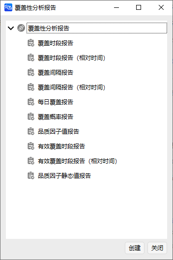
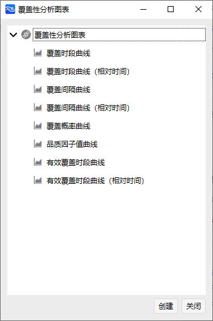

# 覆盖工具案例

覆盖工具可以实现分析一个或多个对象针对于地面目标的覆盖性能，能够生成覆盖时间分析报告，同时可在不同的评估标准下对覆盖效果进行分析。

## 创建任务场景

1. 运行 ATK.exe，点击【新建一个想定文件】；

2. 在“新建想定向导”中，设置场景“名称”为 “CoverageExample”；

3. 设置场景时段为：

    | 开始历元(UTCG)          | 结束历元(UTCG)          |
    | ----------------------- | ----------------------- |
    | 2023-03-11 00:00:00.000 | 2023-03-12 00:00:00.000 |

4. 点击【确定】完成场景建立。

## 创建卫星对象

1. 点击工具栏【开始】中的【】创建对象；

2. 选择“想定对象”—“卫星”，“选择插入方式”—“轨道生成向导”；

3. 点击【插入…】；

4. 选择“轨道类型”—“回归轨道”；

5. 设置轨道参数为：

    | 参数                | 数值 |
    | ------------------- | ---- |
    | 大致高度(km)        | 500  |
    | 轨道倾角(deg)       | 45   |
    | 回归圈数            | 10   |
    | 首个升交点经度(deg) | 0    |

6. 点击【确定】。

## 添加传感器

1. 点击工具栏【开始】中的【】-附加对象-传感器；

2. 点击【插入…】；

3. 选择对象“CoverageExample”—“卫星1”；

4. 点击【确定】；

5. 右击“对象”—“CoverageExample”—“传感器1”，点击【属性】；

6. 选择“敏感器类型”—“简单圆锥”；

7. 设置“半锥角(deg)”为“50”；

8. 点击【确定】。

## 创建覆盖目标

1. 点击工具栏【开始】 —【】；

2. 选择“想定对象”—“地面站”，“选择插入方式”—“插入默认类型”；

3. 点击【插入...】；

4. 右击“对象”—“CoverageExample”—“地面站1”，点击【属性】；

5. 选择“位置”—“类型”为“地理坐标”；

6. 设置地面站位置：

    | 参数      | 数值 |
    | --------- | --- |
    | 纬度(deg) | 30  |
    | 经度(deg) | 110 |
    | 高度(km)  | 0   |

7. 点击【确定】。

## 查看场景的二维和三维视图

1. 点击【开始】；

2. 可查看二维和三维视图结果。

## 进行覆盖性分析

1. 点击【工具】 —【】；

2. 选择“分析对象”，点击【选择对象...】；

3. 选择对象“卫星1”—“传感器1”，点击【确定】；

4. 设置计算时间段为：

    | 开始历元(UTC)           | 结束历元(UTC)           |
    | ----------------------- | ----------------------- |
    | 2023-03-11 00:00:00.000 | 2023-03-12 00:00:00.000 |

5. 选择“地面站1”，点击【计算】；

6. 点击“报告”—【覆盖时段】，查看覆盖时段报告；

7. 点击【保存】，保存可见性分析报告；

8. 关闭“覆盖分析报告”，在“报告”—【更多...】中可以选择更多的数据报告类型；

9. 点击“图表”—【覆盖时段】，查看可视化覆盖时段图表；

10. 关闭“覆盖分析报告”，在“图表”—【更多...】中可以选择更多的图表曲线类型。

## 覆盖品质分析

1. 点击“品质参数”—【定义…】；

2. 选择“类型”—“重访时间”；“计算”—“平均值”；其他选项保持默认；

3. 点击【确定】，得到重访时间平均值。

