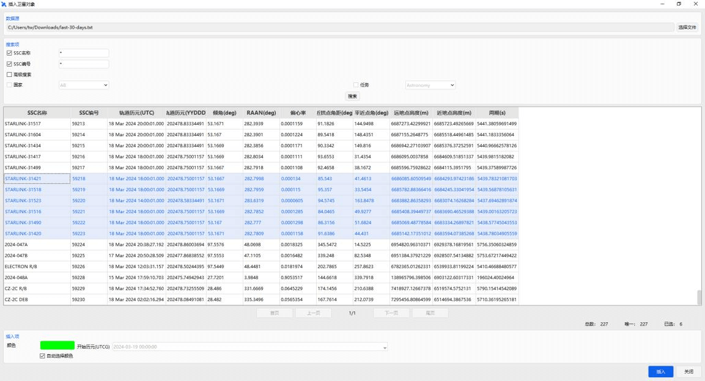

# 区域覆盖案例

## 案例想定

本案例模拟卫星群组对某指定区域的覆盖分析。覆盖区域范围：纬度-20°~20°，经度 150°~180°。卫星选择星链卫星进行分析。

## 创建任务场景与对象

1. 新建想定

运行 ATK.exe，点击【新建一个想定文件】新建一个想定 “AreaCoverage” 。

2. 设置仿真时间

   - 在“ATK：新建想定向导”弹窗中设置时间段

   | 开始历元(UTCG)      | 结束历元(UTCG)      |
   | ------------------- | ------------------- |
   | 2024-03-19 00:00:00 | 2024-03-20 00:00:00 |

   - 点击【确定】完成场景建立

3. 创建及编辑覆盖对象

   - 点击工具栏【开始】中的【插入】创建覆盖定义对象。
   - 选择“想定对象”——“覆盖定义”，“选择插入方式”——“插入默认类型”，点击【插入…】，点击【关闭】。
   - 右键点击对象浏览器中“CoverageDefinition1-属性”，出现覆盖定义的属性设置页面。
   - 选择“基本-网格”，“网格区域配置参数”与“网格定义”参数设置如图所示。点击【确定】关闭属性窗口，区域定义在场景中展示如图所示。

   

   

4. 创建卫星对象

   - 点击工具栏【开始】中的【插入 】创建卫星对象。

   - 选择“想定对象”——“卫星” ，“选择插入方式”——“从 TLE 文件”，点击【插入…】，出现窗口，“数据源”选择由“celestrak”下载的 last-30-days.txt 卫星 TLE 数据文件。

   

   - 按住电脑 shift 键，选择六颗 starlink 卫星，点击【插入…】，场景如图所示。

   

## 区域覆盖分析及结果查看

1. 区域覆盖分析

   - 点击“工具-区域覆盖分析”出现区域覆盖分析功能窗口。
   - 点击【选择对象】，在“选择对象”窗口中选择“CoverageDefinition1”，点击确定。
   - 计算时间选择默认的场景仿真时间。
   - “品质参数”中“覆盖定义”设置为“简单覆盖”，“覆盖品质值”设置为 1。
   - 选择所有 starlink 卫星，点击【计算…】，如图所示。

   
   

2. 区域覆盖分析结果查看

   计算结束后，在右下方“报告”/“图表”区域可查看区域覆盖分析结果，如图所示。

   
   

   
   

