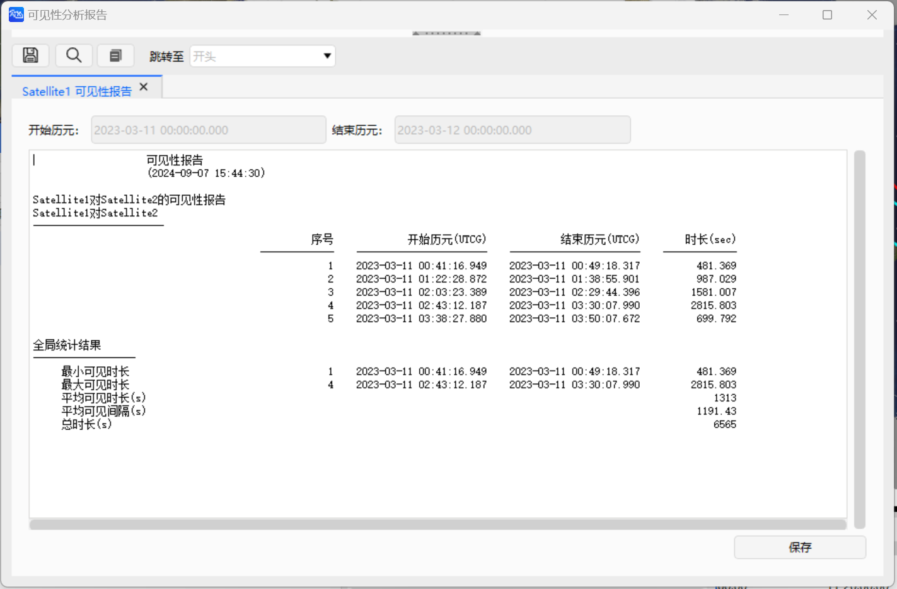
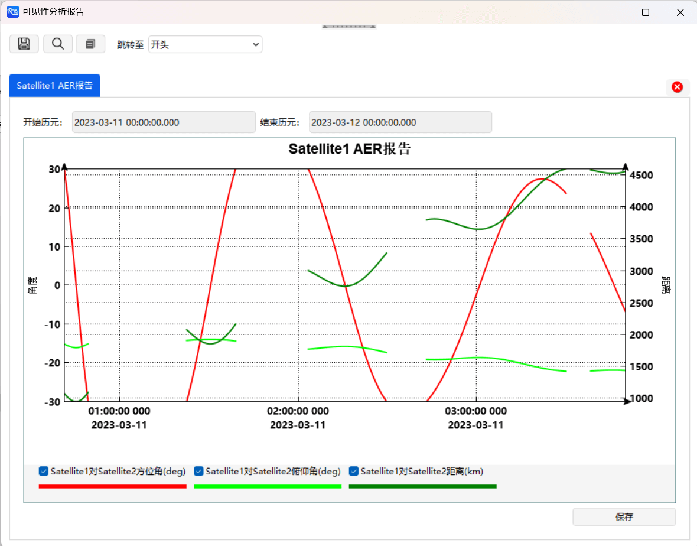

# 可见性工具案例

可见性工具用于计算在对象当前属性和参数约束的条件下，两对象之间是否能够建立联系（是否可见），可用于卫星的星间通信等任务的可视性分析。

本案例介绍如何计算两对象的可见时间、被视对象在分析对象的方位角、俯仰角和两对象间的距离等，并生成报告和可视化图表。

## 创建任务场景

① 运行 ATK.exe，点击【新建一个想定文件】；

② 在“新建想定向导”中设置场景“名称”为 “AccessExample”；

③ 设置场景时段

| 开始历元(UTCG)          | 结束历元(UTCG)          |
| ----------------------- | ----------------------- |
| 2023-03-11 00:00:00.000 | 2023-03-12 00:00:00.000 |

④ 点击【确定】完成场景建立。

## 创建对象

① 点击工具栏“开始”中的，创建对象；

② 选择“想定对象”—“卫星”，“选择插入方式”—“插入默认类型”；

③ 点击两次，插入两颗卫星；

## 修改对象属性

① 右击“对象” — “AccessExample” — “Satellite1”，点击【属性】;

② 选择“坐标类型” — “轨道根数”，修改轨道根数为

| 轨道根数        | 数值        |
| --------------- | ----------- |
| 半长轴(m)       | 6878137.000 |
| 偏心率          | 0.0         |
| 轨道倾角(deg)   | 45.0        |
| 升交点赤经(deg) | 0           |
| 近拱点角距(deg) | 0           |
| 真近点角(deg)   | 0           |

③ 点击【应用】，保存修改结果；

④ 在当前属性界面，点击“约束”—“基本”；

⑤ 修改“方位角(deg)”约束为

| 最小值 | 最大值 |
| ------ | ------ |
| -30    | 30     |

⑥ 修改“仰角(deg)”约束为

| 最小值 | 最大值 |
| ------ | ------ |
| -45    | 45    |

⑦ 勾选“视线约束”；

⑧ 点击【应用】；

⑨ 右击“对象”—“AccessExample”—“Satellite2”，点击【属性】，点击【确定】。

## 查看二维和三维视图轨迹

① 点击【开始】；

② 可查看二维和三维视图结果。

## 查看可见性计算结果

① 点击【开始】；

② 选择“访问对象”，点击【选择对象】；

③ 选择对象“Satellite1”，点击【确定】；

④ 设置计算时间段

| 开始历元(UTC)           | 结束历元(UTC)           |
| ----------------------- | ----------------------- |
| 2023-03-11 00:00:00.000 | 2023-03-12 00:00:00.000 |

⑤ 选择“Satellite2”，点击【计算】；

⑥ 点击“报告”—【可见性分析】，可查看卫星可见时段报告；

⑦ 点击【保存】，保存可见性分析报告。

⑧ 点击【关闭】；

⑨ 点击“可视化参数”—【更多】—【AER 报告】，得到 AER 图表报告。

⑩ 点击【关闭】。
