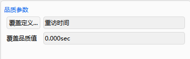

# 覆盖工具案例

覆盖工具可以实现分析一个或多个对象针对于地面目标的覆盖性能，能够生成覆盖时间分析报告，同时可在不同的评估标准下对覆盖效果进行分析。

## 创建任务场景

① 运行 ATK.exe，点击【新建一个想定文件】；

② 在“新建想定向导”中，设置场景“名称”为 “CoverageExample”；

③ 设置场景时段为

| 开始历元(UTCG)          | 结束历元(UTCG)          |
| ----------------------- | ----------------------- |
| 2023-03-11 00:00:00.000 | 2023-03-12 00:00:00.000 |

④ 点击【确定】完成场景建立。

## 创建卫星对象

① 点击工具栏“开始”中的【插入】创建对象；

② 选择“想定对象”—“Satellite”，“选择插入方式”—“轨道生成向导”；

③ 点击【插入…】；

④ 选择“轨道类型”—“回归轨道”；

⑤ 设置轨道参数为

| 参数                | 数值 |
| ------------------- | ---- |
| 大致高度(km)        | 500  |
| 轨道倾角(deg)       | 45   |
| 回归圈数            | 10   |
| 首个升交点经度(deg) | 0    |

⑥ 点击【确定】。

## 添加传感器

① 点击工具栏“开始”中的【插入】-附加对象-敏感器；

② 点击【插入…】；

③ 选择对象“CoverageExample”—“Satellite1”；

④ 点击【确定】；

⑤ 右击“对象”—“CoverageExample”—“Sensor1”，点击【属性】；

⑥ 选择“敏感器类型”—“圆锥”；

⑦ 设置“半锥角(deg)”为“50”；

⑧ 点击【确定】。

## 创建覆盖目标

① 点击工具栏“开始” —【插入】；

② 选择“想定对象”—“地面站”，“选择插入方式”—“插入默认类型”；

③ 点击【插入...】；

④ 右击“对象”—“CoverageExample”—“Facility1”，点击【属性】；

⑤ 选择“位置”—“类型”—“地理坐标”；

⑥ 设置地面站位置：

|           |     |
| --------- | --- |
| 纬度(deg) | 30  |
| 经度(deg) | 110 |
| 高度(km)  | 0   |

⑦ 点击【确定】。

## 查看场景的二维和三维视图

① 点击【开始】；

② 可查看二维和三维视图结果。

## 进行覆盖性分析

① 点击“工具” —【覆盖性】；

② 选择“分析对象”，点击【选择对象...】；

③ 选择对象“Satellite1”—“Sensor1”，点击【确定】；

④ 设置计算时间段

| 开始历元(UTC)           | 结束历元(UTC)           |
| ----------------------- | ----------------------- |
| 2023-03-11 00:00:00.000 | 2023-03-12 00:00:00.000 |

⑤ 选择“Facility1”，点击【计算】；

⑥ 点击“报告”—【覆盖分析...】，查看覆盖时段报告；

⑦ 点击【保存】，保存可见性分析报告。

⑧ 点击【关闭】；

⑨ 点击“图表”—【覆盖分析...】，查看可视化覆盖时段报告；

⑩ 点击【关闭】。

## 覆盖品质分析

① 点击“品质参数”-【覆盖定义…】；

② 选择“类型”—“重访时间”—“平均值”；

③ 点击【确定】，得到重访时间平均值。

