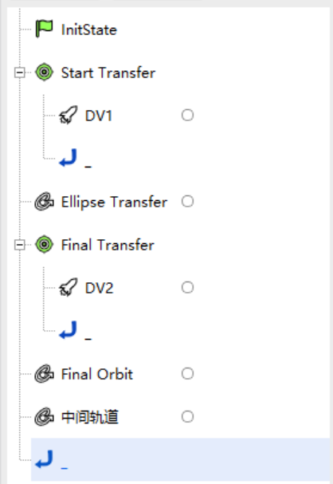

# 霍曼转移

## 案例想定

考虑到速度增量的大小，霍曼转移是两个共面圆轨道之间转移的最有效的两脉冲机动方法，霍曼转移使用椭圆转移轨道，其近拱点在内轨道，远拱点在外轨道。通过机动规划模块的脉冲机动建模和瞄准器设置，可以实现这一类问题的求解。

本案例将介绍航天器从半径 6700 km 的圆轨道转移至半径为 42238 km 的圆轨道的霍曼转移设计过程。

## 任务控制序列说明

为了设计一个从半径为 6700 km 的停泊轨道转移到半径为 42238 km
的目标轨道的转移轨道，我们需要构建以下任务控制序列：

- 一个**初始段**：定义半径为 6700 km 的初始停泊轨道；
- 一个**预报段**：对停泊轨道进行外推；
- 一个**瞄准序列段**：包含一个脉冲机动使航天器进入椭圆转移轨道；
- 一个**预报段**：用于将航天器轨道外推至椭圆轨道的远地点；
- 一个**瞄准序列段**：包含一个脉冲机动使航天器进入目标圆轨道；
- 一个**预报段**：用于对目标圆轨道上的航天器轨道外推。

## 创建任务场景与对象

1.  新建想定

运行 ATK.exe，点击【新建一个想定文件】新建一个想定“Hohmann Transfer”。

2.  设置仿真时间

在“ATK：新建想定向导”弹窗中设置时间段，点击【确定】完成场景建立。

| 开始历元(UTC)              | 结束历元(UTC)              |
| -------------------------- | -------------------------- |
| 2022-11-05 00:00:00.000000 | 2022-11-07 00:00:00.000000 |

3.  创建及编辑卫星对象

    - 点击工具栏【开始】中的【插入】创建卫星对象；

    - 选择“想定对象”——“卫星”，“选择插入方式”——“插入默认类型”，点击【插入…】，点击【关闭】；

    - 在左侧“对象”页面上，右键单击卫星“Satellite1”，选择【重命名】，将其命名为“霍曼转移”；

    - 在左侧“对象”页面上，右键单击卫星“霍曼转移”，选择【属性】，出现卫星参数设置界面，选择“轨道预报器”——“机动规划”。

## 定义初始轨道参数

如果任务控制序列已经有默认的初始段，则直接进行定义，否则点击【新增 】按钮添加一个“初始段”，将其命名为“Inner Orbit”。

1. 轨道历元设置

设置“轨道历元（UTCG）”——“5 Nov 2022 00:00:00.000 ”。

2. 坐标相关设置

选择“坐标系”——“Earth CAsJ2000Axes”，“坐标类型”——“轨道根数”，轨道根数设置如下表：

|                    |        |
| ------------------ | ------ |
| 半长轴             | 6700km |
| 偏心率             | 0      |
| 轨道倾角           | 0°     |
| 升交点赤经（RAAN） | 0°     |
| 近拱点角距         | 0°     |
| 真近点角           | 0°     |

## 设置初始轨道预报段

1.  定义预报段

如果任务控制序列已经有默认的预报段，则直接进行定义，否则点击【新增】按钮添加一个“预报段”，将其命名为“Parking Orbit”。

2.  轨道预报器设置

    1. 点击“轨道预报”——【高级设置…】；

    2. 选择“中心天体”——“Earth”，“引力”中选择“引力场模型”——“JGM3”，勾选“大气阻力摄动”——“采用”、“太阳光压摄动”——“采用”，勾选“三体摄动”——“太阳”、“三体摄动”——“月球”，并选择“点质量”模型；

    3. 点击【确定】。

霍曼转移轨道预报段“Parking Orbit”摄动力设置

3. 停止条件设置

   1. 在“停止条件”中，点击【新建】图标，选择“CAsStopDuration”作为停止条件。

   2. 设置“触发值”为“7200”sec。

## 机动进入椭圆转移轨道

1. 定义瞄准序列段

   1. 点击【新增】按钮添加一个“瞄准序列段”，命名为 “Start Transfer”；

   2. 点击【新增】按钮在“瞄准序列段”——“Start Transfer”嵌入一个“机动段”，命名为“DV1”。

2. 选择变量

   1. 选择“机动类型”——“脉冲”，“推力坐标轴”——“VNC”，坐标类型选择“直角坐标”；

   2. 点击“VX”文字段后方的勾选图标 ，将其勾选为设计变量。

   3. 右键点击该机动段“DV1”，选择“约束配置…”，双击选择“Keplerian Elems”——“CStateCalcRadiusOfApoapsis”作为目标变量，点击【确定】。

3. 设置瞄准器

   选中“Start Transfer”，单击“配置”——【】按钮，选择“微分修正一”，单击【确定】；双击“配置”——“配置类型”——“微分修正一”，进入瞄准器设置界面。

   1. 分别点击“控制变量”和“约束”中“使用”栏下的方框勾选使用的变量和约束；

   | 控制变量 | 约束                      |
   | -------- | ------------------------- |
   | ImpulseX | StateCalcRadiusOfApoapsis |

   2. 在“约束”——“期望值”一栏中填写远地点地心距的期望值为 42238km，“摄动量”、“收敛误差”、“最大步长”等参数选择为默认参数；

   3. 设置完毕后点击【确定】，然后再进入瞄准器设置界面即可看到用户设置后的结果。

霍曼转移轨道瞄准序列段“Start Transfer”瞄准器设置

## 设置椭圆转移轨道预报段

1. 定义预报段

点击【新增】按钮在“瞄准序列段”——“Start Transfer”后添加一个“预报段”，命名为“Ellipse Transfer”，即为过渡的椭圆轨道。

2. 轨道预报器设置

   - 点击“轨道预报”——【高级设置…】；

   - 选择“中心天体”——“Earth”，“引力”中选择“引力场模型”——“JGM3”，勾选“大气阻力摄动”——“采用”、“太阳光压摄动”——“采用”，勾选“三体摄动”——“太阳”、“三体摄动”——“月球”，并选择“点质量”模型；

   - 点击【确定】。

3. 停止条件设置

在“停止条件”，点击【新建】图标，勾选“CAsStopApoapsis”作为停止条件。

## 机动进入目标圆轨道

1. 定义瞄准序列段

   - 点击【新增】按钮在“预报段 ”——“Ellipse Transfer”后插入一个“瞄准序列段 ”，将其命名为“Final Transfer”；

   - 在该序列段内点击【新增】按钮在“瞄准序列段”——“Final Transfer”嵌入一个“机动段”，命名为“DV2”。

2. 选择变量

   - 选择“机动类型”——“脉冲”，“推力坐标轴”——“VNC”，坐标类型选择“直角坐标”；

   - 点击“ VX”文字段后方的勾选图标 ，将其勾选为设计变量。

   - 右键点击该机动段“DV2”，选择“约束配置…”，双击选择“Keplerian Elems”——“CStateCalcEccentricity”作为目标变量，点击【确定】。

3. 设置瞄准器

   选中“Final Transfer”，单击“配置”——【】按钮，选择“微分修正一”，单击【确定】；双击“配置”——“配置类型”——“微分修正一”，进入瞄准器设置界面。

   - 分别点击“控制变量”和“约束”中“使用”栏下的方框勾选使用的控制变量和约束；

   | 控制变量 | 约束                  |
   | -------- | --------------------- |
   | ImpulseX | StateCalcEccentricity |

   - 在“约束”——“期望值”一栏中填写偏心率的期望值为 0，在“约束”——“收敛误差”更改偏心率的收敛误差为
     0.001，“摄动量”、“最大步长”等参数可选择为默认参数；

   - 设置完毕后点击【确定】，然后再进入瞄准器设置界面即可看到用户设置后的结果。

## 设置目标圆轨道预报段

1. 定义预报段

点击【新增】按钮在“瞄准序列段”——“Final Transfer”后插入一个“预报段”，命名为“Final Orbit”。

2. 轨道预报器设置

   - 点击“轨道预报”——【高级设置…】；

   - 选择“中心天体”——“Earth”，“引力”中选择“引力场模型”——“JGM3”，勾选“大气阻力摄动”——“采用”、“太阳光压摄动”——“采用”，勾选“三体摄动”——“太阳”、“三体摄动”——“月球”，并选择“点质量”模型；

   - 点击【确定】。

3. 停止条件设置

在“停止条件”点击【新建】图标，勾选“CAsStopDuration”作为停止条件。触发值设置为“172800”sec。

## 运行任务控制序列

当整个任务控制序列构建完毕后，可以单击左侧段节点区的白色方框选择“预报段”和“机动段”的颜色，设置完毕后左侧的段节点操作区呈现为如下形状：

1. 运行结果显示

   - 点击【运行】按钮，任务控制序列开始计算。可以点击【显示】按钮，查看运行结果。

   

   - 分别点击左侧“段列表”的“瞄准序列段”，可查看任务控制序列中瞄准序列段的运行结果，参考结果如下表所示：

   | Start Transfer |                            | 当前值        |
   | -------------- | -------------------------- | ------------- |
   | 控制变量       | ImpulseX                   | 2416.7305 m/s |
   | 约束           | CStateCalcRadiusOfApoapsis | 42238 km      |

   | Final Transfer |                       | 当前值        |
   | -------------- | --------------------- | ------------- |
   | 控制变量       | ImpulseX              | 1465.6587 m/s |
   | 约束           | StateCalcEccentricity | 4.7151×10-7   |

2. 三维视图显示

   点击【视图】下的【三维视图】按钮，再点击【回放】，操作“时间视图”中的时间轴，可查看轨道形状。

   