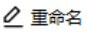
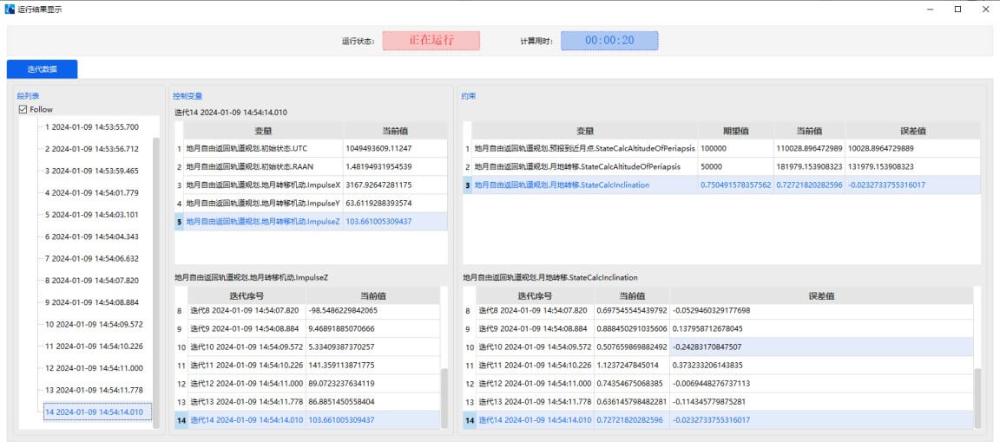

# 基于自由返回轨道的地月转移

## 案例想定

自由返回轨道是从地球出发，在不施加机动的情况下，能够安全返回地球的轨道，包括地月转移和月地返回两部分。此类轨道安全性较高，常被用于载人月球探测任务中。本案例将介绍航天器从近地轨道出发，到达高度为100km 的近月点，然后返回至高度为 50km 的近地点，并满足轨道倾角为 43 度的自由返回过程。

本案例将介绍基于自由返回轨道的地月转移部分，施加轨道机动进入 100km 的环月轨道的设计过程。

## 任务控制序列段说明

为了设计基于自由返回轨道的地月转移过程，我们需要构建以下任务序列：

-  一个**瞄准序列段**：包含一个初始段、一个机动段、一个返回段和两个预报段得到航天器的自由返回轨道。

-  一个**停止段**：用于将任务控制序列停止；

-  一个**机动段**：施加脉冲机动使得航天器进入环月轨道；

-  一个**预报段**：用于对目标环月轨道上的航天器轨道外推。

## 创建任务场景与对象

1. 新建想定

   运行 ATK.exe ， 点 击 【 新 建 一 个 想 定 文 件 】 新 建 一 个 想 定“Earth2MoonTransfer”。

 2. 设置仿真时间

    - 在“ ATK ： 新建想定向导” 中设置 “ 开始历元” 为 2033-04-04 10:00:00.000000，“结束历元”为 2023-04-11 20:00:00.000000；

    - 点击【确定】完成场景建立。

 3. 创建及编辑卫星对象

    -  点击工具栏【开始】中的【插入】创建卫星对象；

    -  选择“想定对象”——“卫星 ”，“选择插入方式”——“插入默认类型”，点击【插入…】，点击【关闭】；

    -  在左侧“对象”页面上，右键单击卫星“Satellite1”，选择【重命名】，将其命名为“Earth2MoonTransfer”；

    -  在左侧“对象”页面上，右键单击卫星“Earth2MoonTransfer”，选择【属性】，出现卫星参数设置界面，选择“轨道预报器”——“机动规划”。

## 设计自由返回轨道

 4. 定义瞄准序列段

    -  点击【新增】按钮添加一个“ 瞄准序列段“，命名为“地月自由返回轨道规划”；

    -  点击【新增】按钮添加一个“ 瞄准序列段“，命名为“地月自由返回轨道规划”——“地月自由返回轨道规划”嵌入一个“初始段”，命名为“初始状态”。设置“轨道历元（UTCG)”——“4 Apr 2033 10:05:00.000 ”。选择“坐标系”——“EarthCAsJ2000Axes”，“坐标类型”——“轨道根数”，轨道根数设置如下表:

    |                    |          |
    | ------------------ | -------- |
    | 半长轴             | 6578137m |
    | 偏心率             | 0        |
    | 轨道倾角           | 28°      |
    | 升交点赤经（RAAN） | 86°      |
    | 近拱点角距         | 0°       |
    | 真近点角           | 223°     |

    - 点击【新增 】按钮在“初始段”后插入一个“机动段”，命名为“地月转移机动”。选择“机动类型”——“脉冲”，“推力坐标轴”——“VVLH”，坐标类型选择“直角坐标”。设置“速度增量 Vx”——“3164.5m/s”，“速度增量 Vy”——“0m/s”，“速度增量 Vz”——“0m/s”。

    - 点击【新增】按钮在“机动段 ”后插入一个“预报段”，命名为“预报到近月点”。点击“轨道预报器”——【高级设置…】，选择“中心天体”——“Earth”，“引力”中选择“引力场模型”——“JGM3”，“次数”——“6”，“阶数”——“6”，不勾选“大气阻力摄动”——“采用”、不勾选“太阳光压摄动”——“采用”，勾选“三体摄动”——“太阳”、“三体摄动”——“月球”，并选择“点质量”模型；点击【确定】。在“停止条件”中，点击【新建】图标，选择“CAsStopPeriapsis”作为停止条件，“中心天体”设置为“Moon”，“重复次数”设置为“1”。

    - 点击【新增】按钮在“预报段”后插入一个“返回段”，命名为“月地段是否启用”，勾选“该段返回控制变量到他的父级段”——“关闭”。

    - 点击【新增】按钮在“返回段”后插入一个“预报段”，命名为“月地转移”，点击“轨道预报器”——【高级设置…】，设置项与第     - 步的设置一样。在“停止条件”中，点击【新建】图标，选择 “CAsStopEpoch” 作为停止条件，“触发值”设置为“2033-04-10 10:00:00.000000”。

 5. 选择变量

    -  在“初始状态”段中，点击“轨道历元”文字段后方、“升交点赤经”文字段后方的勾选图标将其勾选为设计变量。

    -  在“地月转移机动”段中，点击“速度增量 Vx”、“速度增量 Vy”、“速度增量 Vz”文字段后方的勾选图标将其勾选为设计变量。

    -  右键点击“预报到近月点”段，选择“约束配置…”，双击选择“Keplerian Elems”——“CStateCalcAltitudeOfPeriapsis”作为目标变量，“中心天体”设置为“Moon”，点击【确定】。

    -  右键点击“月地转移”段，选择“约束配置…”，双击选择“Keplerian Elems”——“CStateCalcAltitudeOfPeriapsis”和“CStateCalcInclination”作为目标变量，“中心天体”均设置为“Earth”，点击【确定】。

 6. 设置瞄准器

    -  选中“地月自由返回轨道规划”，在“配置”中，点击【新建】图标，选择“微分修正一”；若默认已有“微分修正一”，则无需新建。双击【微分修正一】图框，进入瞄准器设置界面。分别点击“控制变量”和“约束”中“使用”栏下的方框勾选使用的控制变量和约束；

    |          |                               |
    | -------- | ----------------------------- |
    | 控制变量 | UTC                           |
    | 控制变量 | RAAN                          |
    | 控制变量 | ImpulseX                      |
    | 控制变量 | ImpulseY                      |
    | 控制变量 | ImpulseZ                      |
    | 约束     | CStateCalcAltitudeOfPeriapsis |
    | 约束     | CStateCalcAltitudeOfPeriapsis |
    | 约束     | CStateCalcInclination         |

    -  在“约束”——“期望值”一栏中填写近月点高度的期望值为 100000m、近地点高度的期望值为 50000m、轨道倾角的期望值为 43 度，在“约束”——“收敛误差”更改近月点高度和近地点高度的收敛误差为 100m、轨道倾角的收敛误差为 1 度，“摄动量”、“最大步长”等参数可选择为默认参数；

    -  设置完毕后点击【确定】，然后再进入瞄准器设置界面即可看到用户设置后的结果。

## 停止段

点击【新增】按钮在“瞄准序列段”——“地月自由返回轨道规划”后插入一个“停止段”，命名为“是否停止”。勾选“该段使任务控制序列停止”——“开启”。

## 近月制动

点击【新增】按钮在“停止段”——“是否停止”后插入一个“机动段”，命名为“近月制动”。选择“机动类型”——“脉冲”，“推力坐标轴”——“VVLH”，坐标类型选择“直角坐标”。设置“速度增量 Vx ——“-937.33m/s”，“速度增量 Vy”——“31.14m/s”，“速度增量 Vz”——“27.28m/s”。

## 环月飞行

点击【新增】按钮在“机动段”——近月制动后插入一个“预报段”，命名为“环月飞行”。点击“轨道预报器”——【高级设置…】，选择“中心天体”——“Moon”，“引力”中选择“引力场模型”——“GLGM2”，“次数”——“6”，“阶数”——“6”，不勾选“太阳光压摄动”——“采用”，勾选“三体摄动”——“太阳”、“三体摄动”——“地球”，并选择“点质量”模型；

点击【确定】。在“停止条件”中，点击【新建】图标，选择“CAsStopDuration”作为停止条件，“触发值”设置为“14400 sec”。

## 运行任务控制序列并分析

当整个任务控制序列构建完毕后，可以单击左侧段节点区的白色方框选择“预报段”和“机动段”的颜色，设置完毕后左侧的段节点操作区呈现为如下形状：

1. 运行结果显示

   -  点击【运行】按钮，任务控制序列开始计算。可以点击【显示】按钮，查看运行结果。

   

   -  点击左侧“段列表”的“瞄准序列段”，可查看任务控制序列中瞄准序列段的运行结果，参考结果如下表所示：

   | 地月自由返回轨道规划 | 变量                                      | 当前值      |
   | -------------------- | ----------------------------------------- | ----------- |
   | 控制变量             | 初始状态 UTC                              | 2.638       |
   | 控制变量             | 初始状态 RAAN                             | -0.017      |
   | 控制变量             | 地月转移机动 ImpulseX                     | 3.936       |
   | 控制变量             | 地月转移机动 ImpulseY                     | -39.285     |
   | 控制变量             | 地月转移机动 ImpulseZ                     | 93.116      |
   | 约束                 | 预报到近月点 StateCalcAltitudeOfPeriapsis | 100000.0000 |
   | 约束                 | 月地转移 StateCalcAltitudeOfPeriapsis     | 50000.0000  |
   | 约束                 | 月地转移 StateCalcInclination             | 0.750492    |

   - 点击“ 瞄准序列段 ”，选择“动作” ——“应用迭代结果运行”；然后点击左侧“段列表”的“ 瞄准序列段 ”下的“返回段 ”，勾选“该段返回控制变量到他的父级段” ——“开启”；点击左侧“段列表”的“停止段 ”，取消勾选“该段使任务控制序列停止” ——“开启”。

   - 再次点击【运行 】按钮，任务控制序列开始计算。

 2. 三维视图显示

    点击【视图】下的【三维视图】按钮，操作“时间视图”中的时间轴，可查看轨道形状。

    