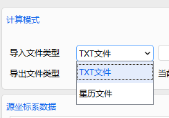
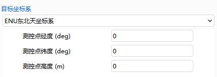

# 批量坐标转换案例

创建场景之后进入初始界面。在 ATK 界面上方点击“工具”，单击【批量坐标转换】按钮，进入“批量坐标转换”界面。可进行“J2000 地心惯性系坐标转为 ECF 地固系坐标”与“ECF 地固系坐标转为 ENU 东北天坐标系坐标”的案例操作。

## J2000 地心惯性系坐标转为 ECF 地固系坐标

### “计算模式”选择

1. 打开坐标批量转换界面，选择“TXT 文件”。

2. 点击【…】按钮，选择 J2000 地心惯性坐标系“J2000Coord”文件，路径为“…\\ATK\\AtkInput\\CoordTrans\\J2000Coord.txt”。

坐标文件格式为：

导入后的 J2000 地心惯性系坐标会显示到“源坐标数据”框内。

### “时间选项”选择

选择“时间选项”——“协调世界时”，“时间格式”为。

### “转换参数”选择

1. 选择“时间”、“位置”和“速度”作为转换参数。如图所示：

2. “数据单位”选择 km 和“时间单位”选择 s。

### “源坐标系”选择

源坐标系与导入文件“ J2000Coord.txt” 格式对应，选择“ 源坐标系”——“J2000 地心惯性系”。

### “目标坐标系”选择

选择“目标坐标系”——“ECF 地固系”作为“目标坐标系”。

### 坐标转换

点击【计算】按钮，“目标坐标系数据”将显示转换后的 ECF 地固系坐标，如图所示：

### 文件导出类型

1. 选择“导出文件类型”—— “TXT 文件”。

2. 点击【导出】按钮，选择路径，数据文件格式为 TXT：

## ECF 地固系坐标转为 ENU 东北天坐标系坐标

### “计算模式”选择

1. 打开坐标批量转换界面 ，选择“导入文件类型” ——“TXT 文件”。

2. 点击【…】按钮，选择 ECF 地固系坐标“ECF.txt” 文件，路径为“XX\\ATK\\ AtkInput\CoordTrans\\ECF.txt”，格式如图所示：

导入后的数据会显示到“源坐标数据”框内。

### “时间选项”选择

选择 “时间选项 ” —— “世界协调时 ”， 时间格式设置为。

### “转换参数”选择

① 选择“时间”、“位置”和“速度”作为转换参数。

② “数据单位”选择 km 和“时间单位”选择 s。

### “源坐标系”选择

源坐标系与导入文件“ECF.txt”格式对应，选择“源坐标系”——“ECF 地固系”。

### “目标坐标系”选择

1. 选择“目标坐标系”——“ENU 东北天坐标系”。

2. 弹出的测控点经度（°）、测控点纬度（°）、测控点高度（m）的输入如图所示：

### 坐标转换

点击【计算】按钮，转换为 ENU 东北天坐标。

### 文件导出类型

1. 选择“导出文件类型”—— “TXT 文件”。

2. 点击【导出】按钮，选择好路径。点击【保存】按钮，保存后的数据文件格式为.e，如图所示：

