# 接近分析案例

接近分析工具可以实现分析和评估太空中的目标与其他物体接近的可能性，得到目标与其他物体的最接近时刻以及最接近时刻所对应的相对位置、速度等信息。

## 案例想定

本案例中，使用基于已有的“目标 TLE 数据库”，对单个或多个主目标进行接近分析，即评估太空中的目标与其他物体接近的可能性，得到目标与其他物体的最接近时刻以及最接近时刻所对应的相对位置、速度等信息。“目标 TLE 数据库”的格式如图所示。

主目标有三种不同加入方式：

1. “从场景对象选择”，主目标来源于用户插入场景中的卫星，且已对该
   卫星仿真完毕。
2. “输入目标国际编号 SSCnumber”，主目标来源于“目标 TLE 数据库”。
3. “载入外部 STK 星历文件”，主目标来源于 STK 生成的外部的星历文件。

本案例将基于上述三种不同的主目标的来源场景，根据我国的目标编号48274“天和一号”卫星与俄罗斯的目标编号 25544“曙光”号分别对目标进行接近分析

## 基于场景对象选择的接近分析

### 创建场景对象

1. 运行 ATK.exe，点击【新建一个想定文件】新建一个想定“CAT_TLE20230212”。

本案例选择场景时间为：

| 开始历元                 | 结束历元                 |
| ------------------------ | ------------------------ |
| 15 Feb 2023 00:00:00.000 | 18 Feb 2023 00:00:00.000 |

### 插入目标卫星与仿真

1. 点击【插入】按钮，打开“插入对象页面”。

2. 选择插入 TLE 数据库中的卫星。

   在“想定对象”选择“卫星”，并“选择插入方式”为“从 TLE 文件”,点击【插入…】按钮，进入“插入卫星对象”页面。

3. 选择“数据源”路径。

   在 “数据源 ”处点击【选择文件】按钮，目标卫星的路径为“…ATK\\AtkInput\\CAT\\TLE20230212.txt”。

4. 插入 25544 卫星。

   在“搜索项”中的“SSC 编号”处输入“25544”。

   点击【搜索】按钮，在下方栏中出现 SSC 编号 25544 卫星，单击选中该卫星，点击【插入】按钮，25544 卫星插入成功。

5. 重复步骤 ④ 操作，插入48274卫星。最终插入结果如图所示：

   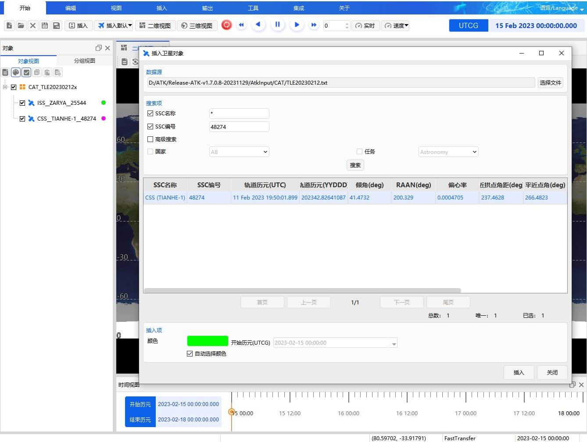

6. 点击【开始】按钮进行仿真，仿真完毕才能进行“基于场景对象的接近分析”。

### 打开“接近分析”工具

1.  点击【刷新】按钮，进行重置。

2.  在 ATK 页面中点击【工具】按钮，选择【接近分析】。

### 选择 SSC 编号 48274 卫星为主目标

1. 选择“选择主目标”——“从场景对象选择”。

2. 单击选中目标 SSC 编号 48274 卫星，如图所示：

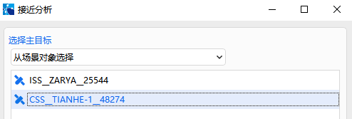

### 选择“目标 TLE 数据库”

1. 点击“目标 TLE 数据库”——【选择…】按钮。

2. 选择“目标 TLE 数据库”文件“ TLE20230212.txt ”， 路径为“…ATK\\AtkInput\\CAT\\TLE20230212.txt” 。

### 选择排除 TLE 中的目标卫星

1. 点击“排除目标 SSC 编号”——【设置…】按钮。

2. 在“排除目标 SSC 编号”栏中，输入目标 SSC 编号“48274”。

3. 点击【添加】按钮，单击选中 48274 卫星，如图所示：

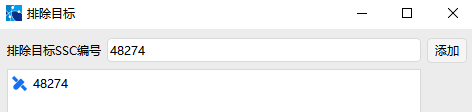

4. 输入“排除目标编号”完毕，点击【确定】按钮。

### 设定“仿真分析时间”

“仿真分析时间”中的“开始历元”、“结束历元”默认与场景设置中的时间默认相同，不建议再修改。

### 设置“接近约束”

设置“接近约束”——“相对距离门限”为 60km。当 TLE 数据库中的卫星与目标卫星的距离小于“相对距离门限”时，会在接近分析的计算结果页面显示。

### 进行“高级设置”

点击【高级设置…】按钮，打开“高级设置”页面。

1. 设置“过滤器”。 “过滤器”，“过滤器”为默认设置：

   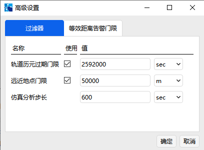

2. 约束“等效距离告警门限”。“等效距离警告门限”设置如图所示，单位选择“m”，点击【确定】按钮：

   

### 计算结果

1. 点击【计算】按钮，得到仿真结果。

2. 结果说明。

   接近分析部分结果如图所示：

   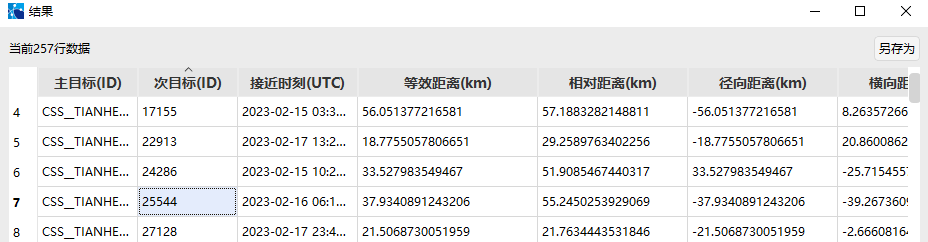

   仿真结果包含满足约束条件的“接近时刻”、“等效距离”、“相对距离”、“径向距离”、“横向距离”、“法向距离”、“接近夹角”与“相对速度”。相对距离门限小于 60km 的接近分析数据共有 257 行。其中，SSC 编号 48274 卫星与 TLE 数据库中的次目标 25544 卫星的接近时刻、等效距离以及相对距离如上图所示。

### 多目标接近分析

1. 同时选择 48274 卫星与 25544 卫星，并排除 TLE 库中的 48274 卫星与 25544 卫星，如图所示。
   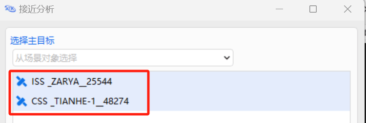

   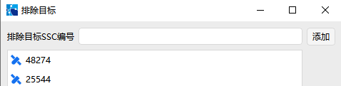

2. 重复以上步骤，点击【计算】按钮，得到多目标的接近分析结果，共有 584 行数据。单击“接近时刻（UTC）”，可得到离仿真时间最近的接近事件，如图所示：

   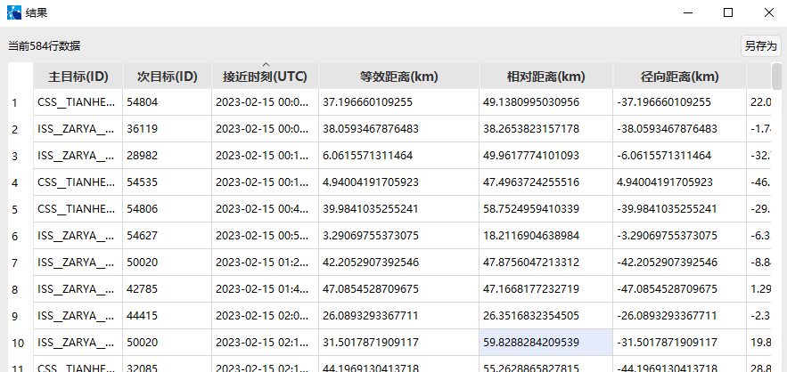

   此外，还可通过点击“次目标（ID）”、“等效距离”，来对接近分析结果排序。若关闭了结算结果页面，可以在“接近分析”页面下方点击【结果…】，可重新打开计算结果。

## 基于存在国际编号目标的接近分析

本案例将通过 TLE 数据库中的国际编号 SSC 48274 卫星与其他国际编号卫星进行接近分析。

### 创建场景对象

运行 ATK.exe，点击【新建一个想定文件】新建一个想定“Access”。本案例选择场景时间为：

| 开始历元 | 15 Feb 2023 00:00:00.000 |
| -------- | ------------------------ |
| 结束历元 | 18 Feb 2023 00:00:00.000 |

### 打开“接近分析”工具

1. 点击【刷新】按钮。

2. 在 ATK 页面中点击【工具】按钮，选择【接近分析】。

### 选择 SSC 编号 48274 卫星为主目标

1. 选择“选择主目标”——“输入目标国际编号”。

2.在目标国际编号栏输入“48274”卫星，单击【添加】按钮后单机选中 48274 卫星，如图所示：

    

### 选择“目标 TLE 数据库”

1. 点击“目标 TLE 数据库”——【选择…】按钮。

2. 选择“目标 TLE 数据库”文件“ TLE20230212.txt ”， 路径为“…ATK\\AtkInput\\CAT\\TLE20230212.txt” 。

### 设定“仿真分析时间”

“仿真分析时间”中的“开始历元”、“结束历元”默认与场景设置中的时间默认相同，不建议再修改。

### 设置“接近约束”

设置“接近约束”——“相对距离门限”为 60km。当 TLE 数据库中的卫星与目标卫星的距离小于“相对距离门限”时，会在接近分析的计算结果页面显示。

### 进行“高级设置”

点击【高级设置…】按钮，打开“高级设置”页面。

1. 设置“过滤器”。“过滤器”为默认设置：

   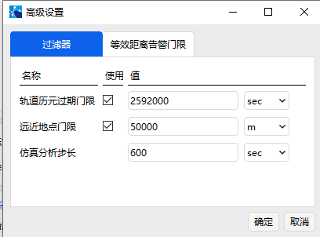

2. 约束“等效距离告警门限”。“等效距离警告门限”设置如图所示，单位选择“m”，点击【确定】按钮：

   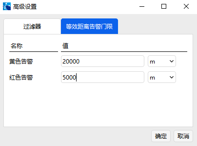

### 计算结果

1. 点击【计算】按钮，得到仿真结果。

2. 在“结果”页面中点击“等效距离(km)”。

3. 结果说明。

   接近分析部分结果如图所示：

   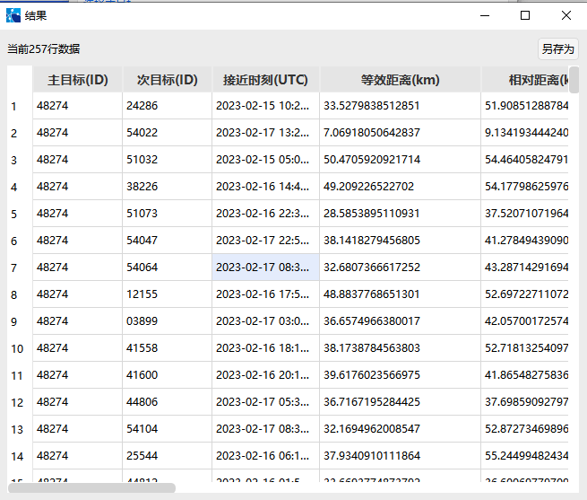

   仿真结果共有 257 行数据。上述仿真结果按“等效距离”排序。

### 多目标接近分析

对 25544、48274 卫星分别与 TLE 数据库中的其他卫星进行接近分析。

1. 在“目标国际编号”中输入“25544”卫星，点击【添加】，并重复以上步骤

2. 同时选中 25544、48274 卫星。

   

3. 点击【计算】按钮，得到输出结果

4. 点击“等效距离（km）”，按等效距离排序，如图所示：

   

## 基于外部 STK 星历文件的接近分析

用户基于已有 STK 的星历文件进行接近分析，已有星历文件的格式如下：

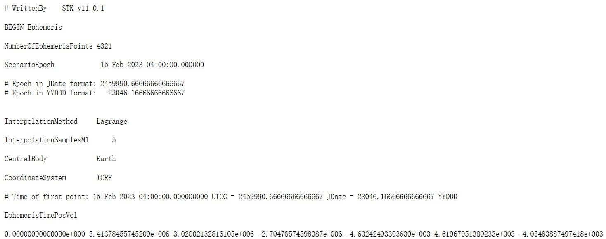

本案例将使用 SSC 编号 48274、25544 的星历文件对“目标 TLE 数据库”进行接近分析，星历文件的时间为 2023-02-15 至 2023-02-18。

### 创建场景对象

运行 ATK.exe，点击【新建一个想定文件】新建一个想定“Access”。本案例选择场景时间为：

| 开始历元 | 15 Feb 2023 00:00:00.000 |
| -------- | ------------------------ |
| 结束历元 | 18 Feb 2023 00:00:00.000 |

### 打开“接近分析”工具

1.  点击【刷新】按钮。

2.  在 ATK 页面中点击【工具】按钮，选择【接近分析】。

### 选择 SSC 编号 48274 卫星为主目标

1. 选择“选择主目标”——“载入外部 STK 星历文件”。

2. 在 STK 星历文件栏点击【选择…】按钮，载入 48274 卫星的“STK 星历文件”。文件路径为“XX\\ 0_CSS TIANHE-1 48274.e”

3. 选择要载入的外部 STK 星历文件，并选中该路径，如图所示：

   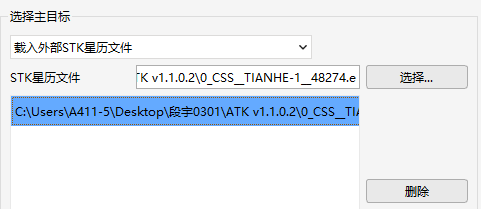

   若需删除该文件，则点击右侧的【删除】按钮。

### 选择“目标 TLE 数据库”

1. 点击“目标 TLE 数据库”——【选择…】按钮。

2. 选择“目标 TLE 数据库”文件“ TLE20230212.txt ”， 路径为“…ATK\\AtkInput\\CAT\\TLE20230212.txt” 。

### 选择“排除目标 SSC 编号”

1. 点击“排除目标 SSC 编号”——【设置…】按钮。

2. 在“排除目标 SSC 编号”栏中，输入目标 SSC 编号“48274”。

3. 点击【添加】按钮，单击选中 48274 卫星，如图所示：

   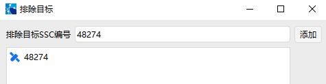

4. 输入“排除目标编号”完毕，点击【确定】按钮。

### 设定“仿真分析时间”

“仿真分析时间”中的“开始历元”、“结束历元”默认与场景设置中的时间默认相同，不建议再修改。

### 设置“接近约束”

设置“接近约束”——“相对距离门限”为 60km。当 TLE 数据库中的卫星与目标卫星的距离小于“相对距离门限”时，会在接近分析的计算结果页面显示。

### 进行“高级设置”

点击【高级设置…】按钮，打开“高级设置”页面。

1. 设置“过滤器”。 “过滤器”，“过滤器”为默认设置：

   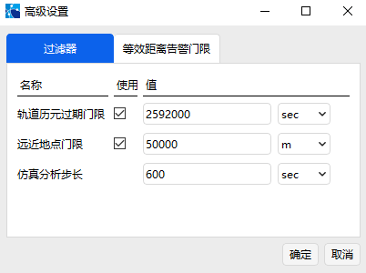

2. 约束“等效距离告警门限”。“等效距离警告门限”设置如图所示，单位选择“m”，点击【确定】按钮：

   

### 计算结果

1. 点击【计算】按钮，得到仿真结果。

2. 在“结果”页面中点击“等效距离（km）”。

3. 结果说明。

接近分析部分结果如图所示：

    

### 多目标接近分析

对 25544、48274 卫星分别与 TLE 数据库中的其他卫星进行接近分析。

1. 重复以上步骤。

   在“STK 星历文件”中载入 25544 卫星的“STK 星历文件”。文件路径为“XX\\ ZARYA_25544.e”，并单击选中。

   同时排除 TLE 数据库中的 25544 卫星。

2. 同时选中 25544、48274 卫星。

   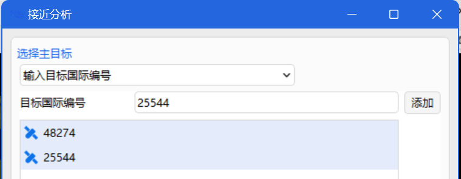

3. 点击【计算】按钮，得到输出结果。

4. 点击“等效距离（km）”，按等效距离排序，如图所示：

   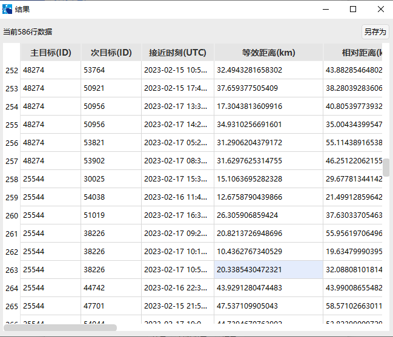