# 碰撞规避

## 案例想定

本案例想定场景为航天器与单个重点空间目标及多目标库的多圈次碰撞规避分析。内容包括：

1. 基于精密星历与相对轨道动力学模型建立航天器碰撞规避机动评估模型，涵盖自然交会分析、机动规划分析、机动复核功能。

2. 考虑航天器与空间目标多圈周期性接近对规避效果的影响，通过优化控制量，寻找测控圈次内的控制最优解，避免控制后短期内再次出现碰撞风险。

3. 进行机动复核，提高机动规避效果，保证操作的安全性。

## 基本设置

点击 ATK.exe，选择【工具】选项中的【轨控安全性分析】功能，即可打开“轨控安全性分析”界面。

### 场景目标数据配置

1. 卫星星历

   - 点击“卫星星历”数据框右侧的，读取“CAM”文件夹中在轨航天器精密星历数据文件“state_chaser.txt”，文件路径为：“…\\ATK\\AtkInput\\CAM\\test20220805\\state_chaser.txt”；代表选择卫星星历为“2022 年 8 月 2 日 23:00”至“2022 年 8 月 8 日 12:00” 中心格式的在轨航天器精密星历数据；

   - 下拉菜单选择 “UTC/BJT”—【UTC】时间格式。

2. 目标星历

   - 勾选【使用】，选择是否进行与指定空间目标的碰撞规避计算；

   - 点击“目标星历”数据框右侧，读取目标精密星历数据 “state_target.txt”，文件路径为“…\\ATK\\AtkInput\\CAM\\test20220805\\state_target.txt”；代表选择目标星历为“2022 年 7 月 31 日 14:26”至“2022 年 8 月 8 日 14:26”中心格式的在轨航天器精密星历数据；

   - 下拉菜单选择 “UTC/BJT”—【UTC】时间格式。

3. 目标数据库

   - 勾选【使用 TLE】，单击【选择…】，使用 TLE 数据与数据库内所有其他空间目标的碰撞规避计算；

   - 选择 并载入 TLE 格 式 数 据 “ 3le20220805.txt ”， 文 件 路 径 为“\\ATK\\AtkInput\\CAM\\test20220805\\3le20220805.txt”；表示截止 2022 年 8 月 5 日 SpaceTrack 收集的所有空间目标编目；

   - 单击【设置】，输入需排除目标编号后选择【添加】，将目标编号加入列表中，点击【确定】保存，其中 SSC 为五位数的空间目标国际编号；

   - 当不需要该空间目标时，也可在列表中选中之前保存的 SSC 编号，点击【删除】后，单击【确定】保存退出。

   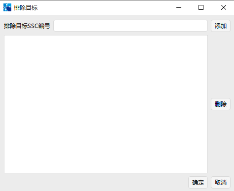

### 规避条件筛选

1. 设置条件约束

   - 在【交会分析门限】中输入需要规避的分析门限值“100km”，则计算后结果仅显示小于此次输入值分析门限值 100km 的数据；

   - 根据航天器与空间目标的相对运动状态，以及任务对计算速度和精度的要求，基于以下表格中的可选项，在【相对轨道预报模型】中选择适用于长时间多圈次的“非线性方程”：

   | 名称         | 算法                   | 选择场景                                             |
   | ------------ | ---------------------- | ---------------------------------------------------- |
   | 线性方程     | C-W 方程               | 相对轨道模型，会损失精度但计算速度较高               |
   | 非线性方程   | 解析非线性相对运动方程 | 精度高于 C-W 模型计算速度低于 C-W 模型               |
   | 解析绝对预报 | Vinti 方法             | 绝对轨道模型，精度最高做大相对运动、较长期预报更适合 |

2. 高级设置

   - 选择【高级设置】中的“过滤器”，根据任务需求，首先勾选使用“轨道历元过期门限”和“远近地点门限”功能；

   - 对具体内容数值进行设置如下所示。注意，可通过不同时间单位置换设定值。

   | 名称             | 默认输入值 | 默认单位 |
   | ---------------- | ---------- | -------- |
   | 轨道历元过期门限 | 2592000    | Sec      |
   | 远近地点门限     | 50000      | m        |
   | 仿真步长分析     | 600        | Sec      |

   - 单击选择【高级设置】中的“等效距离告警门限”；

   - 根据任务需求，设置“黄色告警”和“红色告警”数值如下表所示。单击【确定】。

   | 名称     | 默认值 | 单位 |
   | -------- | ------ | ---- |
   | 黄色告警 | 200    | m    |
   | 红色告警 | 500    | m    |

## 自然交会条件

根据以上步骤，在主界面上完成了各航天器和空间目标数据配置和规避条件筛选。

1. 选择选择【自然交会】功能界面，单击右侧【计算】按钮，得出主目标与次目标的历次接近时刻对应的时间距离信息；

2. 通过计算筛选，功能界面的上栏处得出在自然交会条件下的“最近等效距离”对应的信息：

   | 交会时刻     | 2022/08/05 17:25:54.478 |
   | ------------ | ----------------------- |
   | 最近等效距离 | 52.875m                 |
   | 相对距离     | 412.342m                |
   | 径向距离     | -52.875m                |
   | 横向距离     | -343.620m               |
   | 法向距离     | -221.711m               |
   | 接近角       | 65.715˚                 |

3. 单击【另存为】可保存计算所得的所有数据。

## 机动规划分析

根据航天测控跟踪计划和最近等效距离时的自然交会时刻，输入【控制时刻的前限(BJT)】2022/08/0412:11:49.451 和【控制时刻后限(BJT)】2022/08/04 16:11:49.451；

根据航天器平台机动能力限制和轨道维持约束，确定【半长轴控制量下限】为-100m，【半长轴控制量下限】为 100m。基于以上输入信息，在如下图所示界面实施机动规划分析操作。

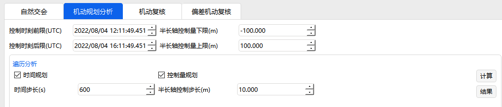

1. 遍历分析

   - 选择遍历分析进行机动规划分析，勾选【时间规划】设定，【时间步长】为“600s”；

   - 勾选【控制量规划】，设定【控制量步长】“10m”；

   - 点击【计算】按钮；

   - 计算完毕后，单击【结果】按键，查看遍历分析结果；

   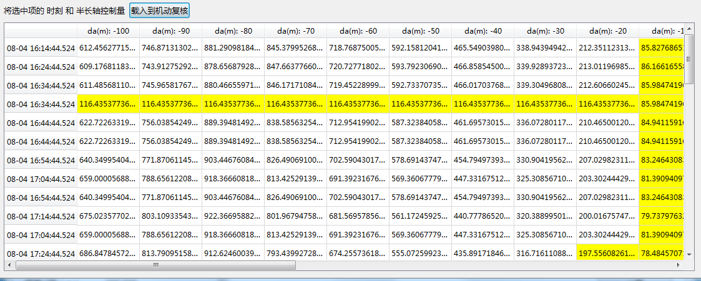

   - 选中需要时刻的“半长轴控制量”，单击右键【查看详情】，查看遍历分析二级详细结果；

   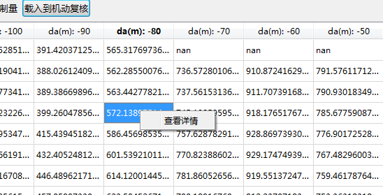

   - 根据所得结果，筛选“2022/08/04 12:41:49.451”控制时刻，对应的“半长轴控制量”为“-40.000m”；

   - 选中该数据，单击【载入机动复核】。

2. 优化算法

   - 选择优化分析进行机动规划分析，输入【规避门限值】为“200m”；

   - 点击【计算】按钮；

   - 得到最优的等效距离所对应的信息：

   | 控制时刻     | 2022/08/04 14:13:19.450 |
   | ------------ | ----------------------- |
   | 半长轴控制量 | -71.757m                |
   | 交会时刻     | 2022/08/05 17:25:53.720 |
   | 等效距离     | 929.811m                |
   | 总距离       | 9298.106m               |
   | 径向距离     | -139.961m               |
   | 横向距离     | 7812.762m               |
   | 法向距离     | 5039.437m               |

   - 计算完毕后，单击【结果】按键，查看优化分析结果；

   - 根据最优时刻数据，单击【载入机动复核】。

## 机动复核

1. 载入到机动复核

   - 点击【载入到机动复核】按键，载入到“机动复核”功能界面中；

   - 检验【控制时刻】为 2022/08/04 12:41:49.451 对应的【半长轴控制量】“-40.000m”,是否是可行的规避控制策略；

   - 点击【计算】按钮；

2. 结果展示

   - 根据计算结果可以得出，在前后多个轨道圈次内，该策略满足规避效果约束；

   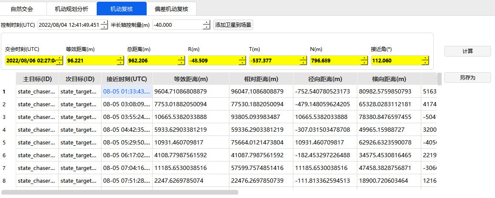

   - 点击数据【另存为】功能，存储 txt 格式数据。

## 偏差机动复核

1. 载入机动复核

   - 通过机动规划分析后，点击【载入到机动复核】按键，载入到“偏差机动复核”功能界面中，

   - 检验数据。

   检查【控制时刻】“2022/08/04 14:13:19.450”对应的【半长轴控制量】“-71.757 m”，是否是可行的规避控制策略；

2. 估算半长轴偏差

   - 点击【半长轴偏差估算】按钮，根据具体航天器的性能进行估算，默认输入为以下表格数值：

   | 名称              | 均值 | 标准差 3σ |
   | ----------------- | ---- | --------- |
   | 发动机推力（N）   | 100  | 3         |
   | 航天器质量（kg）  | 100  | 0.3       |
   | 开机时长（sec）   | 1    | 0.03      |
   | 推力方位角（deg） | 0    | 0.003     |
   | 推力俯仰角（deg） | 0    | 0.003     |

   - 单击“半长轴偏控制偏差结算”页面的【计算】按钮，得到【半长轴标准差 3σ（m）】结果为“76.8550912058161”；

   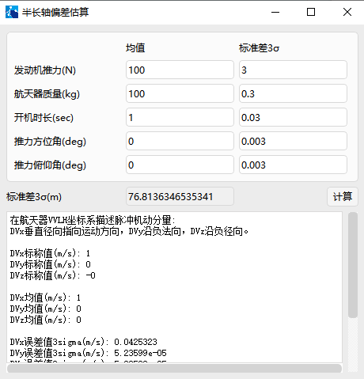

   - 关闭该页面，计算出的“半长轴标准差 3σ”数值直接载入“偏差机动复核”功能界面【半长轴标准差 3σ（m）】的输入框中。

   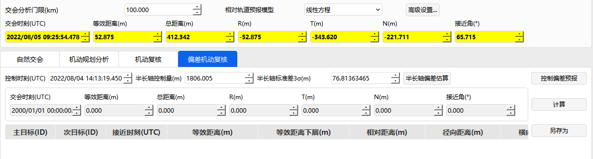

3. 控制偏差预报

   - 点击“偏差机动复核”功能界面的【计算】按钮；

   - 根据偏差机动复核结果，单击【控制偏差预报】按键，设定“预报时长”为 86400s，“预报步长”为 60s；

   - 单击“控制偏差预报”的【计算】按钮，直接生成相应的“坐标图”和“表格”，查看偏差预报的详细情况；

   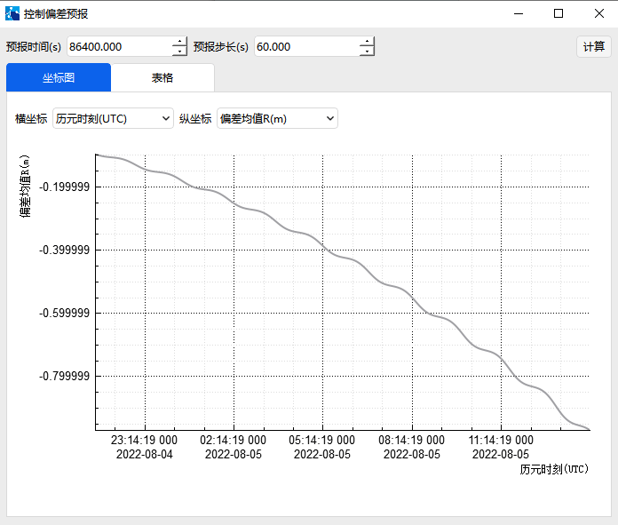

   - 单击【坐标图】，根据需求选择合适的“横坐标”和“纵坐标”，查看偏差预报坐标图；

   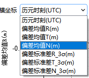 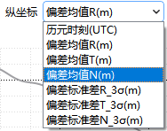

4. 查看结果与存储

   - 单击【表格】功能，查看控制偏差预报的具体数值；若需重新预报则再次输入数值，即可重新生成坐标图和表格数据；

   - 单击【另存为】，存储控制偏差预报的 txt 格式数据结果。

   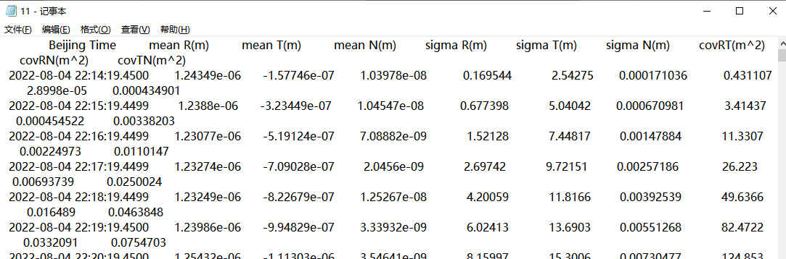

   - 根据输入的控制时刻、半长轴控制量和半长轴标准差，单击【计算】按钮，通过结果可以得出，在前后多个轨道圈次内，验证该机动策略是否满足规避效果约束；

   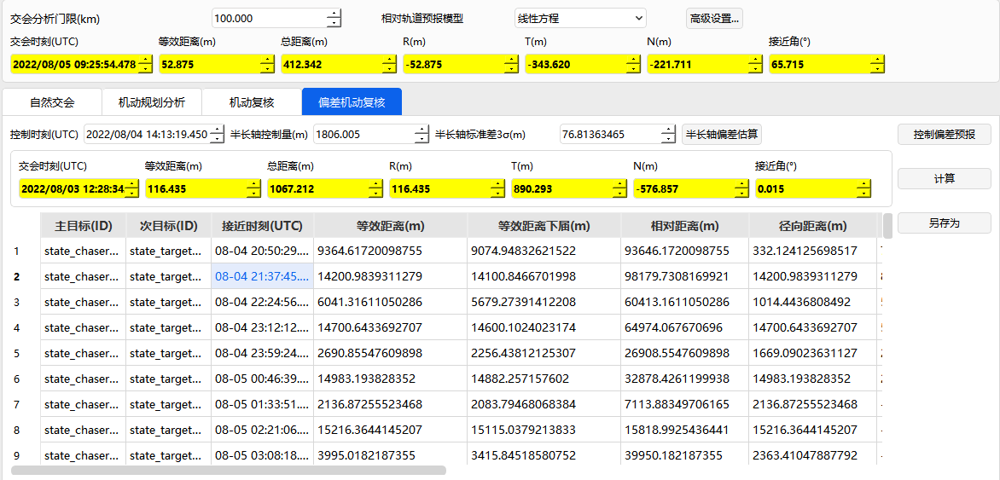

   - 点击【另存为】功能，存储 txt 格式数据。

   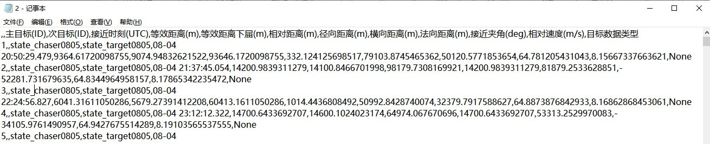