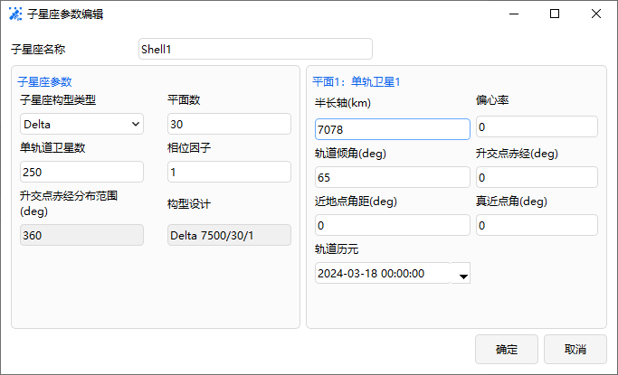
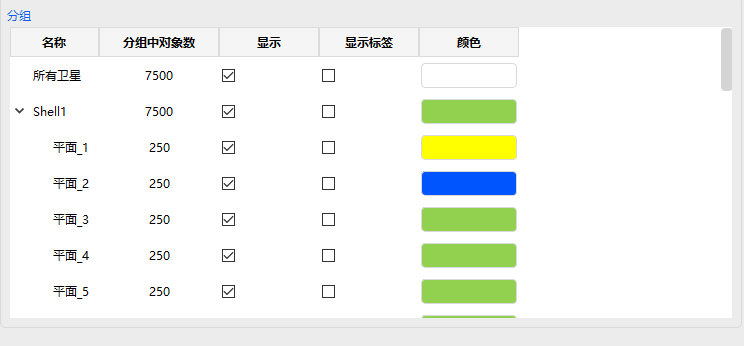

# 巨型星座设计案例

## 案例想定

本案例构想设计一个超过 7000 颗卫星的低轨巨型星座。种子卫星轨道高度为 700km，轨道倾角为 65°的圆形轨道。星座包含 30 个轨道平面，每个轨道平面包含 300 颗卫星。采用 walker 星座构型

## 星座构型说明

本星座设置 30 个轨道面，每个轨道面 250 颗卫星，轨道高度 700km，轨道倾角 65°。

## 创建任务场景与对象

1. 新建想定

运行 ATK.exe，点击【新建一个想定文件】新建一个想定 “HugeConstellation”。

2. 设置仿真时间

   - 在“ATK：新建想定向导”弹窗中设置时间段

   | 开始历元(UTC)       | 结束历元(UTC)       |
   | ------------------- | ------------------- |
   | 2024-03-18 00:00:00 | 2024-03-19 00:00:00 |

   - 点击【确定】完成场景的建立

3. 创建及编辑巨型星座对象

   - 点击工具栏【开始】中的【插入】创建卫星集群对象。
   - 选择“想定对象”——“卫星集群” ，“选择插入方式”——“插入默认类型”，点击【插入…】，点击【关闭】。

## 设置工作星轨道参数

右键单击对象“SatelliteCollection1”，选择【属性】，出现卫星集群参数设置界面，上半部分为 Walker 星座参数设置、下半部分为分组属性设置。

1. Walker星座设置

   - 轨道预报器选择“二体”
   - 双击“Shell1”设置 Walker 星座属性。参数设置如图所示。点击“确定”，退出属性设置。

   

   - 分组设置卫星显示属性：可以统一设置整个星座的展示，也可以分轨道面设置卫星的展示形式。所有卫星设置为绿色，单击 shell1 左侧箭头展示所有轨道面，设置平面 1 为黄色，平面 2 设置为蓝色，去除勾选“所有卫星-显示标签”如图所示。点击“确定”完成设置。

   

2. 运行场景

   点击“开始- ”运行场景，可以看到平面 1/2 分别为黄色与蓝色，其他轨道面默认为绿色，如图所示。

   

