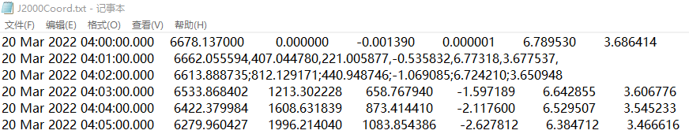
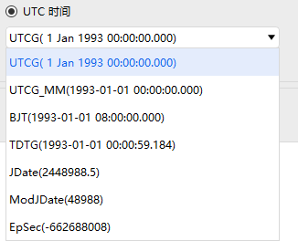
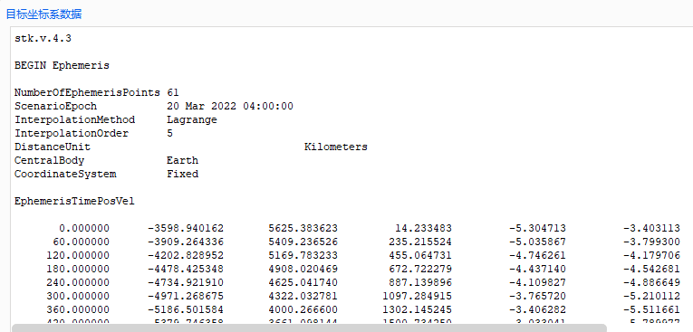
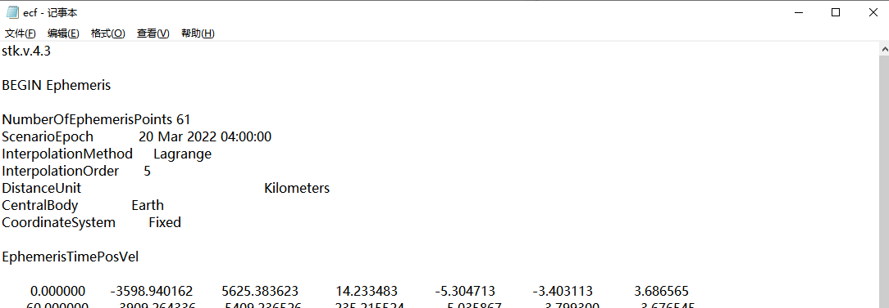
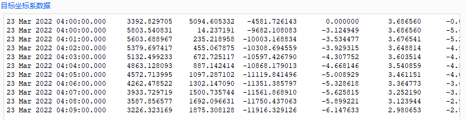
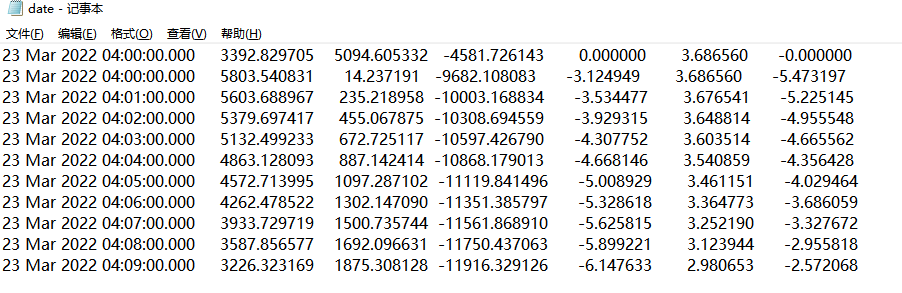

# 批量坐标转换案例

创建场景之后进入初始界面。在 ATK 界面上方点击【工具】，单击【批量坐标转换】按钮，进入“批量坐标转换”界面。可进行“J2000 地心惯性系坐标转为 ECF 地固系坐标”与“ECF 地固系坐标转为 ENU 东北天坐标系坐标”的案例操作。

## J2000 地心惯性系坐标转为 ECF 地固系坐标

### “计算模式”选择

1. 打开坐标批量转换界面，选择“导入文件类型” ——“TXT 文件”；

2. 点击【…】按钮，选择 J2000 地心惯性坐标系“J2000Coord”文件，路径为“…\\ATK\\AtkInput\\CoordTrans\\J2000Coord.txt”，格式如图所示：

导入后的 J2000 地心惯性系坐标会显示到“源坐标系数据”框内。

### “时间选项”选择

“时间选项”，默认勾选UTC时间，“时间模式”下拉列表中小括号内是具体的时间格式，选取UTCG时间格式，从导入的源文件中获取前4列数据作为time值，BJT时间格式占2列，JDate时间格式只占1列，切换时间格式时，根据时间格式读取源坐标系数据。

勾选相对时间，导入源文件只有第一列数据选取为time，相对初始时间可在下方文本框中编辑，默认: 1993-01-01 00:00:00.00。（注意：本案例仍选用UTC时间）

### “转换参数”选择

1. 选择“时间”、“位置”和“速度”作为转换参数；

2. “长度单位”选择 km ，“时间单位”选择 s。

当所选参数发生变动时，根据所选参数读取源坐标系数据。位置x、y、z各占1列，速度vx、vy、vz各占1列，时间time占1~4列，当导入文件数据列数少于所选参数所占列数之和时，读取不到数据。当选择时间和速度时，如果时间占4列，那么从源文件中读取的第5、6、7列分别对应速度的vx、vy、vz。

### “源坐标系”选择

源坐标系的选择有“新建”与“选择”两种方式，另外从下拉列表可以选择常用坐标系，默认是“地球 天体固连系”，此处选择“地球 J2000历元地球平赤道系”，与导入文件“ J2000Coord.txt” 格式对应。

### “目标坐标系”选择

选择“目标坐标系”——“地球 天体固连系”。目标坐标系的选择有“新建”与“选择”两种方式，另外从下拉列表可以选择常用坐标系，默认是“地球 天体固连系”。

### 坐标转换

点击【计算】按钮，“目标坐标系数据”将显示转换后的 ECF 地固系坐标，如图所示：

### 文件导出类型

1. 选择“导出文件类型”—— “TXT 文件”；

2. 点击【导出】按钮，选择路径，数据文件格式为 TXT。

## ECF 地固系坐标转为 ENU 东北天坐标系坐标

### “计算模式”选择

1. 打开坐标批量转换界面，选择“导入文件类型” ——“TXT 文件”；

2. 点击【…】按钮，选择 ECF 地固系坐标“ECF.txt” 文件，路径为“XX\\ATK\\ AtkInput\CoordTrans\\ECF.txt”，格式如图所示：

导入后的数据会显示到“源坐标系数据”框内。

### “时间选项”选择

勾选“历元时间”， 时间格式设置为【】。

### “转换参数”选择

1. 选择“时间”、“位置”和“速度”作为转换参数；

2. “长度单位”选择 km ，“时间单位”选择 s。

### “源坐标系”选择

源坐标系与导入文件“ECF.txt”格式对应，选择“源坐标系”——“地球 天体地固系”。

### “目标坐标系”选择

1. 选择“目标坐标系”——“东北天坐标系”；

2. 弹出的经度（°）、纬度（°）、高度（m）的输入如下：

    | 项目           | 数值  | 单位 |
    |----------------|-------|------|
    | 经度     | 0     | deg  |
    | 纬度     | 0     | deg  |
    | 高度     | 0     | m    |

### 坐标转换

点击【计算】按钮，转换为 ENU 东北天坐标。

### 文件导出类型

1. 选择“导出文件类型”—— “TXT 文件”；

2. 点击【导出】按钮，选择路径，数据文件格式为 TXT。

