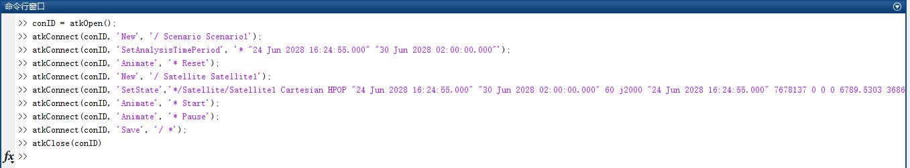
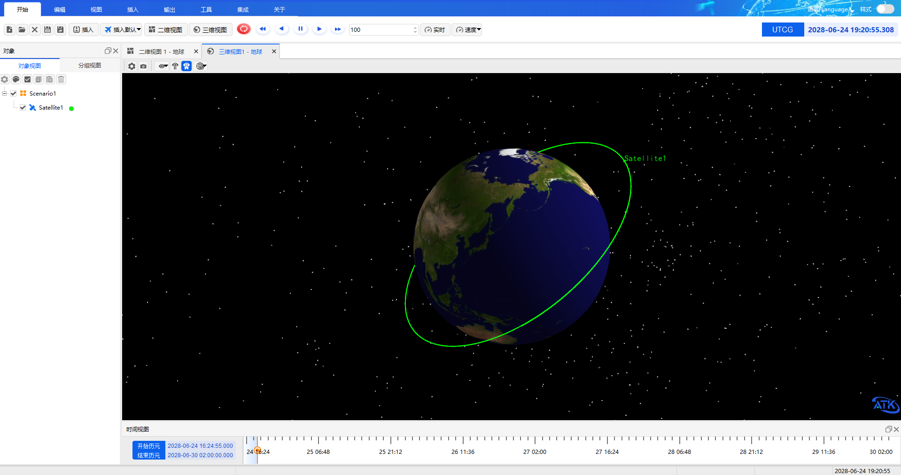

# 二次开发案例
<PathViewer
  :relative-paths="files"
  storage-key="yangyang_test"
/>

## 案例想定

本案例通过二次开发 Connect 模式，使用 Matlab 接口，新建场景和卫星对象并运行。注意必须保持 ATK 为打开状态。具体内容包括：

1. 打开 Matlab，打开命令行窗口。
2. 输入连接语句，与 ATK 进行连接。
3. 新建场景，设置场景属性。
4. 新建对象，设置对象属性。
5. 运行。
6. 保存场景后与 ATK 断开连接。

## 脚本展示



1. 打开 Matlab，打开命令行窗口；

2. 输入连接语句，与 ATK 进行连接；

```matlab
%与 ATK 进行连接， IP 地址请输入本机地址，示例中为 127.0.0.1。端口号默 认为 6655
conID = atkOpen('127.0.0.1',6655);
```

3. 新建场景，设置场景分析时间；

```matlab
%新建一个名为 Scenario1 的场景
atkConnect(conID, 'New', '/ Scenario Scenario1');
%设置场景分析时间段，并重置界面
atkConnect(conID, 'SetAnalysisTimePeriod', '* "24 Jun 2028 16:24:55.000" "30 Jun 2028 02:00:00.000"');
atkConnect(conID, 'Animate', '* Reset');
```

> [!tip]
> 需要保证ATK没有打开场景，否则无法新建Scenario1场景，代码报错

4. 新建卫星，设置卫星属性；

```matlab
%新建卫星
atkConnect(conID, 'New', '/ Satellite Satellite1');
%设置卫星属性
atkConnect(conID, 'SetState','*/Satellite/Satellite1 Cartesian HPOP "24 Jun 202 8 16:24:55.000" "30 Jun 2028 02:00:00.000" 60 J2000 "24 Jun 2028 16:24:5 5.000" 7678137 0 0 0 6789.5303 3686.414174');
```

5. 运行；

```matlab
%开始仿真
atkConnect(conID, 'Animate', '* Start');
```



6. 暂停仿真；

```matlab
%暂停仿真
atkConnect(conID, 'Animate', '* Pause');
```

7. 结束仿真并重置仿真时间；

```matlab
%结束仿真并重置仿真时间
atkConnect(conID, 'Animate', '* Reset');
```

8. 仿真结束后，可以保存场景并与 ATK 断开连接（注：仿真运行过程中无法保存场景）。

```matlab
%保存此场景
atkConnect(conID, 'Save', '/ *');
%与 ATK 断开连接
atkClose(conID);
```

<script setup>
import PathViewer from "@components/PathViewer/PathViewer.vue";

const files = [
  { path: 'Help\\Examples\\08-二次开发案例', name: '二次开发案例' },
  { path: 'Help\\Examples\\08-二次开发案例\\ATK_Matlab_Connect.m', name: 'Matlab二次开发脚本' },
  { path: 'Help\\Examples\\08-二次开发案例\\MatlabScenario.atk', name: '二次开发生成场景文件' },
  { path: 'Help\\Examples\\08-二次开发案例\\Matlab运行结果.png', name: 'Matlab驱动ATK运行结果' }
];
</script>