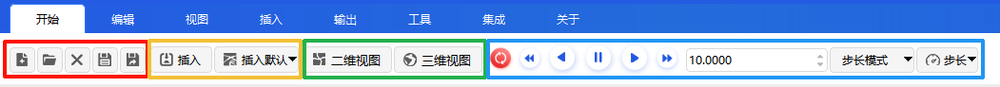
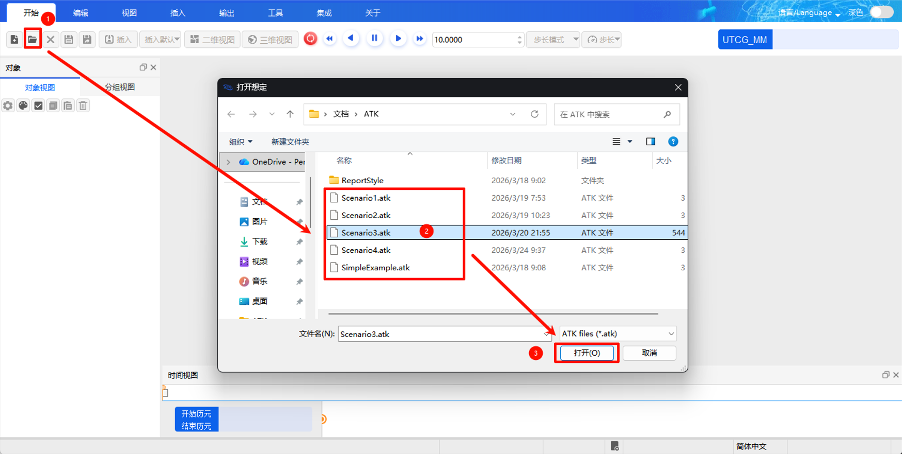

# 开始

点击 **【开始】** 菜单，可展开以下功能工具集：

- **文件操作**：[新建](#新建)、[打开](#打开)、[关闭](#关闭)、[保存](#保存)、[另存为](#另存为)
- **对象插入**：[插入](#插入)、[插入默认](#插入默认)
- **视图**：[二维视图](#二维视图)、[三维视图](#三维视图)
- **仿真控制**：[开始](#仿真控制)、[暂停](#仿真控制)、[重置](#仿真控制)、[播放速度加减](#仿真控制)、[速度输入框](#仿真控制)、[步长模式键](#仿真控制)、[步长键](#仿真控制)等

## 文件操作

### 新建

点击<kbd >新建</kbd>，弹出 **【ATK: 新建场景向导】** 对话框。

按向导提示，选择场景的中心天体，即可快速完成新场景的创建。

### 打开

点击<kbd >打开 </kbd>，弹出默认的场景文件目录。场景文件默认以 `.atk` 格式保存。选中需要打开的想定文件，即可恢复之前的场景设定。

### 关闭

点击<kbd >关闭 </kbd>，关闭当前正在编辑的想定。

### 保存

点击<kbd >保存 </kbd>，保存当前想定的修改。

### 另存为

点击<kbd >另存为 </kbd>，弹出保存目录对话框。可输入文件名并选择保存格式（支持 `.atk`、`.xml`、`.txt`），默认保存为 `.atk` 格式。将当前场景另存为新文件。

## 对象插入

### 插入

详情请见 [插入](./04-插入.md#插入)

### 插入默认

详情请见 [插入默认](./04-插入.md#插入默认)

## 视图

### 二维视图

点击，弹出二维视图窗口。具体功能说明请参考 [视图-二维视图](./03-视图.md#二维视图)。

### 三维视图

点击，弹出三维视图窗口。具体功能说明请参考 [视图-三维视图](./03-视图.md#三维视图)。

## 仿真控制

仿真控制模块提供仿真过程的运行控制功能，包括开始、暂停、重置、播放速度调节、步长模式切换等。详细说明请参见 [执行仿真](./3-执行仿真.md)。
