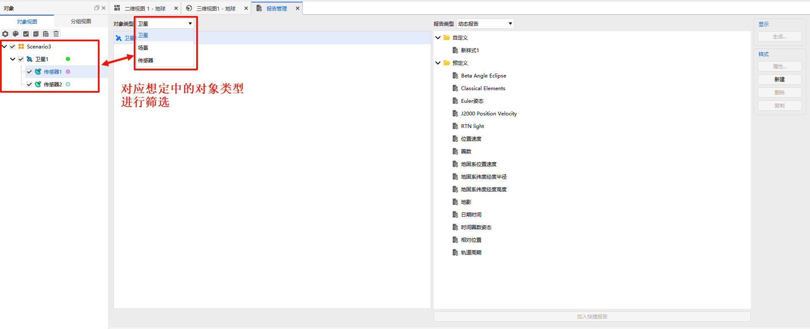
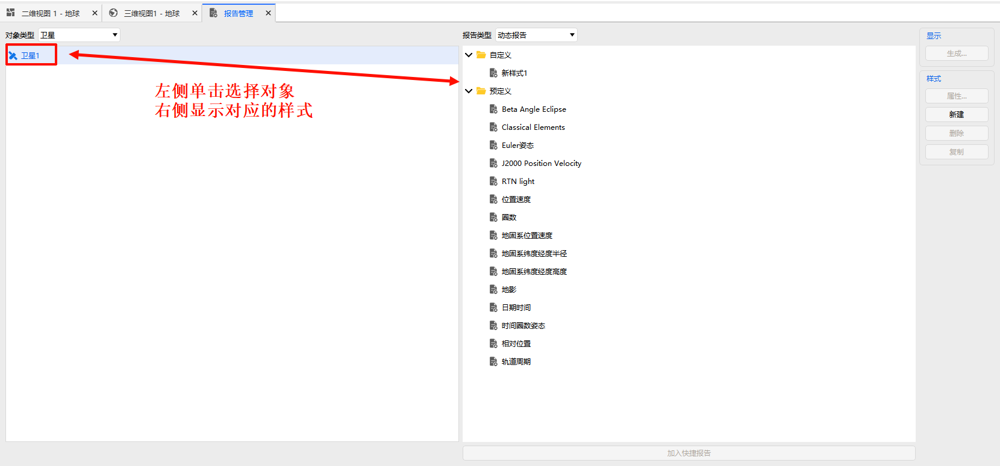
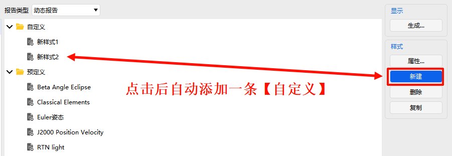
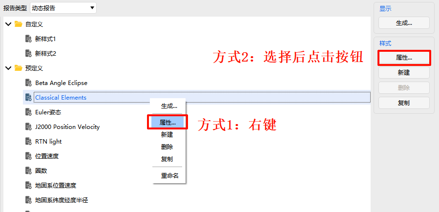
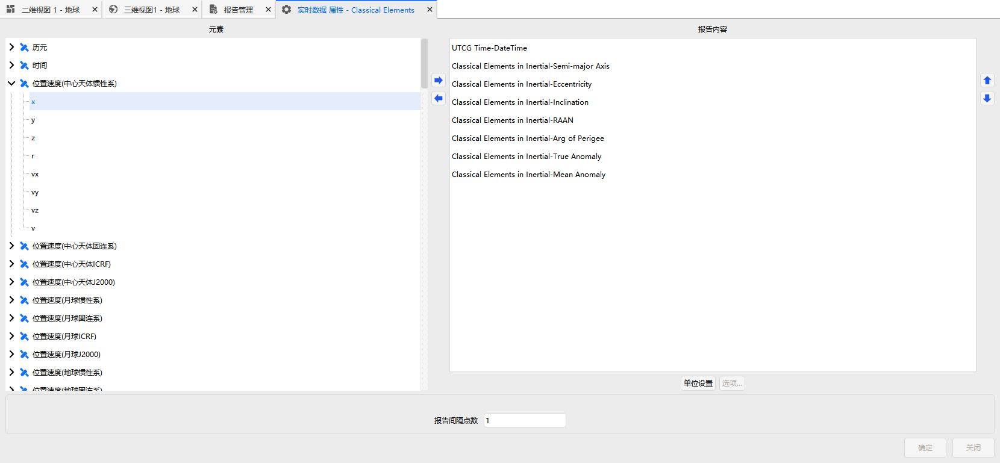
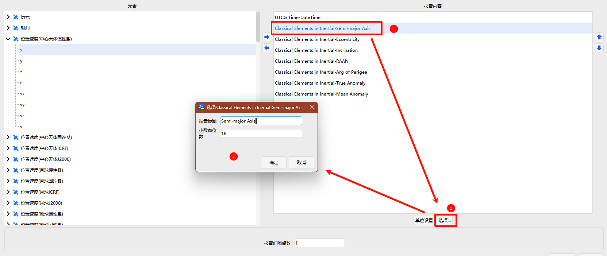
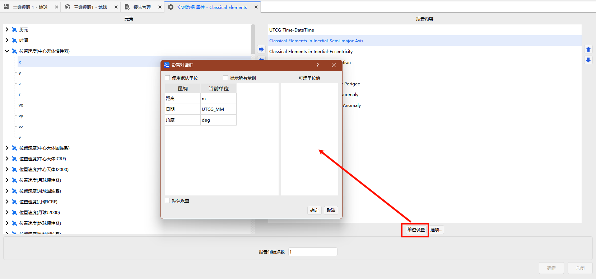

# 报告管理

## 对象选择

窗口**左侧**为对象选择区：

- 通过【对象类型】下拉框筛选对象（可选择场景或场景中的具体对象）
- 选中所需对象后，右侧即可为该对象配置报告样式

## 报告类型

窗口**右侧**顶部为【报告类型】下拉框，可选：

- [动态报告](#动态报告)
- [数据报告](#数据报告)
- [曲线图表](#曲线图表)

> [!NOTE]
>
> 从输出菜单点击打开时，会自动切换到对应的报告类型，后续也可在此手动切换。

## 样式管理

样式列表位于窗口右侧中部，包含两类样式：

- **预定义样式**：系统内置，不可删除
- **自定义样式**：用户新建，可删除

### 新建样式

点击 <kbd>新建</kbd> 按钮，创建一个空白自定义样式。

### 编辑样式

1. 选中任意样式（预定义或自定义）
2. 点击右侧 <kbd>属性...</kbd> 按钮，进入 [属性编辑界面](#属性编辑界面)

### 删除样式

仅限自定义样式：选中后点击右侧 <kbd>删除</kbd> 按钮。

### 复制样式

选中任意样式，点击右侧 <kbd>复制</kbd> 按钮，可快速生成一个配置相同的新样式（新样式为自定义样式）。

> [!CAUTION]
>
> 未选中任何样式时，右侧操作按钮为不可用状态。

## 属性编辑界面

在【属性编辑界面】中，可以定义报告包含哪些属性、显示顺序、名称及单位。

### 添加属性

- 左侧为**可选属性列表**
- 双击某属性，或单击后点击右箭头 ，即可将该属性添加到右侧“报告内容”栏目

### 删除属性

- 在“报告内容”栏目中，双击某属性
- 或单击后点击左箭头 ，即可移除该属性

### 排序属性

- 在“报告内容”栏目中单击选中某属性
- 通过上下箭头  调整显示顺序

### 重命名与单位设置

- 在“报告内容”栏目中选中某属性，点击 <kbd>选项...</kbd> 按钮，可对该属性进行重命名和单位设置

### 全局单位设置

- 点击 <kbd>单位设置</kbd> 按钮，打开【设置对话框】
  - 勾选 <kbd>使用默认单位</kbd>：一键恢复所有属性的默认单位
  - 勾选 <kbd>显示所有量纲</kbd>：查看所有可用的量纲
  - 勾选 <kbd>默认设置</kbd>：将当前单位设置保存为下次新建报告时的默认值

### 报告间隔点数

报告间隔点数为无单位数值，表示从底层星历序列输出报告时，每隔多少个时间点输出一条数据。

> [!NOTE]
>
> 示例：若预报器步长为 60s，间隔点数设为 2，则报告实际时间间隔为 120s。
> 如需直接按时间间隔输出，可使用 VGT 数据报告功能，该模块支持直接设置输出时间间隔并自动插值。

## 生成报告

样式配置完成后，可通过以下任一方式生成对应报告或图表：

- 在样式列表中双击某样式条目
- 选中某样式条目，点击 <kbd>生成...</kbd> 按钮

生成的报告类型由当前【报告类型】下拉框决定。