# 创建场景

## 场景的功能介绍

### 场景是什么？

场景是使用 ATK 仿真建模的一个分析或操作任务的实例工况，在 ATK中，场景用“”图标表示“场景”。

### 设置场景属性

选中“对象视图” —【 】图标，在右侧属性信息栏可以设置其属性信息，包括仿真时间、地球数据、地形、场景保存、二维和三维视图设置等。场景属性中包含的信息可用于创建报告和执行其他分析任务。

在 ATK中卫星、飞机、火箭、导弹、舰船、潜艇、恒星、行星、地面站、车辆、传感器、接收器和发射器、高级接近分析等都是可以在场景里构成场景对象的模型。

## 菜单栏介绍

菜单栏有开始，编辑，视图，插入，输出，工具，集成和关于等子菜单，选中卫星对象时还会动态出现“卫星”栏。

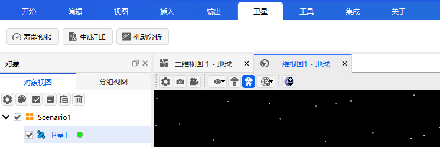

### 开始

点击“开始”菜单选项，里面包括新建、打开、关闭、保存、另存为、插入、插入默认、二维视图、三维视图（二维和三维视图介绍详见视图菜单栏）以及仿真演示动画的开始、暂停、停止、播放速度加减键、速度输入框、步长模式键、步长键等子项。

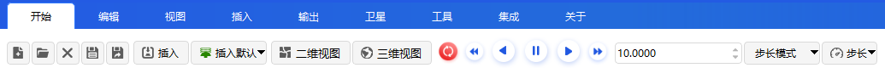

1. 新建

点击【新建】场景按钮，即可弹出 ATK 新建想定向导界面。

新建场景向导对话框旨在帮助用户简化创建、组织 ATK 场景的过程；支持新建场景中心天体的选取。

2. 打开

单击【打开】按钮，会弹出默认保存的想定场景文件的目录，场景文件的保存格式为.xml。选中已经保存的 XML 文件，点击打开即可复现之前保存的场景设定了。

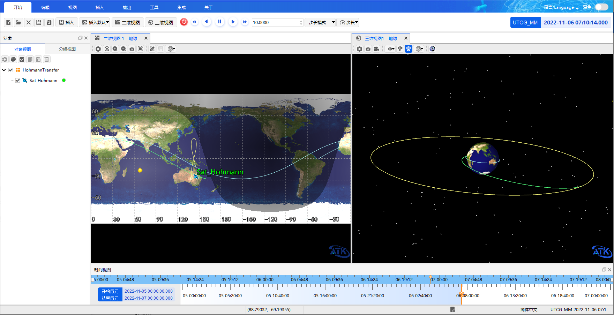

3. 保存

单击【保存】按钮，会保存想定场景文件。

4. 另存为

单击【另存为】按钮，会弹出保存的想定场景文件的保存目录，输入保存文件的文件名，选择保存的类型，即可保存想定场景文件了。

5. 插入

点击【插入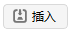】按钮，在 ATK想定场景文件中，可以选择插入场景对象：高级接近分析、飞机、区域目标、链路、集群、覆盖定义、地面站、车辆、火箭、导弹、行星、卫星、卫星集群、卫星系统、舰船、恒星和潜艇等以及附加对象：天线、品质因子、接收器、发射器和传感器等（注意: 附加对象中的品质因子只能插入到覆盖定义对象下，其他附加对象只能插入到飞机、地面站、车辆、火箭、导弹、卫星、舰船和潜艇等对象下）；同时，支持插入对象中心天体的选取。

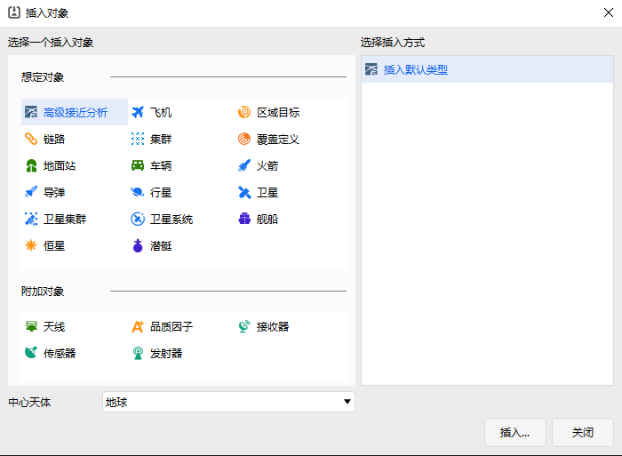

6. 插入默认

点击【插入默认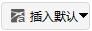】按钮，会弹出如下提示框，可以选择默认插入对象为高级接近分析、卫星、地面站、舰船等对象，下次点击按钮即可插入默认对象。算是默认对象插入的快捷方式。

7. 二维视图

点击【二维视图】按钮，弹出二维视图窗口。具体说明详见视图菜单

8. 三维视图

点击【三维视图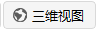】按钮，弹出三维视图窗口。具体说明详见视图菜单

9. 动画演示模块

(详细说明见 [执行仿真](./3-执行仿真.md) )

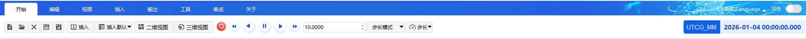

### 编辑

点击“编辑”菜单选项，里面包括复制、粘贴、删除、属性四个子项。其中复制、粘贴、删除三个子项均可通过键盘快捷键进行等效操作。

1. 复制

【复制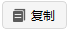】按钮，通常情况下是置灰的不可用状态，当在左侧场景对象栏中选中对象，然后点击【复制】按钮或选中对象右击选择复制，然后点击粘贴按钮或从对象处右击选择粘贴进行粘贴。

2. 粘贴

【粘贴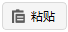】按钮，通常情况下是置灰不可用状态，当在左侧场景对象栏中选中对象复制后，然后点击【粘贴】按钮进行粘贴，或者从对象处右击选择粘贴，然后选择的对象就会粘贴到场景中。

3. 删除

【删除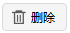】按钮，通常情况下是置灰不可用状态，当在左侧场景对象栏中选中对象后，然后点击【删除】按钮或者从对象处右击选择删除，选中的对象即可从场景中移除了。

4. 属性

【属性】按钮，在左侧场景对象栏中选中“对象”后，然后点击【属性】按钮或者选中“对象”右击选择【属性】，就会弹出选定对象的属性设置页面，便可修改对应对象的属性。

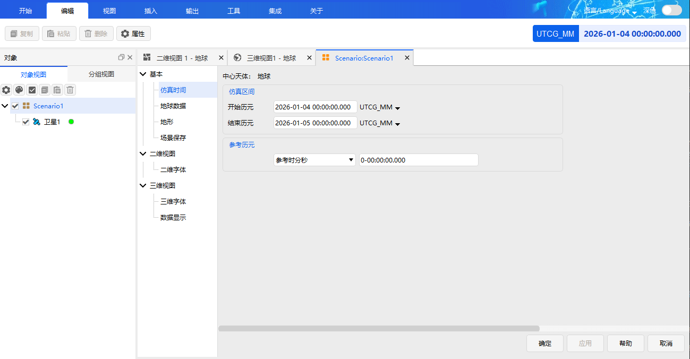

### 视图

“视图”菜单选项包括五个子菜单：对象视图、消息视图、时间视图、二维视图、三维视图。

1. 对象视图

对象视图，是直观反映该想定场景上的对象情况的窗口。单击【对象视图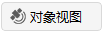】按钮，即可看到想定场景等对象内容。“对象”已经默认显示在整个视图的左侧，再次单击，则会隐藏对象窗口。【分组视图】也在对象窗口里面，可以对对象进行分组管理。

2. 消息视图

消息视图，是用来提示反馈软件操作信息的窗口，在界面上的编辑操作会有相应的提示信息在“消息”窗口显示。

单击【消息视图】按钮，即可看到消息提示等内容。“消息”已经默认显示在整个视图的下侧，再次单击，则会隐藏“消息”窗口。

3. 时间视图

时间视图展示了想定场景的起止时间。鼠标按住黄色滑块可拖动进度，松开即设置为该进度。单击【时间视图】按钮，则会隐藏时间视图。

4. 二维视图

二维视图，是用来直观的显示该想定场景在仿真过程中的各个对象地球投影点的二维运动状态信息的窗口。单击【二维视图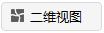】按钮，即可看到想定对象二维的位置显示信息，再次单击则会增加一个二维窗口显示。目前新建想定文件后二维视图默认处于打开状态。

5. 三维视图

三维视图，是用来直观的显示该想定场景在仿真过程中的各个对象三维运动状态信息的窗口。单击【三维视图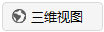】按钮，即可看到地球及其他对象的三维显示状态，再次单击则会增加一个三维窗口显示。目前新建想定文件后三维视图默认处于打开状态。

### 插入

“插入”菜单下有四个子菜单：插入、插入默认、从数据库、星座，其中插入、插入默认已在前文“开始”菜单介绍，这里不再赘述。

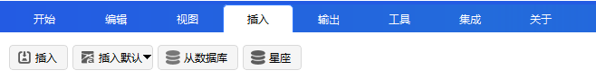

1. 从数据库

点击【从数据库】按钮，弹出查询标准对象数据库的界面，可以通过设置相关参数信息并点击【搜索】按钮，查找到自己想要的对象数据信息，再选中想要插入的对象点击【插入】即可。

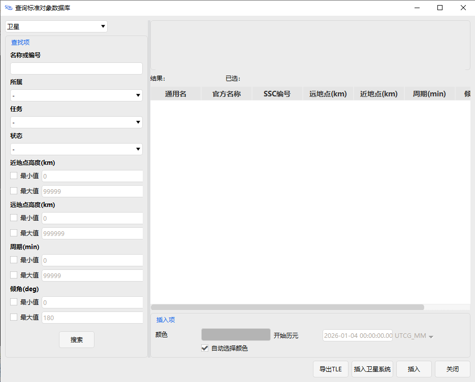

2. 星座

点击【星座】按钮，弹出星座插入界面，点击下拉列表显示 北斗、天链、伽利略、格洛纳斯、GPS、DSP，点击选中想要插入的对象点击【插入】即可。

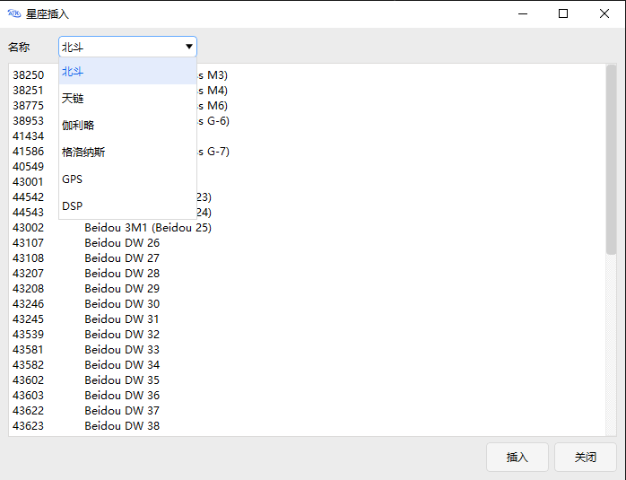

### 输出

“输出”菜单下有动态报告、数据报告、曲线图表、快捷报告和数据文件五个子菜单。具体操作报告详见 [查看图文报告](./6-查看图文报告.md) 的描述。

1. 动态报告

动态报告，是指场景运行过程中实时显示的所选择对象的报告信息的动态展示，用户能够查看到选定对象在场景运行过程中的状态变化。

2. 数据报告

数据报告，是指选定对象在当前选定时间的所有数据信息的静态汇总。用户能够查看到选定对象在一定时间内的更改。

3. 曲线图表

曲线图表，是指选定对象在当前选定时间的仿真期间所有数据信息汇总所绘制出来的曲线图表，这样显示的优势在于更直观方便的对比数据信息。

4. 快捷报告

快捷报告，是指选定对象在当前选定时间的所有数据信息的快捷显示方式。

需要在数据报告界面将配置好的数据报告点击【加入快捷报告】，将其加入到快捷报告中，后面直接点击【快捷报告】按钮就可以显示相应的数据报告了，否则直接点击【快捷报告】按钮显示为空。

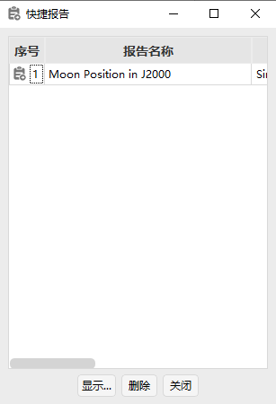

5. 数据文件

数据文件，是指相应对象在仿真过程中的星历数据输出功能，可以实现对星历类型、坐标系、数据周期、步长以及输出文件的名称和格式进行设置。

### 卫星

选中对象为卫星时，菜单栏会自动显示“卫星”菜单，“卫星”菜单选项包括寿命预报、生产TLE、机动分析等工具模块。各个工具的使用指南详见下章 [ATK专业使用指南](../5.专业使用指南/)。

### 工具

“工具”菜单选项包括TLE下载、可见性、覆盖性、区域覆盖、批量坐标转换、星座设计、高级星座设计、接近分析、碰撞规避、再入回收、矢量几何工具等工具模块。各个工具的使用指南详见下章 [ATK专业使用指南](../5.专业使用指南/)。

### 集成

“集成”是二次开发工具包，有开发包、客户端、控制台和UI录制四个子项。

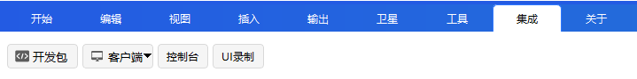

1. 开发包

点击【开发包】按钮，会弹出 ATK 的 connect 文件夹路径，可以根据相应的需求选择进行二次开发的内容。

2. 客户端

点击【客户端】按钮，会弹出 ATK 的 ATKClient客户端的对话框，可以根据相应的需求选择进行参数配置和二次开发的内容。

3. 控制台

点击【控制台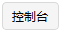】按钮，会弹出ATK的Console界面，可以使用二次开发命令实现对ATK软件的操作。

4. UI录制

点击【UI录制】按钮，会弹出ATK的Ui Recoder界面，点击【Strat Recode】按钮，即可对接下来在ATK软件中的操作过程进行录制，点击【Stop Recode】按钮完成录制，录制结束后，可以对录制好的操作过程进行回放、保存、加载、清理等操作。

### 关于

“关于”里面有设置、关于ATK、ATK帮助三个子选项。

1. 设置

点击【设置】按钮，可以设置场景的下次打开可视化是否开启二维三维。

2. 关于ATK

点击【关于ATK】按钮，可以查看到 ATK 的版本号信息，以及 ATK产品的版权等信息。

3.  ATK帮助

点击【ATK帮助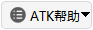】按钮，将会看到 ATK 使用说明文档。

## 操作流程

### 创建新场景

1. 创建场景

从菜单项选择“开始”—【新建】，或者在软件打开时使用“新建一个想定文件”进行创建；

2. 保存场景

点击“开始”菜单选择【保存】按钮，即可保存当前的场景信息。在保存场景时，场景中的每个对象信息将被保存，场景本身的信息也将被保存，场景文件后缀为“.xml”。

### 打开一个场景

（1）点击“开始”—【打开】按钮，弹出打开想定文件目录框;

（2）选中需要的场景（.xml文件），点击【打开(O)】按钮；

（3）场景信息自动复现。

### 场景属性配置

场景定义了其对象的基本属性，你可以根据喜好配置场景的基本属性和可视化属性。

#### 基本

场景的基本属性包括仿真时间、地球数据、地形和场景保存等内容设置。

1. 仿真时间

场景仿真时间可以设置仿真区间和参考历元。

|    |    |
|--- |--- |
|仿真区间 |设置开始历元和结束历元， 在相应下拉框中选择相应的时间模式并根据时间模式设置详细的时间内容|
|参考历元 |用于对比参考时间模式， 在下拉框中选择相应的参考时间模式，右侧设置相应的时间内容|

2. 地球数据

这里可以进行地球方向参数的设置，包括设置开始时间、结束时间和数据文件。

3. 地形

这里可以对不同中心天体的地形数据进行增加，删除和修改。

4. 场景保存

这里可以设置是否保存场景历史数据。

#### 二维视图

场景的二维可视化属性可以设置二维字体属性。

二维字体将在二维窗口进行显示，可以选择系统字体库下的字体，设置字体大小，是否加粗，是否斜体，是否显示字体样式外框，设置字体颜色等内容。

在二维图形窗口中配置字体的显示，并对文本应用轮廓，以提高更改地图颜色的可读性。

字体设置方法：

（1）点击下拉箭头选择字体。

（2）从下拉框中选择一个大小。

（3）使用按钮选择粗体、斜体或两者都不选择。

（4）在样式下拉菜单中，无轮廓选择“无”或“显示”。

### 三维视图

场景的三维可视化属性可以设置三维字体和数据显示属性。

1. 三维字体

三维字体将在三维窗口进行显示，可以选择系统字体库下的字体，设置字体大小，是否加粗，是否斜体，是否显示字体样式外框，设置字体颜色等内容。

在三维图形窗口中配置字体的显示，并对文本应用轮廓，以提高更改地图颜色的可读性。

字体设置方法：

（1）点击下拉箭头选择字体。

（2）从下拉框中选择一个大小。

（3）使用按钮选择粗体、斜体或两者都不选择。

（4）在样式下拉菜单中，无轮廓选择“无”或“显示”。

2. 数据显示

可选择添加的数据有：“Moon Position in J2000”、“仿真信息”、“时间步长”，并且可以设置添加的数据是否在三维窗口进行显示。

可以对添加的数据进行删除或修改，可以修改的内容包括数据显示的位置、背景颜色和边框颜色等。