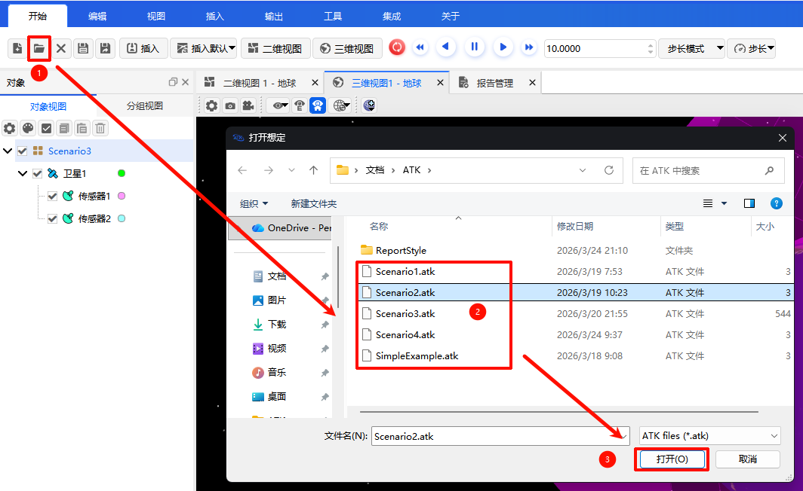

# 打开场景

打开已有场景的步骤如下：

1. 点击【开始】菜单，选择 <kbd>打开</kbd>  按钮，弹出【打开想定文件】对话框。

2. 在【打开想定】对话框中，选中需要打开的想定文件（文件后缀为 `.atk` 或 `.xml`），点击 <kbd>打开</kbd> 按钮。

   

3. 场景信息将自动加载并恢复。

> 开始菜单详细说明请参考：[开始](../01-菜单栏介绍/01-开始.md)
>
> 开始菜单打开按钮详细说明请参考：[开始-打开](../01-菜单栏介绍/01-开始.md#打开)
