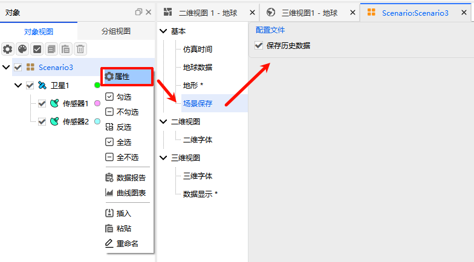

# 场景保存配置

场景保存配置用于设置是否保存场景的历史数据，合理配置可便于后续场景复盘、数据追溯与二次分析。

## 操作说明
进入【场景属性配置】窗口后，找到场景保存相关设置项，在【场景保存】窗口中勾选 <kbd>保存历史数据</kbd> 选项，即可开启场景历史数据保存功能。

> 开启历史数据保存后，场景运行过程中的相关操作记录、数据变化会同步保存，便于后续查阅与复盘。
>
> 场景属性相关总配置可参考：[场景属性配置](../README.md)
>
> 场景保存操作可参考：[保存场景](../../03-保存场景.md)
