# 创建对象

## 对象的功能介绍

|图标|对象|描述|
|----------------------------------------|-----------------------------|--------------------------------------------------------|
||高级接近分析/AdvCat|对多个卫星和双线元素（TLE）集进行进程分析|
||飞机/Aircraft|模拟飞机在大弧线（通常在地球表面以上）飞行时的特性和行为|
||区域目标/AreaTarget|地球表面的区域面目标|
||链路/Chain|链路|
||集群/Constellation|一组相关的模型|
||覆盖定义/CoverageDefinition|同时分析多个覆盖区域|
||地面站/Facility|模拟地球表面的地面设施或工厂模型|
||车辆/GroundVehicle|车辆模型|
||火箭/LaunchVehicle|火箭模型|
||导弹/Missile|导弹模型|
||行星/Planet|行星模型|
||卫星/Satellite|卫星模型|
||卫星集群/SatelliteCollection|对单个物体类的一组卫星建模，单个卫星不会出现在对象浏览器|
||卫星系统/SatelliteSystem|卫星系统模型|
||舰船/Ship|舰船模型|
||恒星/Star|恒星模型|
||潜艇/Submarine|潜艇模型|
||天线/Antenna|天线模型|
||品质因子/FigureOfMerit|品质因子模型|
||接收器/Receiver|接收器模型|
||传感器/Sensor|传感器模型|
||发射器/Transmitter|模拟发射机的特性、使用天线和工作环境的模型|

## 插入对象

### 创建高级接近分析

（1）点击【插入默认】按钮，或点击【插入】按钮并选择想定对象为“高级接近分析”。

（2）插入方式为“插入默认类型”（插入默认）。

（3）点击【插入】按钮，对象窗口即可显示插入的高级接近分析对象。

### 创建飞机

（1）点击【插入默认】按钮，或点击【插入】按钮并选择想定对象为“飞机”。

（2）插入方式为“插入默认类型”（插入默认）。

（3）点击【插入】按钮，对象窗口即可显示插入的飞机对象。

### 创建区域目标

目前插入区域目标的方式有两种：一是插入默认区域目标对象、二是从国家和地区库中插入区域目标对象。

**（1）插入默认区域目标对象**

1）点击【插入默认】按钮，或点击【插入】按钮并选择想定对象为“区域目标”。

2）插入方式为“插入默认类型”（插入默认）。

3）点击【插入】按钮，对象窗口即可显示插入的区域目标对象。

**（2）从国家和地区库中插入区域目标对象**

1）点击【插入】按钮并选择想定对象为“区域目标”。

2）插入方式为“选择国家和地区”。

3）在弹出界面的左侧可以选择想要添加的国家和地区，右侧可以设置插入选项、插入区域以及可视化颜色。

4）点击【插入】按钮，对象窗口即可显示插入的区域目标对象。

### 创建链路

（1）点击【插入默认】按钮，或点击【插入】按钮并选择想定对象为“链路”。

（2）插入方式为“插入默认类型”（插入默认）。

（3）点击【插入】按钮，对象窗口即可显示插入的链路对象。

### 创建集群

（1）点击【插入默认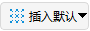】按钮，或点击【插入】按钮并选择想定对象为“集群”。

（2）插入方式为“插入默认类型”（插入默认）。

（3）点击【插入】按钮，对象窗口即可显示插入的集群对象。

### 创建覆盖定义

（1）点击【插入默认】按钮，或点击【插入】按钮并选择想定对象为“覆盖定义”。

（2）插入方式为“插入默认类型”（插入默认）。

（3）点击【插入】按钮，对象窗口即可显示插入的覆盖定义对象。

### 创建地面站

目前插入地面站的方式有三种：一是插入默认地面站对象、二是从标准对象数据库中插入地面站对象、三是从初始数据库中插入地面站对象。

**（1）插入默认地面站对象**

1）点击【插入默认】按钮，或点击【插入】按钮并选择想定对象为“地面站”。

2）插入方式为“插入默认类型”（插入默认）。

3）点击【插入】按钮，对象窗口即可显示插入的地面站对象。

**（2）从标准对象数据库中插入地面站对象。**

1）点击【插入】按钮并选择想定对象为“地面站”。

2）插入方式为“从数据库”（标准数据库）。

3）点击【插入…】按钮，即可弹出查询标准对象数据库窗口，在查找项中输入相应搜索参数。

4）点击【搜索】按钮，右侧结果页面可显示相应搜索数据，再在结果数据中选择想要插入的地面站。

5）设置相应的颜色，点击【插入】按钮，即可在对象窗口中看到插入的地面站对象。

6）最后点击【关闭】按钮，关闭标准对象数据库窗口。

**（3）从标准城市数据库中插入地面站对象。**

1）点击【插入】按钮并选择想定对象为“地面站”。

2）插入方式为“从城市数据库”（初始数据库）。

3）点击【插入…】按钮，即可弹出查询标准对象数据库窗口（此标准对象数据库窗口与（2）中的在查找项上有细微区别），在查找项中输入相应搜索参数。

4）点击【搜索】按钮，右侧结果页面可显示相应搜索数据，再在结果数据中选择想要插入的地面站。

5）设置相应的颜色，点击【插入】按钮，即可在对象窗口中看到插入的地面站对象。

6）最后点击【关闭】按钮，关闭标准对象数据库窗口。

### 创建车辆

（1）点击【插入默认】按钮，或点击【插入】按钮并选择想定对象为“车辆”。

（2）插入方式为“插入默认类型”（插入默认）。

（3）点击【插入】按钮，对象窗口即可显示插入的车辆对象。

### 创建火箭

（1）点击【插入默认】按钮，或点击【插入】按钮并选择想定对象为“火箭”。

（2）插入方式为“插入默认类型”（插入默认）。

（3）点击【插入】按钮，对象窗口即可显示插入的火箭对象。

### 创建导弹

（1）点击【插入默认】按钮，或点击【插入】按钮并选择想定对象为“导弹”。

（2）插入方式为“插入默认类型”（插入默认）。

（3）点击【插入】按钮，对象窗口即可显示插入的导弹对象。

### 创建行星

（1）点击【插入默认】按钮，或点击【插入】按钮并选择想定对象为“行星”。

（2）插入方式为“插入默认类型”（插入默认）。

（3）点击【插入】按钮，对象窗口即可显示插入的行星对象。

### 创建卫星

创建卫星对象工具提供5种插入方式。

**（1）轨道生成向导方式插入卫星**

点击【轨道生成向导】插入对象，将弹出轨道生成向导界面，根据向导界面提示设置相应的参数，可以非常直观的看到生成轨道的样式图像。

轨道类型有圆轨道、临界倾角轨道、临界倾角，太阳同步轨道、静止轨道、闪电轨道、回归轨道、太阳同步回归轨道、太阳同步轨道、自定义轨道、星下点定义轨道、星下点定义回归轨道。右侧可以设置时间区间和可视化的颜色。

|卫星轨道|描述|
|----------------------|------------------------------------------------------------|
|圆轨道|轨道半径始终保持恒定。|
|临界倾角轨道|临界倾角轨道使近地点保持在一个固定的纬度。拱线不随时间变化。在固定轨道上的卫星将在指定的固定经度上的天空中保持一个固定纬度。|
|临界倾角，太阳同步轨道|临界倾斜太阳同步轨道结合这两种类型轨道的特点。该轨道使用的逆行倾角为116.565度。卫星每转一圈都会以相同的当地平均太阳时从上空经过，其近地点保持在一个固定的纬度。|
|静止轨道|地球静止轨道上的卫星将在指定固定经度的上空中保持固定。|
|闪电轨道|闪电轨道为大偏心率轨道，远地点与近地点高度差异显著；同时该轨道为临界倾角轨道，可使近地点保持在南半球，且卫星在北半球高纬度区域具有较长的驻留时间。|
|回归轨道|当不同时间需要相同的观测条件以检测变化时，具有重复地面轨迹的轨道是有用的。地面痕迹可以每天重复，或者在重复之前日复一日的交织。|
|太阳同步回归轨道|太阳同步回归轨道适用于需要在不同时段获得一致观测与光照条件以监测变化的场景，地面轨迹可逐日重复或在重复前逐日交错，轨道可完成地面覆盖周期的重复，且卫星每绕轨一圈，均会在大致相同的当地平太阳时经过地面同一点。|
|太阳同步轨道|这些轨道的设计利用了地球扁率的影响，使轨道平面以等于地球绕太阳的平均轨道速率进动。太阳同步轨道具有其节点保持恒定的局部平均太阳时间的性质。|
|自定义轨道|用于用户创建自定义的轨道。|
|星下点定义轨道|根据星下点轨迹定义轨道参数。|
|星下点定义回归轨道|根据星下点轨迹定义回归轨道参数。|

**（2）插入默认对象**

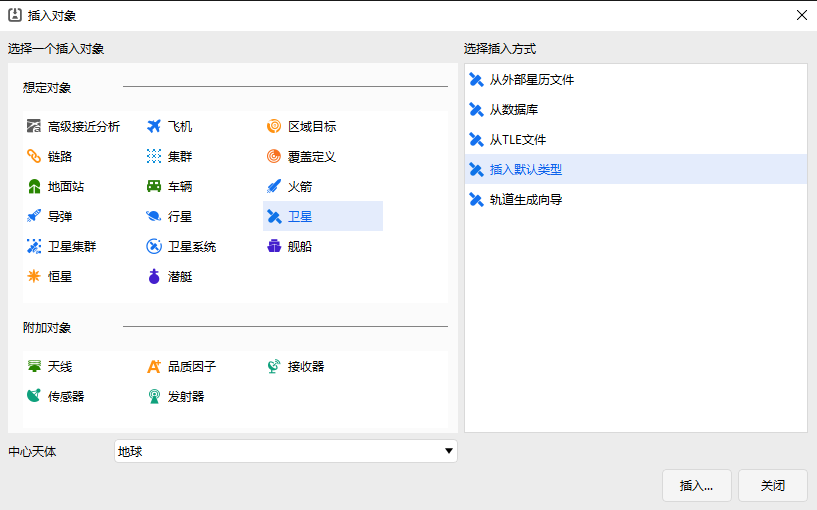

点击“插入默认类型”时，在插入对象窗中将直接添加卫星对象数据，卫星为默认状态。

**（3）从TLE文件数据中插入卫星**

点击【从TLE文件】中插入卫星对象，将弹出TLE数据源对话框，可以选择TLE数据源，选择相应的数据。

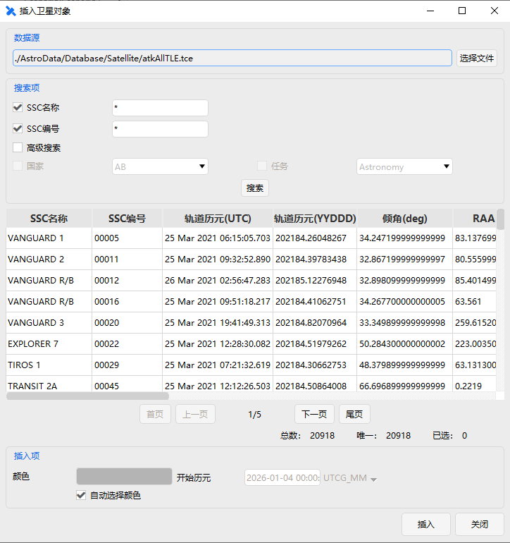

数据表中会显示相应轨道的相关信息，底部显示表中数据总数及选中数。可以设置插入项的颜色和开始历元。

**（4）从标准对象数据库中插入卫星**

点击【从数据库】中插入卫星对象，将弹出查询标准对象数据库界面，可以查询卫星数据源，选择相应的数据。

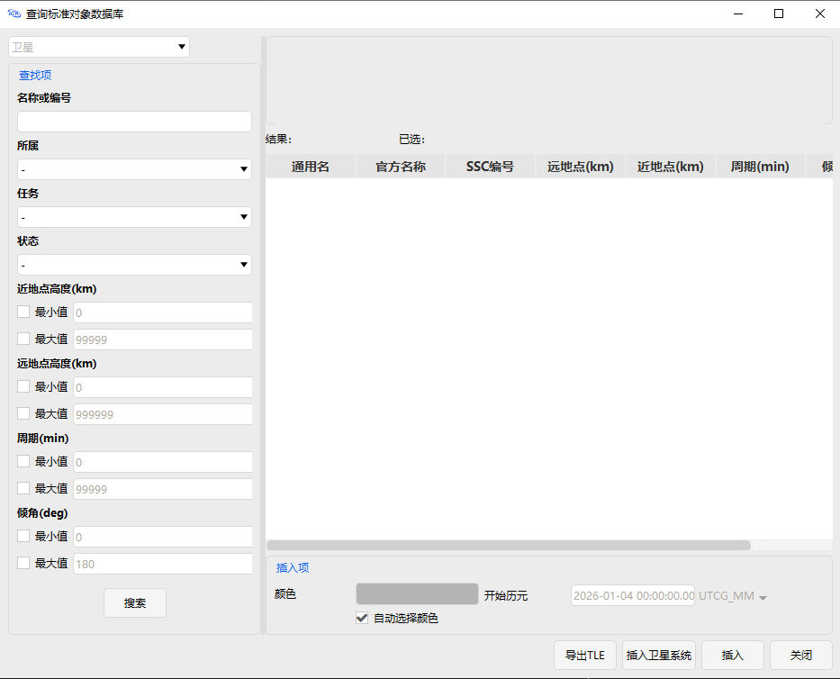

**（5）从外部星历文件中插入卫星**

点击【从外部星历文件】插入卫星对象，则会弹出相应的文件对话框，从中选择`.e`的星历文件数据。

### 创建卫星集群

（1）点击【插入默认】按钮，或点击【插入】按钮并选择想定对象为“卫星集群”。

（2）插入方式为“插入默认类型”（插入默认）。

（3）点击【插入】按钮，对象窗口即可显示插入的卫星集群对象。

### 创建卫星系统

（1）点击【插入默认】按钮，或点击【插入】按钮并选择想定对象为“卫星系统”。

（2）插入方式为“插入默认类型”（插入默认）。

（3）点击【插入】按钮，对象窗口即可显示插入的卫星系统对象。

### 创建舰船

（1）点击【插入默认】按钮，或点击【插入】按钮并选择想定对象为“舰船”。

（2）插入方式为“插入默认类型”（插入默认）。

（3）点击【插入】按钮，对象窗口即可显示插入的舰船对象。

### 创建恒星

目前插入恒星的方式有两种：一是插入默认恒星对象、二是从数据库中插入恒星对象。

**（1）插入默认恒星对象**

1）点击【插入默认】按钮，或点击【插入】按钮并选择想定对象为“恒星”。

2）插入方式为“插入默认类型”（插入默认）。

3）点击【插入】按钮，对象窗口即可显示插入的恒星对象。

**（2）从数据库插入恒星对象**

1）点击【插入】按钮并选择想定对象为“恒星”。

2）选择插入方式为“从数据库”。

3）点击【插入…】按钮，即可弹出查询标准对象数据库界面，在查找项中输入相应搜索参数。

4）点击【搜索】按钮，右侧结果页面可显示相应搜索数据，再在结果数据中选择想要插入的恒星对象。

5）设置相应的颜色，点击【插入】按钮，即可在对象窗口中看到插入的恒星对象。

6）最后点击【关闭】按钮，关闭标准数据库窗口。

### 创建潜艇

（1）点击【插入默认】按钮，或点击【插入】按钮并选择想定对象为“潜艇”。

（2）插入方式为“插入默认类型”（插入默认）。

（3）点击【插入】按钮，对象窗口即可显示插入的潜艇对象。

### 创建天线

（1）点击【插入】按钮并选择附加对象为“天线”。

（2）插入方式为“插入默认类型”。

（3）点击【插入…】按钮。

（4）弹出选择对象窗口，选择相应父对象，点击【确定】。

注意：插入默认天线时，首先要选择相应的想定对象，没有对应的想定对象时是无法创建天线的。

### 创建品质因子

（1）点击【插入】按钮并选择附加对象为“品质因子”。

（2）插入方式“插入默认类型”。

（3）点击【插入…】按钮。

（4）弹出选择对象窗口，选择覆盖定义对象，点击【确定】。

注意：插入默认品质因子时，首先要选择相应的覆盖定义对象，没有对应的覆盖定义对象时是无法创建品质因子的。

### 创建接收器

（1）点击【插入】按钮并选择附加对象为“接收器”。

（2）插入方式为“插入默认类型”。

（3）点击【插入…】按钮。

（4）弹出选择对象窗口，选择相应父对象，点击【确定】。

注意：插入默认接收器时，首先要选择相应的想定对象，没有对应的想定对象时是无法创建接收器的。

### 创建传感器

（1）点击【插入】按钮并选择附加对象为“传感器”。

（2）插入方式为“插入默认类型”。

（3）点击【插入…】按钮。

（4）弹出选择对象窗口，选择相应父对象，点击【确定】。

注意：插入默认传感器时，首先要选择相应的想定对象，没有对应的想定对象时是无法创建传感器的。

### 创建发射器

（1）点击【插入】按钮并选择附加对象为“发射器”。

（2）插入方式为“插入默认类型”。

（3）点击【插入…】按钮。

（4）弹出选择对象窗口，选择相应父对象，点击【确定】。

注意：插入默认发射器时，首先要选择相应的想定对象，没有对应的想定对象时是无法创建发射器的。

## 对象属性

### 高级接近分析的属性设置

高级接近分析属性设置包括：基本属性、可视化。

#### 基本属性

基本属性包括：主配置、高级、非线性计算。

主配置设置包含周期设置、主目标列表、次目标列表、阈值设置、是否使用距离测量、【计算】按钮、【报告】按钮。

高级设置包含预滤波器设置、高级椭球属性设置、SSC目标半径文件设置、最大采样步长设置、最小采样步长设置、碰撞类型设置。

非线性计算包含参数设置和非线性计算设置。

参数设置包含积分时长设置、最大时间步长设置、最大弯角设置、分辨率设置、概率分数极限设置、末端标准差设置、最大标准差步长设置。

非线性计算设置包含线性检测计算、碰撞概率计算（Cylinders）、碰撞概率计算（Bundles）。

#### 可视化

可视化显示设置包含是否显示、是否显示主椭球、是否显示次椭球、次椭球是选择“所有”类型还是“带碰撞”类型。

### 飞机的属性设置

飞机属性设置包括：基本属性、二维视图、三维视图、约束和RF。

#### 基本属性

基本属性包括：航线、地面椭圆。

#### 二维视图

二维视图包括：显示、轨迹、等高线、距离、地面椭圆。

显示设置包含是否显示、是否显示标签、是否显示二维地面轨迹、是否显示三维轨道、是否保留轨迹、颜色设置、标识类型设置、线型线宽设置。

轨迹设置包含轨迹类型设置，包括点、时间、所有、无四种类型。

等高线设置包含仰角轮廓线设置和仰角椭圆设置，距离设置包含范围轮廓线设置，仰角轮廓线和范围轮廓线均可以设置分级属性。

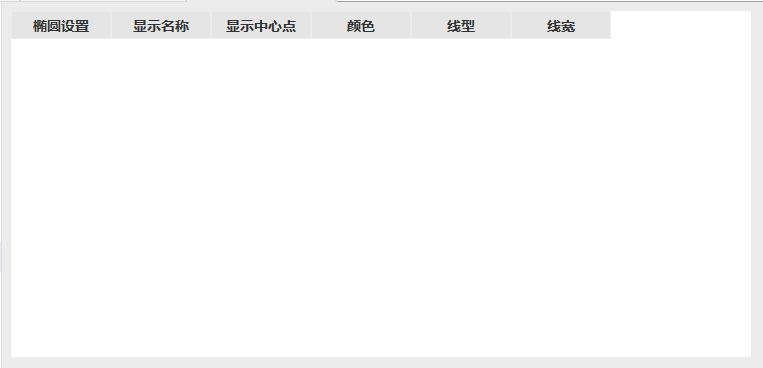

#### 三维视图

三维视图包括：模型、向量、姿态球、接近、等高线、距离、数据显示。

模型设置包含是否显示、模型文件选择、Log比例、欧拉角设置、标签偏移量设置、平移补偿设置、点设置。

模型支持的模型文件类型有：OpenSceneGraph（.ive）、3D Studio模型(.3ds)、Flight Studio Open Flight模型(.flt)、Autodesk模型(.fbk)。

Log比例可以调节模型比例大小，滑动条的取值范围为 -10.0~20.0。

欧拉角设置包括Euler1、Euler2、Euler3的设置，单位为度，以及转序的设置。标签偏移量可以设置X轴、Y轴、Z轴的偏移量，单位为米。

平移补偿可以设置X轴、Y轴、Z轴的补偿量，单位为米。

向量设置包含向量尺寸的大小以及坐标系、向量和点的配置信息，包括是否显示、是否显示标签、粗细、颜色等相关信息。

姿态球设置包括姿态球是否显示、显示的颜色、零度颜色、线宽、零度线宽、参考坐标系、姿态球的比例大小以及投影等信息。

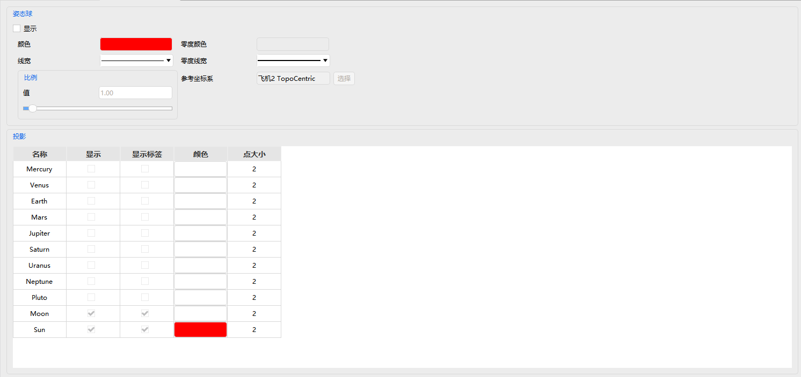

接近设置可以设置不确定区域信息，包括类型、是否显示、颜色、线宽、是否显示文字，文字内容等信息。

等高线设置包含仰角轮廓线设置，距离设置包含范围轮廓线设置。

数据显示可以设置对象对应的动态报告数据在三维视图上的显示信息，包括是否显示、显示位置、字体颜色等。

#### 约束

基本约束包括方位角、方位角变化率、角变换率、仰角、仰角变化率、高度、距离、距离变化率、传播延时等信息。可设置每个约束的最小值、最大值和是否设置反向选择。基本约束也包括是否设置视线约束、是否设置地形约束。

太阳约束包括太阳仰角、太阳地平仰角、月球仰角等信息。可设置每个约束的最小值、最大值。太阳约束包括视线设置、附加中心天体遮挡设置。视线可设置太阳规避角和月球规避角。

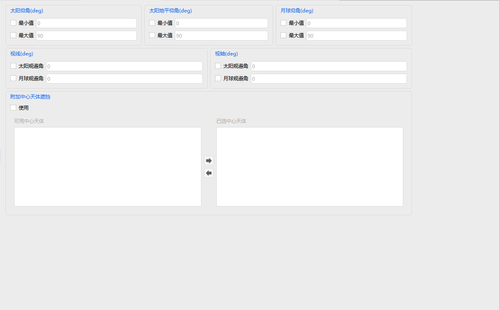

时间约束包括时间类型及其开始结束时间设置、时长最小值、最大值设置、时段设置。

#### RF

环境设置中包括大气吸收和云雨雾衰减参数的设置。

大气吸收可设置表面温度和水蒸气密度。

云雨雾衰减参数可设置雨天模型、云和雾模型。

雨天模型可设置表面温度。

云和雾模型可设置云层上限、云层厚度、云层温度、水密度。

### 区域目标的属性设置

区域目标属性设置包括：基本属性、可视化、约束。

#### 基本属性

基本属性包括：边界、质心。

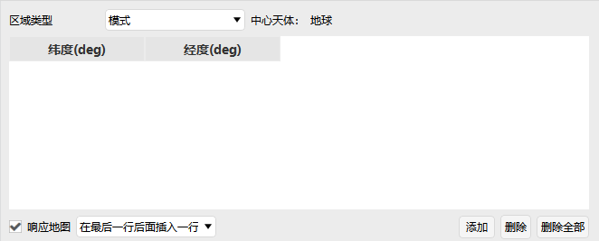

#### 可视化

可视化显示设置包含是否显示、是否显示标签、是否显示中心点、是否显示边界点、是否填充、透明度设置、颜色设置、线型线宽设置。

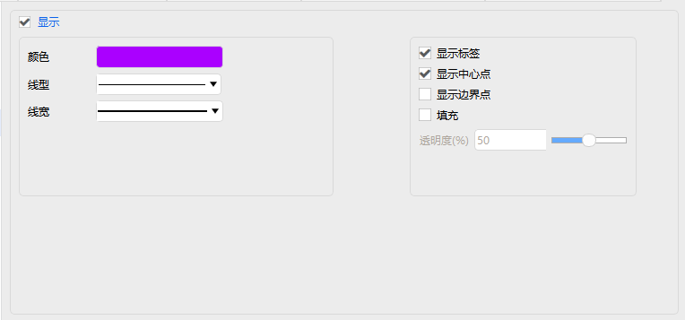

#### 约束

基本约束包括最小俯仰角设置、是否访问整个对象、是否设置视线约束、高度最小值和最大值设置。

时间约束详情见[飞机的属性设置](#飞机的属性设置)部分，这里不再赘述。

### 链路的属性设置

链路属性设置包括：基本属性、可视化。

#### 基本属性

基本属性定义设置包括对象选项过滤器、可选对象、已选对象。

#### 可视化

可视化显示设置包含是否显示、静态可视化设置、动态可视化设置。

静态可视化设置包含是否显示、颜色设置、线型线宽设置。

动态可视化设置包含是否显示亮度、是否显示线、颜色设置、线型线宽设置、是否显示方向。

### 集群的属性设置

集群属性设置包括：基本属性、可视化。

#### 基本属性

基本属性定义设置详情见[链路的属性设置](#链路的属性设置)部分，这里不再赘述。

#### 可视化

可视化显示设置详情见[区域目标的属性设置](#区域目标的属性设置)部分，这里不再赘述。

### 覆盖定义的属性设置

覆盖定义属性设置包括：基本属性、可视化、约束。

#### 基本属性

基本属性网格设置包括网格区域配置参数、网格定义、是否使用并行计算。

网格区域配置参数设置包括类型设置，以及对应类型的参数设置。

网格定义设置包括网格类型设置、点高度设置、点位置设置。

#### 可视化

可视化显示设置包括是否显示、是否显示区域、是否显示点、颜色设置、点大小设置、是否填充。

#### 约束

约束详情见[飞机的属性设置](#飞机的属性设置)部分，这里不再赘述。

### 地面站的属性设置

地面站属性设置包括：基本属性、二维视图、三维视图、约束和RF。

#### 基本属性

基本属性位置设置包含类型设置以及对应参数设置，可以选择是否响应地图设置。

#### 二维视图

二维视图包括：显示、距离，详情见[飞机的属性设置](#飞机的属性设置)二维视图部分，这里不再赘述。

#### 三维视图

三维视图包括：模型、向量、姿态球、距离、数据显示，详情见[飞机的属性设置](#飞机的属性设置)三维视图部分，这里不再赘述。

#### 约束

约束详情见[飞机的属性设置](#飞机的属性设置)约束部分，这里不再赘述。

#### RF

环境设置详情见[飞机的属性设置](#飞机的属性设置)RF部分，这里不再赘述。

### 车辆的属性设置

车辆属性设置包括：基本属性、二维视图、三维视图、约束和RF。

#### 基本属性

基本属性包括：航线、地面椭圆，详情见[飞机的属性设置](#飞机的属性设置)基本属性部分，这里不再赘述。

#### 二维视图

二维视图包括：显示、轨迹、距离、地面椭圆，详情见[飞机的属性设置](#飞机的属性设置)二维视图部分，这里不再赘述。

#### 三维视图

三维视图包括：模型、向量、姿态球、距离，详情见[飞机的属性设置](#飞机的属性设置)三维视图部分，这里不再赘述。

#### 约束

约束详情见[飞机的属性设置](#飞机的属性设置)约束部分，这里不再赘述。

#### RF

环境设置详情见[飞机的属性设置](#飞机的属性设置)RF部分，这里不再赘述。

### 火箭的属性设置

火箭属性设置包括：基本属性、二维视图、三维视图、约束和RF。

#### 基本属性

基本属性包括：弹道、姿态、地面椭圆。

弹道设置包含轨道预报器类型选择，类型包括：简单上升轨道、STK星历。

简单上升轨道参数设置包括：发射开始时刻、发射终点时刻、仿真步长、发射点纬度、发射点经度、发射点高度、发射终点速度、发射终点纬度、发射终点经度、发射终点高度。

STK星历参数设置包括：开始历元、结束历元、星历文件选择、是否覆盖文件时间、首个星历点的时间。

姿态设置包含姿态模式类型选择，类型包括：标准、多分段、STK文件。

标准参数设置包括：姿态类型设置、偏置姿态形式及对应参数设置。

多分段数设置包括：开始时间、姿态类型设置、四元数参数设置。

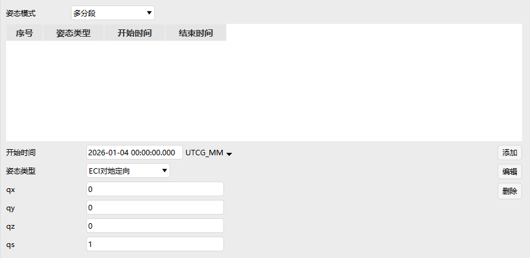

STK文件参数设置包括：开始历元、结束历元、姿态文件选择。

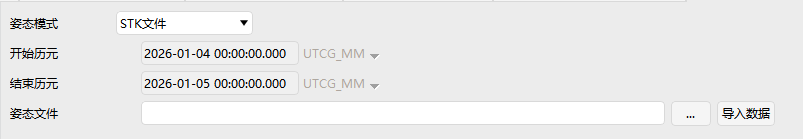

地面椭圆设置详情见[飞机的属性设置](#飞机的属性设置)基本属性部分，这里不再赘述。

#### 二维视图

二维视图包括：显示、轨迹、等高线、距离、刈幅、地面椭圆。

刈幅设置包含类型选择和显示选项设置，类型包括：地面仰角、飞行器半锥角、刈幅半幅宽、地面仰角包络、飞行器半锥角包络。

其余设置详情见[飞机的属性设置](#飞机的属性设置)二维视图部分，这里不再赘述。

#### 三维视图

三维视图包括：模型、向量、姿态球、轨道系统、接近、等高线、距离、数据显示。

轨道系统设置包含坐标系统的选择、是否显示、是否自定义颜色、颜色设置。

其余设置详情见[飞机的属性设置](#飞机的属性设置)三维视图部分，这里不再赘述。

#### 约束

约束详情见[飞机的属性设置](#飞机的属性设置)约束部分，这里不再赘述。

#### RF

环境设置详情见[飞机的属性设置](#飞机的属性设置)RF部分，这里不再赘述。

### 导弹的属性设置

导弹属性设置包括：基本属性、二维视图、三维视图、约束和RF。

二维视图中没有刈幅设置，其余属性设置与火箭相同，详情见[火箭的属性设置](#火箭的属性设置)部分，这里不再赘述。

### 行星的属性设置

行星属性设置包括：基本属性、三维视图、约束。

#### 基本属性

基本属性定义设置包含天体选择、是否自动重命名。

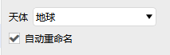

#### 三维视图

三维视图数据显示设置详情见[飞机的属性设置](#飞机的属性设置)三维视图部分，这里不再赘述。

#### 约束

约束基本设置包含是否设置视线约束、是否设置地形约束。

### 卫星的属性设置

卫星属性设置包括：基本属性、二维视图、三维视图和约束。

#### 基本属性

基本属性设置包含轨道、姿态、质量、轨道圈数、地面椭圆。

##### 轨道 

轨道设置中包括轨道预报器设置、坐标系设置、坐标类型设置、轨道生成向导、按相对状态生成等参数设置。

轨道预报器类型包括：二体、J2摄动、J4摄动、SGP4、HPOP、机动规划、STK星历、Vinti、偏差分析等类型。

二体、J2摄动、J4摄动是通过计算公式产生星历的解析传播器。二体公式是精确的（即该公式只考虑了，物体作为质点的影响，生成了围绕中心物体运动的已知解），但不是物体的实际受力环境的准确模型。J2摄动包括了质点效应和重力场中不对称性的主导效应（即重力场中的J2项，代表南北半球的扁率）。J4额外考虑了其次重要的扁率效应（J2之外的J2^2和J4项）这些传播子都没有模拟大气阻力、太阳辐射压力或三体重力，它们只解释了一个完整重力场模型中的几个项。

这些传播器通常用于早期研究（通常无法获得卫星数据，以生产更准确的星历）来进行趋势分析。J2摄动常用于短期分析（周），J4摄动常用于长期分析（月、年）。它们特别适用于对“理想的”维持轨道建模，而不必对维护机动本身建模。对于卫星，这些维护轨道可以使用轨道向导来构建。

由J2摄动和J4摄动传播子产生的解是基于开普勒平均元素的近似解。一般来说，施加在卫星上的力会导致开普勒平均元素随时间漂移（长期变化）和振荡（通常振幅很小）。特别是J2和J4项只引起半长轴、偏心率和倾角的周期性振荡，同时在近地点、赤经和平均异常幅角上的产生漂移。ATK的J2摄动和J4摄动传播器只模型元素的长期漂移（平均异常的漂移最好被视为卫星运动周期的变化）。许多理想的维持轨道在设计上都是利用J2引起的普遍的长期漂移来实现其任务的。

选择二体、J2摄动、J4摄动或Vinti模型后，必须设置卫星的开始时间，停止时间和步长。若勾选“使用场景区间”，则使用当前场景时段。然后选择一个坐标系统和坐标类型并输入轨道参数的值。

坐标系统可以设置为：ICRF、J2000、天体固连系、真赤道系、平赤道系、真赤道平春分点系、真黄道系、平黄道系、J2000历元平黄道系。

坐标类型可以设置为：位置速度、轨道根数、球坐标。

位置速度对应参数为位置XYZ和速度XYZ。

轨道根数对应参数可以选择为半长轴、偏心率、轨道倾角、升交点赤经、近地点角距、真近点角等。可选择半长轴，也可选择远拱点半径、远拱点高度、周期、平均运动。可选择偏心率，也可选择近拱点半径、近拱点高度。可选择升交点赤经，也可选择升交点经度。可选择真近点角，也可选择平近点角、偏近点角、纬度幅角、过升交点时间、过近地点时间。

球坐标对应参数为赤经、赤纬、半径、水平航迹角、方位角、速度。

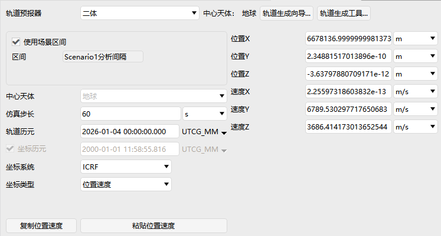

除了坐标系统、坐标类型，HPOP模型还可以设置轨道模型中的受力模型、数值算法中的积分算法、协方差等参数。

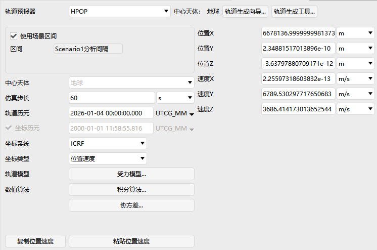

受力模型参数设置包括引力设置、太阳光压设置、大气阻力摄动设置、太阳辐射通量/地磁指数设置、三体引力设置。

引力设置参数有：引力模型、阶数、次数。

太阳光压设置参数有：光压系数、光压面积。

大气阻力摄动设置参数有：大气模型、大气阻力系数、阻力面积。

太阳辐射通量/地磁指数设置参数有：F10.7、平均F10.7、地磁指数。

三体引力设置参数有：天体名字、类型、模型、阶数、次数、引力值等。

积分算法参数设置包含积分精度设置、是否固定步长输出星历。

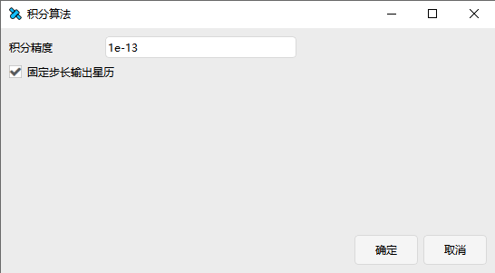

SGP4模型需要导入TLE文件或直接导入TLE数据，进行TLE相应的参数设置。

STK星历模型可以设置星历文件等参数。

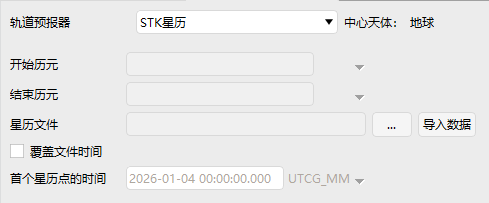

机动规划模型可以新增，删除段，对段进行约束配置，添加参考航天器等。

轨道偏差分析模型参数设置界面与机动规划的界面一致。

按相对状态生成参数设置界面包括卫星类型卫星状态，相对参考卫星的状态（参考卫星VVLH坐标系）设置相对位置和相对速度、初始状态生成结果。

##### 姿态 

卫星姿态设置包括姿态类型选择以及对应参数设置。

姿态类型包含：对齐约束姿态、AttitudeEcfAligndVel、AttitudeEciAligndVel、固定姿态、固定于天体固定系姿态、固定于天体惯性系姿态、多段姿态、实时姿态、STK姿态、卫星姿态旧版、旋转姿态、目标指向姿态、轨道局部坐标系姿态、固连系VVLH姿态、惯性系VVLH姿态。

当姿态类型选择卫星姿态旧版时，对应参数设置包括：姿态模式、姿态类型、偏置姿态形式。

姿态模式包括标准、多分段和STK文件。姿态类型包括ECI对地定向、ECF对地定向、ECI对速度定向、ECF对速度定向。偏置姿态形式包括四元数、欧拉角、YPR角设置。

##### 质量

质量设置包括：总质量、质心位置、转动惯量等参数设置。

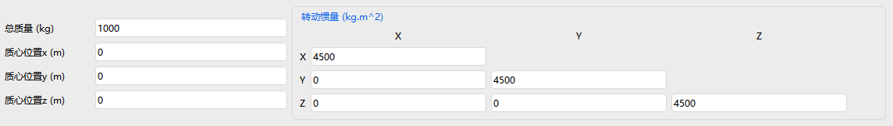

##### 轨道圈数

轨道圈数设置包括定义、方向、坐标系统以及说明。轨道定义包括纬度、经度、初始圈次的设置。轨道方向可以选择升轨或降轨。坐标系统可以选择惯性系或地固系。

##### 地面椭圆

地面椭圆设置详情见[飞机的属性设置](#飞机的属性设置)基本属性部分，这里不再赘述。

#### 二维视图

二维视图显示设置添加了自定义模式，可以设置开始结束时间、是否显示、颜色设置、是否显示二维三维地面轨迹、是否显示轨道、是否显示标签。

其他设置与火箭一样，详情见[火箭的属性设置](#火箭的属性设置)二维视图部分，这里不再赘述。

#### 三维视图

三维视图设置详情见[火箭的属性设置](#火箭的属性设置)三维视图部分，这里不再赘述。

#### 约束

约束详情见[飞机的属性设置](#飞机的属性设置)约束部分，这里不再赘述。

### 卫星集群的属性设置

卫星集群属性设置包括：基本属性、三维视图和约束。

#### 基本属性

基本属性定义设置包含Walker星座参数设置和分组设置。

#### 三维视图

三维视图数据显示设置详情见[飞机的属性设置](#飞机的属性设置)三维视图部分，这里不再赘述。

#### 约束

基本约束和太阳约束详情见[飞机的属性设置](#飞机的属性设置)约束部分，这里不再赘述。

### 卫星系统的属性设置

卫星系统属性设置包括：基本属性、二维视图、三维视图和约束。

#### 基本属性

基本属性轨道设置包含加载TLE数据和卫星数量显示。

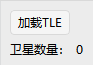

#### 二维视图

二维视图显示设置包含是否显示、是否显示标签、颜色设置、标识类型设置。

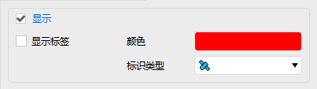

#### 三维视图

三维视图包括：模型、数据显示，相关设置详情见[飞机的属性设置](#飞机的属性设置)三维视图部分，这里不再赘述。

#### 约束

基本约束和太阳约束详情见[飞机的属性设置](#飞机的属性设置)约束部分，这里不再赘述。

### 舰船的属性设置

舰船属性设置包括：基本属性、二维视图、三维视图、约束和RF。

#### 基本属性

基本属性包括：航线、地面椭圆。

详情见[飞机的属性设置](#飞机的属性设置)基本属性部分，这里不再赘述。

#### 二维视图

二维视图包括：显示、轨迹、距离、地面椭圆。

详情见[飞机的属性设置](#飞机的属性设置)二维视图部分，这里不再赘述。

#### 三维视图

三维视图包括：模型、向量、姿态球、接近、距离、数据显示。

详情见[飞机的属性设置](#飞机的属性设置)三维视图部分，这里不再赘述。

#### 约束

详情见[飞机的属性设置](#飞机的属性设置)约束部分，这里不再赘述。

#### RF

详情见[飞机的属性设置](#飞机的属性设置)RF部分，这里不再赘述。

### 恒星的属性设置

恒星属性设置包括：基本属性和可视化。

#### 基本属性

基本属性定义设置包括J2000惯性系下位置的赤经赤纬设置、自行的赤经赤纬设置、以及星等和年视差设置。

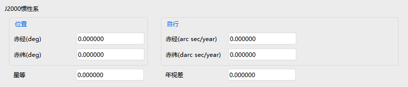

#### 可视化

可视化设置包括：显示、数据显示。

显示设置包含是否显示、是否显示标签以及颜色设置。

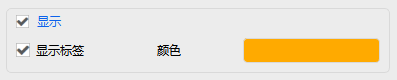

数据显示详情见[飞机的属性设置](#飞机的属性设置)三维视图部分，这里不再赘述。

### 潜艇的属性设置

潜艇属性设置包括：基本属性、二维视图、三维视图、约束和RF。

#### 基本属性

基本属性航线设置详情见[飞机的属性设置](#飞机的属性设置)基本属性部分，这里不再赘述。

#### 二维视图

二维视图包括：显示、轨迹。

详情见[飞机的属性设置](#飞机的属性设置)二维视图部分，这里不再赘述。

#### 三维视图

三维视图包括：模型、向量、姿态球、接近、数据显示。

详情见[飞机的属性设置](#飞机的属性设置)三维视图部分，这里不再赘述。

#### 约束

详情见[飞机的属性设置](#飞机的属性设置)约束部分，这里不再赘述。

#### RF

详情见[飞机的属性设置](#飞机的属性设置)RF部分，这里不再赘述。

### 天线的属性设置

天线属性设置包括：基本属性和约束。

#### 基本属性

基本属性包括：定义、指向。

定义设置包含类型以及对应的参数设置，类型有：高斯天线、全向天线、抛物面天线、外部天线。

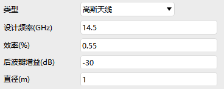

指向设置包含指向类型以及对应的参数设置，类型有：方位-高度角、欧拉角、四元数、YPR。还包含位置偏移量设置，可以设置X轴、Y轴、Z轴的偏移量，单位为米。

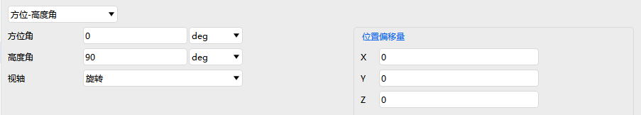

#### 约束

时间约束详情见[飞机的属性设置](#飞机的属性设置)约束部分，这里不再赘述。

### 品质因子的属性设置

品质因子属性设置包括基本属性和二维视图。

#### 基本属性

基本属性定义设置包含定义类型设置、有效条件设置、无效数据指标设置、有效值限制。

类型包含：简单覆盖、访问时长、访问间隔、覆盖时间、多重覆盖、访问次数、覆盖间隔次数、响应时间、重访时间、时间平均间隔。

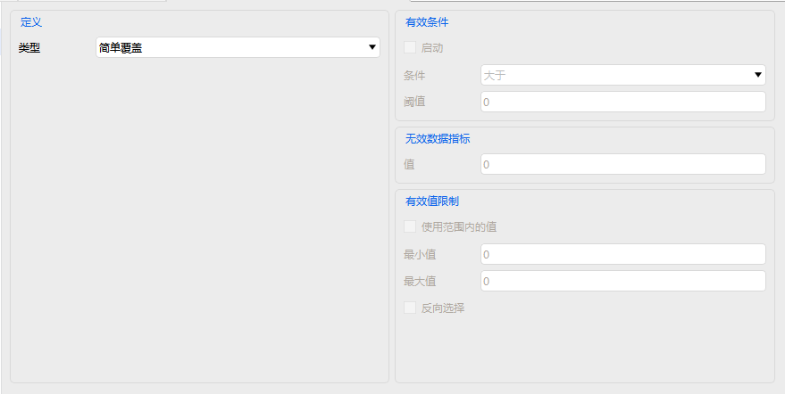

#### 二维视图

二维视图设置包含动态、静态。

动态和静态设置都包含是否显示对应图像、显示网格点设置和显示指标设置。

### 接收器的属性设置

接收器属性设置包括：基本属性、约束和RF。

#### 基本属性

定义设置中可以选择接收器的类型，类型包括：简单接收机模型、中等接收机模型、复杂接收机模型。

简单、中等和复杂模型参数设置均包含模型规格、调制器、滤波器、额外损益等参数的设置，中等模型还包含系统噪声温度的设置，复杂模型还包含天线和系统噪声温度的设置。

#### 约束

基本约束和时间约束详情见[飞机的属性设置](#飞机的属性设置)约束部分，这里不再赘述。

通信约束支持频率、接收到的各向同性功率、通量密度、链路等效各向同性辐射功率、多普勒频移、C/No、接收机输入功率、C/N、误码率、链路裕量、Eb/No、极化相对角、天线性能品质因子等参数的设置。所有约束设置都支持“反向选择”。

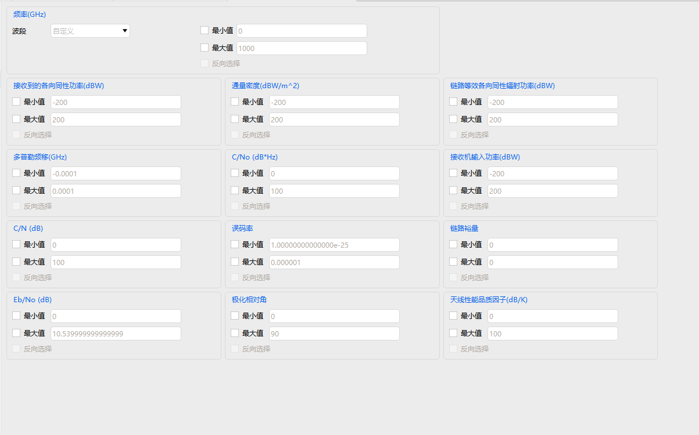

#### RF

环境设置详情见[飞机的属性设置](#飞机的属性设置)RF部分，这里不再赘述。

### 传感器的属性设置

传感器属性设置包括：基本属性、二维视图、三维视图和约束。

#### 基本属性

定义设置包括敏感器的类型、定义参数设置、相对位置设置。敏感器类型包括简单圆锥、矩形、复杂圆锥、半功率和SAR。

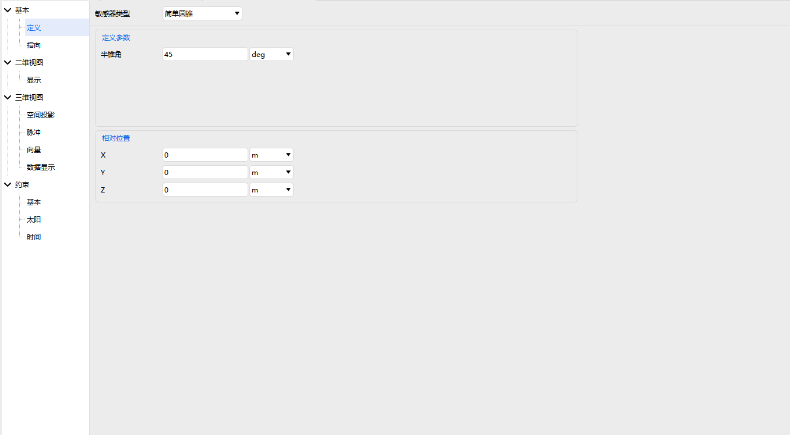

敏感器类型为简单圆锥时，定义参数包括半锥角的设置。

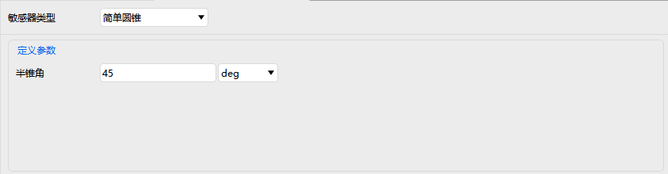

敏感器类型为矩形时，定义参数设置包括垂直半角和水平半角设置。

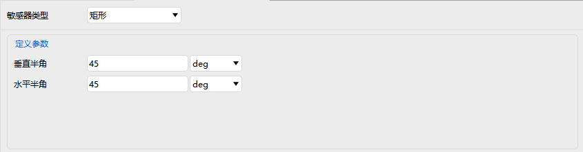

敏感器类型为复杂圆锥时，定义参数包括半锥角和钟角设置。

敏感器类型为半功率时，定义参数包括频率和直径设置。

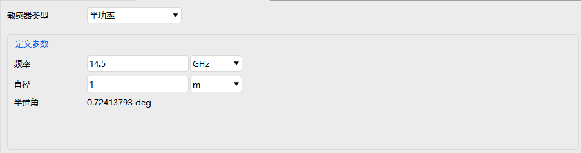

敏感器类型为SAR时，定义参数包括地面仰角、排除角、是否跟踪父对象高度、高度设置。

指向设置中包括指向类型以及类型对应参数的设置。指向类型包括固定指向、旋转、目标定向、入射高度、外部等。

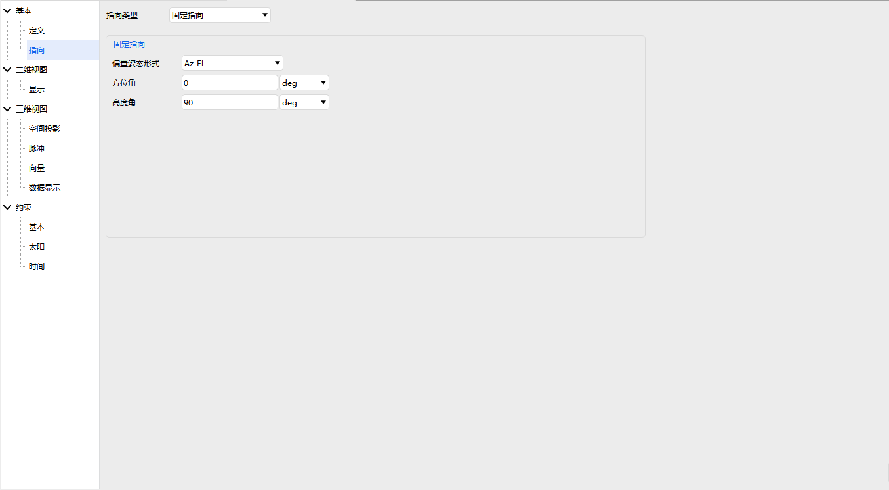

#### 二维视图

二维视图显示设置包括是否显示、是否填充、显示相交类型选择、颜色及线宽设置。

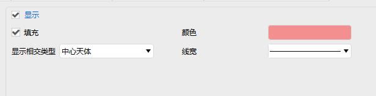

#### 三维视图

三维视图设置包括：空间投影、脉冲、向量、数据显示。

空间投影设置包含空间投影距离设置以及是否使用距离约束。

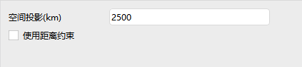

脉冲设置包括是否显示脉冲，振幅、脉冲长度、频率值，是否反向，重置为缺省值等相关参数设置。

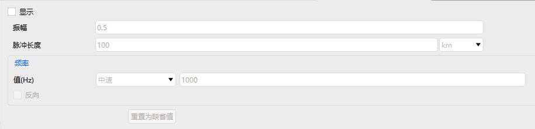

向量和数据显示设置部分详情见[飞机的属性设置](#飞机的属性设置)对应部分，这里不再赘述。

#### 约束

约束详情见[飞机的属性设置](#飞机的属性设置)约束部分，这里不再赘述。

### 发射器的属性设置

发射器属性设置包括：基本属性、约束和RF。

#### 基本属性

定义设置中可以选择发射器的类型，类型包括：简单发射机模型、中等发射机模型、复杂发射机模型、简单转发器模型、中等转发器模型、复杂转发器模型。

简单、中等和复杂模型参数设置均包含模型规格、调制器、滤波器、额外损益等参数的设置，复杂模型还包含天线参数的设置。

#### 约束

基本约束和时间约束详情见[飞机的属性设置](#飞机的属性设置)约束部分，这里不再赘述。

通信约束详情见[接收器飞机的属性设置](#接收器的属性设置)约束部分，这里不再赘述。

#### RF

环境设置详情见[飞机的属性设置](#飞机的属性设置)RF部分，这里不再赘述。