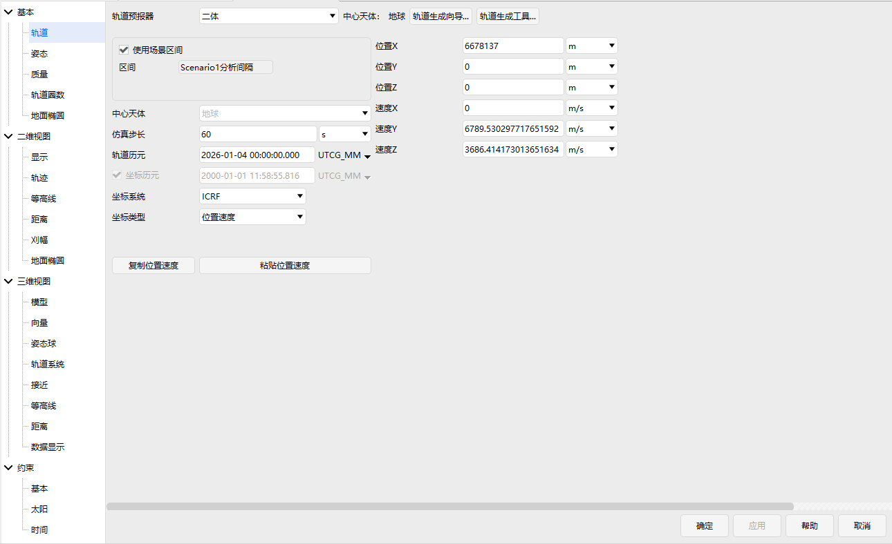
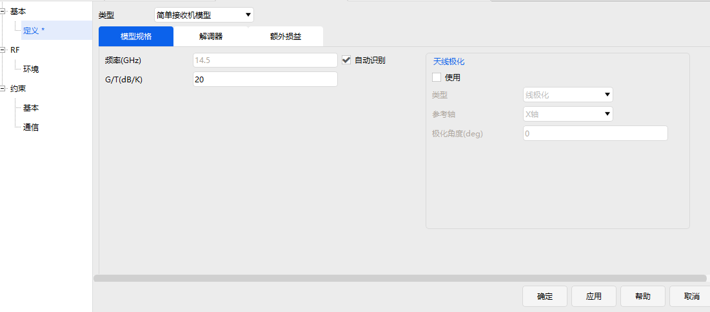
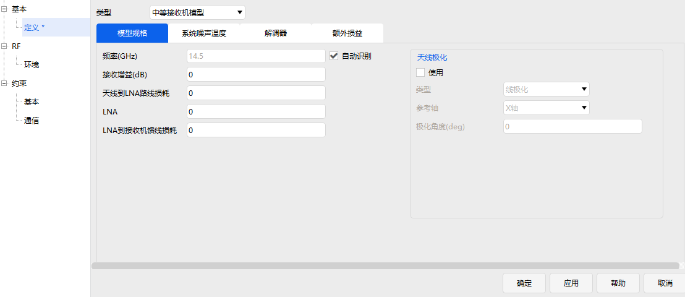
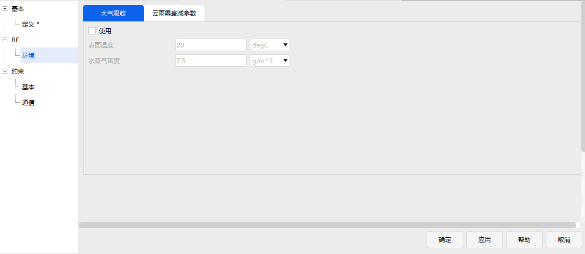
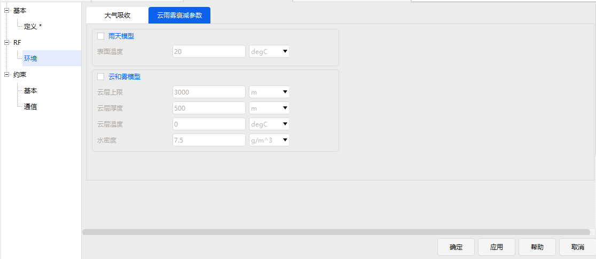
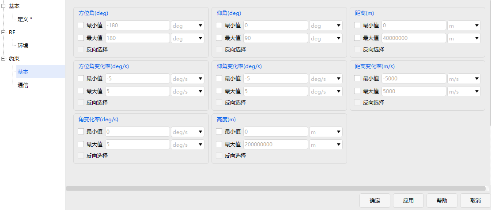
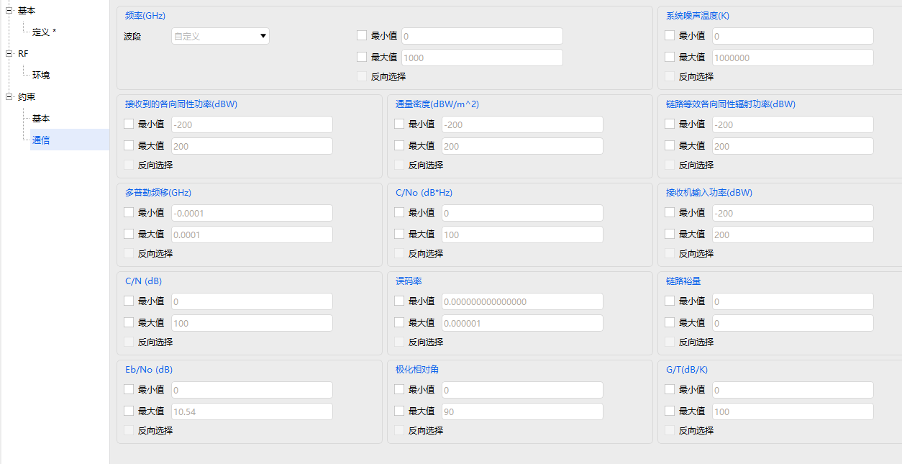
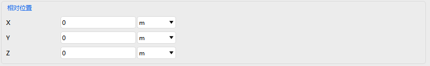
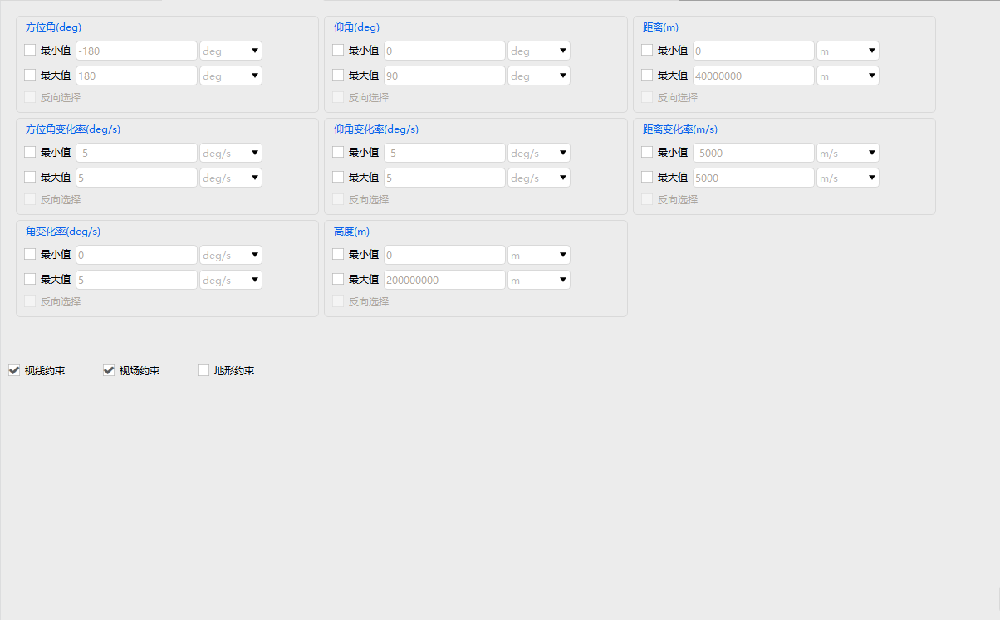

# 创建对象

## 对象的功能介绍

|图标|对象|描述|
|----------------------------------------|-----------------------------|--------------------------------------------------------|
||高级接近分析/AdvCat|对多个卫星和双线元素（TLE）集进行进程分析|
||飞机/Aircraft|模拟飞机在大弧线（通常在地球表面以上）飞行时的特性和行为|
||区域目标/AreaTarget|地球表面的区域面目标|
||链路/Chain|链路|
||集群/Constellation|一组相关的模型|
||覆盖定义/CoverageDefinition|同时分析多个覆盖区域|
||地面站/Facility|模拟地球表面的地面设施或工厂模型|
||车辆/GroundVehicle|车辆模型|
||火箭/LaunchVehicle|火箭模型|
||导弹/Missile|导弹模型|
||行星/Planet|行星模型|
||卫星/Satellite|卫星模型|
||卫星集群/SatelliteCollection|对单个物体类的一组卫星建模，单个卫星不会出现在对象浏览器|
||卫星系统/SatelliteSystem|卫星系统模型|
||舰船/Ship|舰船模型|
||恒星/Star|恒星模型|
||潜艇/Submarine|潜艇模型|
||天线/Antenna|天线模型|
||品质因子/FigureOfMerit|品质因子模型|
||接收器/Receiver|接收器模型|
||传感器/Sensor|传感器模型|
||发射器/Transmitter|模拟发射机的特性、使用天线和工作环境的模型|

## 插入对象

### 创建高级接近分析

（1）点击【插入默认】按钮，或点击【插入】按钮选择想定对象高级接近分析。

（2）插入方式为“插入默认类型”（插入默认）。

（3）点击【插入】按钮，对象窗口即可显示插入的高级接近分析对象。

### 创建飞机

（1）点击【插入默认】按钮，或点击【插入】按钮选择想定对象选择飞机。

（2）插入方式为“插入默认类型”（插入默认）。

（3）点击【插入】按钮，对象窗口即可显示插入的飞机对象。

### 创建区域目标

目前插入区域目标的方式有两种：一是插入默认区域目标对象、二是从国家和地区库中插入区域目标对象。

**（1）插入默认区域目标对象**

1）点击【插入默认】按钮，或点击【插入】按钮选择区域目标对象。

2）插入方式为“插入默认类型”（插入默认）。

3）点击【插入】按钮，对象窗口即可显示插入的区域目标对象。

**（2）从国家和地区库中插入区域目标对象**

1）点击【插入】按钮。

2）选择想定对象“区域目标”。

3）选择插入方式“选择国家和地区”。

4）在弹出界面的左侧可以选择想要添加的国家和地区，右侧可以设置插入选项、插入区域以及可视化颜色。

5）点击【插入】按钮，对象窗口即可显示插入的区域目标对象。

### 创建链路

（1）点击【插入默认】按钮，或点击【插入】按钮选择想定对象链路。

（2）插入方式为“插入默认类型”（插入默认）。

（3）点击【插入】按钮，对象窗口即可显示插入的链路对象。

### 创建集群

（1）点击【插入默认】按钮，或点击【插入】按钮选择想定对象集群。

（2）插入方式为“插入默认类型”（插入默认）。

（3）点击【插入】按钮，对象窗口即可显示插入的集群对象。

### 创建覆盖定义

（1）点击【插入默认】按钮，或点击【插入】按钮选择想定对象覆盖定义。

（2）插入方式为“插入默认类型”（插入默认）。

（3）点击【插入】按钮，对象窗口即可显示插入的覆盖定义对象。

### 创建地面站

目前插入地面站的方式有三种：一是插入默认地面站对象、二是从标准数据库中插入地面站对象、三是从初始数据库中插入地面站对象。

**（1）插入默认地面站对象**

1）点击【插入默认】按钮，或点击【插入】按钮选择想定对象地面站。

2）插入方式为“插入默认类型”（插入默认）。

3）点击【插入】按钮，对象窗口即可显示插入的地面站对象。

**（2）从标准对象数据库中插入地面站对象。**

1）点击【插入】按钮。

2）选择想定对象“地面站”。

3）选择插入方式“从数据库”（标准数据库）。

4）点击【插入…】按钮，即可弹出查询标准对象数据库，在查找项中输入相应搜索参数。

5）点击【搜索】按钮，右侧结果页面可显示相应搜索数据，再在结果数据中选择想要插入的地面站。

6）设置相应的颜色，点击【插入】按钮，即可在对象窗口中看到插入的地面站对象。

7）最后点击【关闭】按钮，关闭标准数据库窗口。

**（3）从标准城市数据库中插入地面站对象。**

1）点击【插入】按钮。

2）选择想定对象“地面站”。

3）选择插入方式“从城市数据库”（初始数据库）。

4）点击【插入…】按钮，即可弹出查询标准对象数据库，在查找项中输入相应搜索参数。

5）点击【搜索】按钮，右侧结果页面可显示相应搜索数据，再在结果数据中选择想要插入的地面站。

6）设置相应的颜色，点击【插入】按钮，即可在对象窗口中看到插入的地面站对象。

7）最后点击【关闭】按钮，关闭标准数据库窗口。

### 创建车辆

（1）点击【插入默认】按钮，或点击【插入】按钮选择想定对象车辆。

（2）插入方式为“插入默认类型”（插入默认）。

（3）点击【插入】按钮，对象窗口即可显示插入的车辆对象。

### 创建火箭

（1）点击【插入默认】按钮，或点击【插入】按钮选择想定对象火箭。

（2）插入方式为“插入默认类型”（插入默认）。

（3）点击【插入】按钮，对象窗口即可显示插入的火箭对象。

### 创建导弹

（1）点击【插入默认】按钮，或点击【插入】按钮选择想定对象导弹。

（2）插入方式为“插入默认类型”（插入默认）。

（3）点击【插入】按钮，对象窗口即可显示插入的导弹对象。

### 创建行星

（1）点击【插入默认】按钮，或点击【插入】按钮选择想定对象行星。

（2）插入方式为“插入默认类型”（插入默认）。

（3）点击【插入】按钮，对象窗口即可显示插入的行星对象。

### 创建卫星

创建卫星对象工具提供5种插入方式。

**（1）轨道向导方式插入卫星**

点击【轨道生成向导】插入对象，将弹出轨道生成向导界面，根据向导界面提示设置相应的参数，可以非常直观的看到生成轨道的样式图像。

轨道类型有圆轨道、临界倾角轨道、临界倾角，太阳同步轨道、静止轨道、闪电轨道、回归轨道、太阳同步回归轨道、太阳同步轨道。右侧可以设置时间区间和可视化的颜色。

|卫星轨道|描述|
|----------------------|------------------------------------------------------------|
|圆轨道|圆形轨道|
|临界倾角轨道|临界倾角轨道使近地点保持在一个固定的纬度。近地线不随时间变化。在固定轨道上的卫星将在指定的固定经度上的天空中保持一个固定纬度|
|临界倾角，太阳同步轨道|临界倾斜太阳同步轨道结合点这两种级别类型轨道的特点。该轨道使用的逆行倾角为116.565度。卫星每转一圈都会以相同的当地平均太阳时从上空经过，其近地点保持在一个固定的纬度|
|静止轨道|地球静止轨道上的卫星将在指定的固定经度以上的天空中保持固定|
|闪电轨道|闪电轨道是高度偏心的，这意味着远地点的高度和近地点的高度之间有很大的差异。闪电轨道也是严重倾斜的，这使得轨道的近地点在南半球。在北半球极端纬度地区，闪电轨道也有很长的停留时间|
|回归轨道|当不同时间需要相同的观测条件以检测变化时，具有重复地面轨迹的轨道是有用的。地面痕迹可以每天重复，或者在重复之前日复一日的交织|
|太阳同步回归轨道|具有回归地面轨迹的太阳同步轨道是有用的，当不同时间需要相同的观测和照明条件来检测变化时。地面痕迹可能会导致明天重复，或者在重复之前日复一日的交织。轨道重复覆盖地面周期，每次公转以大约相同的当地平均太阳时从头顶经过|
|太阳同步轨道|这些轨道的设计利用了地球扁率的影像，是轨道平面以等于地球绕太阳的平均轨道速率进动。太阳同步轨道具有其节点保持恒定的局部平均太阳时间的性质|
|自定义轨道|用于用户创建自定义的轨道|
|星下点定义轨道|根据星下点轨迹定义轨道参数|
|星下点定义回归轨道|根据星下点轨迹定义回归轨道参数|

**（2）插入默认对象**

点击“插入默认类型”时，在插入对象窗中将直接添加卫星对象数据，卫星为默认状态。

**（3）从TLE文件数据方式中插入卫星**

点击【从TLE文件】中插入卫星对象，将弹出TLE数据源对话框，可以选择TLE数据源，选择相应的数据。

数据表中会显示相应轨道的相关信息，底部显示表中数据总数及选中数。可以设置插入项的颜色和开始历元。

**（4）从标准对象数据库中插入卫星**

点击【从数据库】中插入卫星对象，将弹出查询标准对象数据库，可以查询卫星数据源，选择相应的数据。

**（5）从外部星历文件中插入卫星**

点击“从外部星历文件”插入卫星项，则会弹出相应的文件对话框，从中选择`.e`的星历文件数据。

### 创建卫星集群

（1）点击【插入默认】按钮，或点击【插入】按钮选择想定对象卫星集群。

（2）插入方式为“插入默认类型”（插入默认）。

（3）点击【插入】按钮，对象窗口即可显示插入的卫星集群对象。

### 创建卫星系统

（1）点击【插入默认】按钮，或点击【插入】按钮选择想定对象卫星系统。

（2）插入方式为“插入默认类型”（插入默认）。

（3）点击【插入】按钮，对象窗口即可显示插入的卫星系统对象。

### 创建舰船

（1）点击【插入默认】按钮，或点击【插入】按钮选择想定对象舰船。

（2）插入方式为“插入默认类型”（插入默认）。

（3）点击【插入】按钮，对象窗口即可显示插入的舰船对象。

### 创建恒星

目前插入恒星的方式有两种：一是插入默认恒星对象、二是从数据库中插入恒星对象。

**（1）插入默认恒星对象**

1）点击【插入默认】按钮，或点击【插入】按钮选择恒星对象。

2）插入方式为“插入默认类型”（插入默认）。

3）点击【插入】按钮，对象窗口即可显示插入的恒星对象。

**（2）从数据库插入恒星对象**

1）点击【插入】按钮。

2）选择想定对象“恒星”。

3）选择插入方式“从数据库”。

4）点击【插入…】按钮，即可弹出查询标准对象数据库，在查找项中输入相应搜索参数。

5）点击【搜索】按钮，右侧结果页面可显示相应搜索数据，再在结果数据中选择想要插入的恒星对象。

6）设置相应的颜色，点击【插入】按钮，即可在对象窗口中看到插入的恒星对象。

7）最后点击【关闭】按钮，关闭标准数据库窗口。

### 创建潜艇

（1）点击【插入默认】按钮，或点击【插入】按钮选择想定对象潜艇。

（2）插入方式为“插入默认类型”（插入默认）。

（3）点击【插入】按钮，对象窗口即可显示插入的潜艇对象。

### 创建天线

（1）点击【插入】按钮。

（2）选择附加对象“天线”。

（3）选择插入方式“插入默认类型”。

（4）点击【插入…】按钮。

（5）弹出选择对象窗口，选择相应父对象，点击【确定】。

注意：插入默认天线时，首先要选择相应的想定对象，没有对应的想定对象时是无法创建天线的。

### 创建品质因子

（1）点击【插入】按钮。

（2）选择附加对象“品质因子”。

（3）选择插入方式“插入默认类型”。

（4）点击【插入…】按钮。

（5）弹出选择对象窗口，选择相应父对象，点击【确定】。

注意：插入默认品质因子时，首先要选择相应的想定对象，没有对应的想定对象时是无法创建品质因子的。

### 创建接收器

（1）点击【插入】按钮。

（2）选择附加对象“接收器”。

（3）选择插入方式“插入默认类型”。

（4）点击【插入…】按钮。

（5）弹出选择对象窗口，选择相应父对象，点击【确定】。

注意：插入默认接收器时，首先要选择相应的想定对象，没有对应的想定对象时是无法创建接收器的。

### 创建传感器

（1）点击【插入】按钮。

（2）选择附加对象“传感器”。

（3）选择插入方式“插入默认类型”。

（4）点击【插入…】按钮。

（5）弹出选择对象窗口，选择相应父对象，点击【确定】。

注意：插入默认传感器时，首先要选择相应的想定对象，没有对应的想定对象时是无法创建传感器的。

### 创建发射器

（1）点击【插入】按钮。

（2）选择附加对象“发射器”。

（3）选择插入方式“插入默认类型”。

（4）点击【插入…】按钮。

（5）弹出选择对象窗口，选择相应父对象，点击【确定】。

注意：插入默认发射器时，首先要选择相应的想定对象，没有对应的想定对象时是无法创建发射器的。

## 对象属性

### 卫星的属性设置

卫星属性设置包括：基本属性、可视化、约束三个章节点。

#### 轨道属性

卫星属性的基本属性中包含轨道、姿态、质量、轨道圈数、地面椭圆等属性值的设置。

轨道设置中包括轨道预报器的选取、坐标系的选取、坐标类型的设置、轨道生成向导、按相对状态生成等参数设置。

轨道预报器类型包括：二体、J2摄动、J4摄动、SGP4、HPOP、机动规划、STK星历、Vinti、偏差分析等类型。

二体、J2摄动、J4摄动是通过计算公式产生星历的解析传播器。二体公式是精确的（即该公式只考虑了，物体作为质点的影响，生成了围绕中心物体运动的已知解），但不是物体的实际受力环境的准确模型。J2摄动包括了质点效应和重力场中不对称性的主导效应（即重力场中的J2项，代表南北半球的扁率）。J4额外考虑了其次重要的扁率效应（J2之外的J2^2和J4项）这些传播子都没有模拟大气阻力、太阳辐射压力或三体重力，它们只解释了一个完整重力场模型中的几个项。

这些传播器通常用于早期研究（通常无法获得卫星数据，以生产更准确的星历）来进行趋势分析。J2摄动常用于短期分析（周），J4摄动常用于长期分析（月、年）。它们特别适用于对“理想的”维持轨道建模，而不必对维护机动本身建模。对于卫星，这些维护轨道可以使用轨道向导来构建。

由J2摄动和J4摄动传播子产生的解是基于开普勒平均元素的近似解。一般来说，施加在卫星上的力会导致开普勒平均元素随时间漂移（长期变化）和振荡（通常振幅很小）。特别是J2和J4项只引起半长轴、偏心率和倾角的周期性振荡，同时在近地点、赤经和平均异常幅角上的产生漂移。ATK的J2摄动和J4摄动传播器只模型元素的长期漂移（平均异常的漂移最好被视为卫星运动周期的变化）。许多理想的维持轨道在设计上都是利用J2引起的普遍的长期漂移来实现其任务的。

选择二体、J2摄动或J4摄动模型后，必须定义其参数：

1）用初始状态工具获取一个新的初始矢量（可选）。

2）设置卫星的开始时间，停止时间和步长。打开“使用场景分析时段”，使用当前场景时段。

3）选择一个坐标系。

4）选择一个坐标类型并输入轨道参数的值。

5）使用特殊选项…按钮，设置卫星的传播帧。对于J2和J4传播器，还可以指定椭圆选项。

除了坐标系统、坐标类型，HPOP模型还可以设置轨道模型、数值算法等参数。

受力模型有摄动力包括地球引力、太阳光压、大气阻力、太阳辐射通量/地磁指数、三体引力等相应参数设置。

地球引力的对应参数有：引力模型、阶数、次数。

太阳光压的对应参数有：光压系数、光压面积。

大气阻力摄动的对应参数有：大气模型、大气阻力系数、阻力面积。

太阳辐射通量/地磁指数的对应参数有：F10.7、平均F10.7、地磁指数。

三体引力的对应参数有：名字、类型、模型、阶数、次数、引力值等。

积分算法对应参数设置的数值算法有积分算法可选择Runge-Kutta2、RungeKutta4、Runge-Kutta8等。

SGP4模型需要导入TLE文件或直接导入TLE数据，进行TLE相应的参数设置。

保持模型可以设置坐标系统、坐标类型等参数。

当坐标系设置成J2000时，坐标类型可以设置为位置速度、轨道根数、球坐标。位置速度对应参数为位置速度XYZ。球坐标对应参数为赤经、赤纬、半径、水平航迹角、方位角、速度。轨道根数对应参数可以选择为半长轴、偏心率、轨道倾角、升交点赤经、近地点角距、真近点角等设置。

当坐标系设置成地固系时，坐标类型可以设置为位置速度、轨道根数、球坐标，具体参数设置同上。

STK星历模型可以设置星历文件等参数。

机动规划模型可以新增，删除段，对段进行约束配置，添加参考航天器等。

Vinti模型可以设置坐标系统、坐标类型等参数。

当坐标系设置成J2000时，坐标类型可以设置为位置速度、轨道根数、球坐标。位置速度对应参数为位置速度XYZ。球坐标对应参数为赤经、赤纬、半径、水平航迹角、方位角、速度。轨道根数对应参数可以选择为半长轴、偏心率、轨道倾角、升交点赤经、近地点角距、真近点角等设置。

当坐标系设置成地固系时，坐标类型可以设置为位置速度、轨道根数、球坐标，具体参数设置同上。

轨道偏差分析模型界面设置与机动规划的设置界面一致。

轨道类型：有圆轨道、临界倾角轨道、临界倾角同步轨道、地球静止轨道、闪电轨道、回归轨道、太阳同步回归轨道、太阳同步轨道等。

界面包括卫星类型卫星状态，相对参考卫星的状态（参考卫星VVLH坐标系）设置相对位置和相对速度、初始状态生成结果。

坐标系统可以选择J2000和地固系。当选择J2000时，坐标类型可以选择轨道根数、位置速度、球坐标等设置模式。

当坐标类型选择了轨道根数，参数可以选择半长轴、偏心率、轨道倾角、升交点赤经、近地点角、真近点角。可选择半长轴，也可选择远拱点半径、远拱点高度、周期、平均运动。可选择偏心率，也可选择近拱点半径、近拱点高度。可选择升交点赤经，也可选择升交点经度。可选择真近点角，也可选择平近点角、偏近点角、纬度幅角、过升交点时间、过近地点时间。

#### 姿态属性

卫星姿态包括姿态模式、姿态类型、偏置姿态形式及参数设置。姿态模式包括标准模式和多分段模式。姿态类型包括对地定向、对速度定向、对太阳定向。偏置姿态形式包括欧拉角、四元数等相关参数设置。

#### 质量属性

质量设置包括：总质量、质心位置、转动惯量等参数设置。

#### 轨道圈数属性

轨道圈数设置中包括定义、方向、坐标系统以及说明。轨道定义包括纬度、经度、初始圈次的设置。轨道方向可以选择升轨或降轨。坐标系统可以选择惯性系或地固系。

#### 二维视图

卫星二维视图属性包含显示、轨迹等属性值的设置。

轨迹设置中可以设置轨迹类型。

#### 三维视图

卫星二维视图属性包含模型、向量、姿态球、相对轨迹等属性值的设置。模型用于在“3D图形”窗口中选择代表所选对象的模型并调整其大小。确定在动画期间的不同时间使用的模型，默认情况下，模型为不可见。

选择此项可在动画过程中始终显示相同模型。使用此按钮浏览模型文件。

支持的模型文件类型有：OpenSceneGraph（.ive）、3D Studio模型(.3ds)、Flight Studio Open Flight模型(.flt)、Autodesk模型(.fbk)。

可以调节模型比例大小，滑动条的取值范围为 0~30,值为0时即模型不可见。

欧拉角设置包括欧拉角1、欧拉角2、欧拉角3的设置，以及转序的设置。标签偏移量设置可以设置X轴、Y轴、Z轴的偏移量，单位为米。

平移补偿设置可以设置X轴、Y轴、Z轴的补偿量，单位为米。

可以设置三维窗口中设置向量模型的大小。

向量界面可以设置相关坐标系的配置信息，包括是否显示相关标签名字，是否显示向量指向，指向的箭头类型，箭头颜色信息等相关信息。

向量界面可以设置相关向量的配置信息，包括是否显示相关标签名字，是否显示显示向量指向，指向的箭头类型，箭头颜色信息等相关信息。

有三种类型：点类型、2D类型、3D类型。

设置界面可以设置姿态球是否显示、显示的颜色设置、零度线宽、线宽、参考坐标系、姿态球的比例大小以及投影等信息。

目前ATK支持添加VVLH相对坐标系在三维视图中显示卫星相对运动轨迹。

#### 约束

基本约束包括方位角约束、方位角变化率、角变换率、仰角、仰角变化率、高度、距离、距离变化率等信息。可设置每个约束的最大值、最小值。基本约束也包括是否设置视线约束的复选框。

|  | |
|------------|------------------------------------------------------------|
|方位角|方位角是在垂直于天底的平面，从惯性速度矢量的投影到相对位置矢量的投影之间的角度。方位角0°表示物体正前方的位置，方位角180°表示物体正后方的位置。|
|方位角变化率|方位角的变化率。|
|角变换率|角变换率是一个物体的旋转速度，这是保持该物体的固定坐标系中的固定矢量与两个物体的视线对齐所必需的。|
|仰角|仰角测量为天底矢量与相对位置矢量之间的夹角减去90度。|
|仰角变化率|仰角的变化率。|
|高度|对对象的可见性受到对象的最小和最大高度的约束。|
|距离|两个物体之间的距离。|
|距离变化率|两个物体沿视线方向相对速度的分量。|
|视线约束|如果选中此复选框，则对对象的可见性仅限于未被地面阻挡的视线。视线地面模型因对象类别而异。|

太阳约束包括太阳仰角、太阳地平仰角、月球仰角等信息。可设置每个约束的最大值、最小值。太阳约束还包括视场线设置，可设置太阳不可见角和月球不可见角。

|太阳仰角||
|------------|------------------------------------------------------------|
|太阳地平仰角|太阳地平仰角是相对于当地平面的太阳仰角。|
|月球仰角|最小和最大值表示与月球视位置的仰角。|
|视场线设置|选择适当的复选框来定义太阳或月球不可见角，从对象的视场线测量而来。 - 太阳不可见角：对象的视线矢量与太阳矢量之间的最小夹角 - 月球不可见角：对象的视线矢量与月球矢量之间的最小夹角 |

 

### 地面站的属性设置

地面站属性设置包括：基本属性、可视化、约束。

#### 基本属性

基本属性包括：位置、数据缓存等。

#### 可视化

可视化属性包括：地面站的显示设置、3D模型、向量设置等。显示设置包含是否显示地面站标签，颜色设置，标识类型设置。地面站的3D模型设置同卫星3D模型设置一样。地面站的向量设置同卫星向量设置一样。

#### 约束

同卫星约束一致，多一个视场约束。

|视场约束|如果选中此复选框，则如果相关对象不在传感器设置的角度所定义的视场内则拒绝访问。|
|--------|------------------------------------------------------------|

同卫星太阳约束一致，多一个瞄准线，太阳不可见角设置和月球不可见角设置。

### 传感器的属性设置

传感器属性设置包括：基本属性、二维可视化、三维可视化、约束。

#### 基本属性

基本属性包括：定义、指向、探测对象、数据缓存、投影等。

传感器的定义包括传感器的类型、定义参数设置、相对位置设置。传感器类型包括矩形和圆锥。传感器类型为圆锥时，定义参数包括半锥角的设置。传感器类型为矩形时，定义参数设置包括垂直半锥角设置、水平半锥角设置。相对位置设置包括X轴、Y轴、Z轴设置。

指向设置中包括指向类型、指向参数的设置。指向类型可选固定。指向参数包含的指向形式有四元数、欧拉角、转换矩形等方式。

探测对象设置中包括可选探测对象类型、已选探测对象的设置。

投影设置中包括投影类型、投影半径设置。投影类型可以设置固定半径和对象半径，投影半径通过输入数值设置。

#### 可视化

可视化属性包括：传感器的显示设置、空间投影、脉冲设置、向量设置等。显示设置包含是否显示传感器，是否显示二维视轴交点，是否填充，颜色设置，轨迹线线型设置，轨迹线宽设置。

脉冲设置包括是否显示脉冲，振幅、脉冲长度、空间投影、频率的设置，是否反向，重置为缺省值等相关参数设置。可以设置三维窗口中设置向量模型的大小。向量界面可以设置相关坐标系的配置相关信息，包括是否显示相关标签，是否显示坐标系，坐标系的箭头类型，坐标系箭头颜色等信息。向量界面可以设置相关向量的配置信息，包括是否显示相关标签，是否显示向量，向量的箭头类型，箭头颜色等相关信息。有三种箭头类型：点类型、2D类型、3D类型。

#### 约束

基本约束包括方位角、方位角变化率、角变换率、仰角、仰角变化率、高度、距离、距离变化率等信息。可设置每个约束的最大值、最小值。基本约束也包括是否设置视线约束、是否设置视场约束。

太阳约束包括太阳仰角、太阳地平仰角、月球仰角等信息。可设置每个约束的最大值、最小值。太阳约束包括视场线设置、瞄准线设置。视场线和瞄准线可设置太阳不可见角和月球不可见角。

### 接收器的属性设置

接收器属性设置包括：基本属性、RF、约束。

#### 基本属性

基本属性中可以定义接收器的类型，可选简单接收器或中等接收器模型。其中包含模型规格、解调器、额外损益等参数的设置。

#### RF

环境设置中包括大气吸收和云雨雾衰减参数的设置。

#### 约束

约束包括基本约束和通信约束，基本约束支持方位角、仰角、距离及其变化率和高度的设置；通信约束支持频率、系统噪声温度、接收到的各向同性功率、通量密度、链路等效各向同性辐射功率、多普勒频移、C/No、接收机输入功率、C/N、误码率、链路裕量、Eb/No、极化相对角、G/T等参数的设置。所有约束设置都支持“反向选择”。

### 高级接近分析的属性设置

### 飞机的属性设置

飞机属性设置包括：基本属性、二维视图、三维视图、约束和RF。

#### 基本属性

基本属性包括：航线、地面椭圆。

#### 二维视图

二维视图包括：显示、轨迹、等高线、距离、地面椭圆。

显示设置包含是否显示、是否显示标签、是否显示二维地面轨迹、是否显示三维轨道、是否保留轨迹、颜色设置、标识类型设置、线型线宽设置。

轨迹设置包含轨迹类型设置，类型包括：点、时间、所有、无四种。

等高线设置包含仰角轮廓线设置和仰角椭圆设置，距离设置包含范围轮廓线设置，仰角轮廓线和范围轮廓线均可以设置分级属性。

#### 三维视图

三维视图包括：模型、向量、姿态球、接近、等高线、距离、数据显示。

模型设置包含是否显示、模型文件选择、Log比例、欧拉角设置、标签偏移量设置、平移补偿设置、点设置。

模型支持的模型文件类型有：OpenSceneGraph（.ive）、3D Studio模型(.3ds)、Flight Studio Open Flight模型(.flt)、Autodesk模型(.fbk)。

Log比例可以调节模型比例大小，滑动条的取值范围为 -10.0~20.0。

欧拉角设置包括Euler1、Euler2、Euler3的设置，单位为度，以及转序的设置。标签偏移量可以设置X轴、Y轴、Z轴的偏移量，单位为米。

平移补偿可以设置X轴、Y轴、Z轴的补偿量，单位为米。

向量设置包含向量尺寸的大小以及坐标系、向量和点的配置信息，包括是否显示、是否显示标签、粗细、颜色等相关信息。

姿态球设置包括姿态球是否显示、显示的颜色、零度颜色、线宽、零度线宽、参考坐标系、姿态球的比例大小以及投影等信息。

接近设置可以设置不确定区域信息，包括类型、是否显示、颜色、线宽、是否显示文字，文字内容等信息。

等高线设置包含仰角轮廓线设置，距离设置包含范围轮廓线设置。

数据显示可以设置对象对应的动态报告数据在三维视图上的显示信息，包括是否显示、显示位置、字体颜色等。

#### 约束

基本约束包括方位角、方位角变化率、角变换率、仰角、仰角变化率、高度、距离、距离变化率、传播延时等信息。可设置每个约束的最小值、最大值和是否设置反向选择。基本约束也包括是否设置视线约束、是否设置地形约束。

太阳约束包括太阳仰角、太阳地平仰角、月球仰角等信息。可设置每个约束的最小值、最大值。太阳约束包括视线设置、附加中心天体遮挡设置。视线可设置太阳规避角和月球规避角。

时间约束包括时间类型及其开始结束时间设置、时长最小值、最大值设置、时段设置。

#### RF

环境设置中包括大气吸收和云雨雾衰减参数的设置。

### 区域目标的属性设置

### 链路的属性设置

### 集群的属性设置

### 覆盖定义的属性设置

### 地面站的属性设置

### 车辆的属性设置

### 火箭的属性设置

### 导弹的属性设置

### 行星的属性设置

行星属性设置包括：基本定义、三维视图数据显示、约束基本。

### 卫星的属性设置

### 卫星集群的属性设置

### 卫星系统的属性设置

### 舰船的属性设置

### 恒星的属性设置

恒星属性设置包括：基本定义、可视化显示、可视化数据显示。

### 潜艇的属性设置

### 天线器的属性设置

### 品质因子的属性设置

### 接收器的属性设置

接收器属性设置包括：基本属性、约束、RF。

#### 基本属性

定义设置中可以选择接收器的类型，类型包括：简单接收机模型、中等接收机模型、复杂接收机模型。

简单、中等和复杂模型参数设置均包含模型规格、调制器、滤波器、额外损益等参数的设置，中等模型还包含系统噪声温度的设置，复杂模型还包含天线和系统噪声温度的设置。

#### 约束

基本约束包括方位角、方位角变化率、角变换率、仰角、仰角变化率、高度、距离、距离变化率、传播延时等信息。可设置每个约束的最小值、最大值和是否设置反向选择。基本约束也包括是否设置视线约束、是否设置视场约束、是否设置地形约束。

通信约束支持频率、接收到的各向同性功率、通量密度、链路等效各向同性辐射功率、多普勒频移、C/No、接收机输入功率、C/N、误码率、链路裕量、Eb/No、极化相对角、天线性能品质因子等参数的设置。所有约束设置都支持“反向选择”。

时间约束包括时间类型及其开始结束时间设置、时长最小值、最大值设置、时段设置。

#### RF

环境设置中包括大气吸收和云雨雾衰减参数的设置。

### 传感器的属性设置

传感器属性设置包括：基本属性、二维视图、三维视图、约束。

#### 基本属性

定义设置包括敏感器的类型、定义参数设置、相对位置设置。敏感器类型包括简单圆锥、矩形、复杂圆锥、半功率和SAR。

敏感器类型为简单圆锥时，定义参数包括半锥角的设置。

敏感器类型为矩形时，定义参数设置包括垂直半角和水平半角设置。

敏感器类型为复杂圆锥时，定义参数包括半锥角和钟角设置。

敏感器类型为半功率时，定义参数包括频率和直径设置。

敏感器类型为SAR时，定义参数包括地面仰角、排除角、是否跟踪父对象高度、高度设置。

相对位置设置包括X轴、Y轴、Z轴设置。

指向设置中包括指向类型以及类型对应参数的设置。指向类型包括固定指向、旋转、目标定向、入射高度、外部等。

#### 二维视图

二维视图显示设置包括是否显示、是否填充、显示相交类型选择、颜色及线宽设置。

#### 三维视图

二维视图设置包括：空间投影、脉冲、向量、数据显示。

空间投影设置包含空间投影距离设置以及是否使用距离约束。

脉冲设置包括是否显示脉冲，振幅、脉冲长度、频率值，是否反向，重置为缺省值等相关参数设置。

向量设置包含向量尺寸的大小以及坐标系、向量和点的配置信息，包括是否显示、是否显示标签、粗细、颜色等相关信息。

数据显示可以设置对象对应的动态报告数据在三维视图上的显示信息，包括是否显示、显示位置、字体颜色等。

#### 约束

基本约束包括方位角、方位角变化率、角变换率、仰角、仰角变化率、高度、距离、距离变化率、传播延时等信息。可设置每个约束的最小值、最大值和是否设置反向选择。基本约束也包括是否设置视线约束、是否设置视场约束、是否设置地形约束。

太阳约束包括太阳仰角、太阳地平仰角、月球仰角等信息。可设置每个约束的最小值、最大值。太阳约束包括视线设置、附加中心天体遮挡设置。视线可设置太阳规避角和月球规避角。

时间约束包括时间类型及其开始结束时间设置、时长最小值、最大值设置、时段设置。

### 发射器的属性设置

发射器属性设置包括：基本属性、约束、RF。

#### 基本属性

定义设置中可以选择发射器的类型，类型包括：简单发射机模型、中等发射机模型、复杂发射机模型、简单转发器模型、中等转发器模型、复杂转发器模型。

简单、中等和复杂模型参数设置均包含模型规格、调制器、滤波器、额外损益等参数的设置，复杂模型还包含天线参数的设置。

#### 约束

基本约束包括方位角、方位角变化率、角变换率、仰角、仰角变化率、高度、距离、距离变化率、传播延时等信息。可设置每个约束的最小值、最大值和是否设置反向选择。基本约束也包括是否设置视线约束、是否设置视场约束、是否设置地形约束。

通信约束支持频率、接收到的各向同性功率、通量密度、链路等效各向同性辐射功率、多普勒频移、C/No、接收机输入功率、C/N、误码率、链路裕量、Eb/No、极化相对角、天线性能品质因子等参数的设置。所有约束设置都支持“反向选择”。

时间约束包括时间类型及其开始结束时间设置、时长最小值、最大值设置、时段设置。

#### RF

环境设置中包括大气吸收和云雨雾衰减参数的设置。

