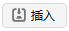
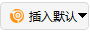
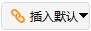
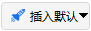
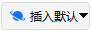
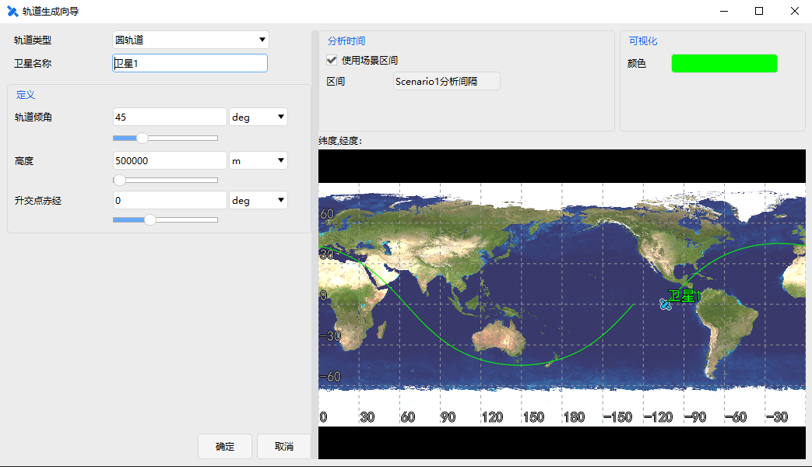
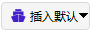

# 插入对象

## 创建高级接近分析

（1）点击【插入默认】按钮，或点击【插入】按钮并选择想定对象为“高级接近分析”。

（2）插入方式为“插入默认类型”（插入默认）。

（3）点击【插入】按钮，对象窗口即可显示插入的高级接近分析对象。

## 创建飞机

（1）点击【插入默认】按钮，或点击【插入】按钮并选择想定对象为“飞机”。

（2）插入方式为“插入默认类型”（插入默认）。

（3）点击【插入】按钮，对象窗口即可显示插入的飞机对象。

## 创建区域目标

目前插入区域目标的方式有两种：一是插入默认区域目标对象、二是从国家和地区库中插入区域目标对象。

**（1）插入默认区域目标对象**

1）点击【插入默认】按钮，或点击【插入】按钮并选择想定对象为“区域目标”。

2）插入方式为“插入默认类型”（插入默认）。

3）点击【插入】按钮，对象窗口即可显示插入的区域目标对象。

**（2）从国家和地区库中插入区域目标对象**

1）点击【插入】按钮并选择想定对象为“区域目标”。

2）插入方式为“选择国家和地区”。

3）在弹出界面的左侧可以选择想要添加的国家和地区，右侧可以设置插入选项、插入区域以及可视化颜色。

4）点击【插入】按钮，对象窗口即可显示插入的区域目标对象。

## 创建链路

（1）点击【插入默认】按钮，或点击【插入】按钮并选择想定对象为“链路”。

（2）插入方式为“插入默认类型”（插入默认）。

（3）点击【插入】按钮，对象窗口即可显示插入的链路对象。

## 创建集群

（1）点击【插入默认】按钮，或点击【插入】按钮并选择想定对象为“集群”。

（2）插入方式为“插入默认类型”（插入默认）。

（3）点击【插入】按钮，对象窗口即可显示插入的集群对象。

## 创建覆盖定义

（1）点击【插入默认】按钮，或点击【插入】按钮并选择想定对象为“覆盖定义”。

（2）插入方式为“插入默认类型”（插入默认）。

（3）点击【插入】按钮，对象窗口即可显示插入的覆盖定义对象。

## 创建地面站

目前插入地面站的方式有三种：一是插入默认地面站对象、二是从标准对象数据库中插入地面站对象、三是从初始数据库中插入地面站对象。

**（1）插入默认地面站对象**

1）点击【插入默认】按钮，或点击【插入】按钮并选择想定对象为“地面站”。

2）插入方式为“插入默认类型”（插入默认）。

3）点击【插入】按钮，对象窗口即可显示插入的地面站对象。

**（2）从标准对象数据库中插入地面站对象。**

1）点击【插入】按钮并选择想定对象为“地面站”。

2）插入方式为“从数据库”（标准数据库）。

3）点击【插入…】按钮，即可弹出查询标准对象数据库窗口，在查找项中输入相应搜索参数。

4）点击【搜索】按钮，右侧结果页面可显示相应搜索数据，再在结果数据中选择想要插入的地面站。

5）设置相应的颜色，点击【插入】按钮，即可在对象窗口中看到插入的地面站对象。

6）最后点击【关闭】按钮，关闭标准对象数据库窗口。

**（3）从标准城市数据库中插入地面站对象。**

1）点击【插入】按钮并选择想定对象为“地面站”。

2）插入方式为“从城市数据库”（初始数据库）。

3）点击【插入…】按钮，即可弹出查询标准对象数据库窗口（此标准对象数据库窗口与（2）中的在查找项上有细微区别），在查找项中输入相应搜索参数。

4）点击【搜索】按钮，右侧结果页面可显示相应搜索数据，再在结果数据中选择想要插入的地面站。

5）设置相应的颜色，点击【插入】按钮，即可在对象窗口中看到插入的地面站对象。

6）最后点击【关闭】按钮，关闭标准对象数据库窗口。

## 创建车辆

（1）点击【插入默认】按钮，或点击【插入】按钮并选择想定对象为“车辆”。

（2）插入方式为“插入默认类型”（插入默认）。

（3）点击【插入】按钮，对象窗口即可显示插入的车辆对象。

## 创建火箭

（1）点击【插入默认】按钮，或点击【插入】按钮并选择想定对象为“火箭”。

（2）插入方式为“插入默认类型”（插入默认）。

（3）点击【插入】按钮，对象窗口即可显示插入的火箭对象。

## 创建导弹

（1）点击【插入默认】按钮，或点击【插入】按钮并选择想定对象为“导弹”。

（2）插入方式为“插入默认类型”（插入默认）。

（3）点击【插入】按钮，对象窗口即可显示插入的导弹对象。

## 创建行星

（1）点击【插入默认】按钮，或点击【插入】按钮并选择想定对象为“行星”。

（2）插入方式为“插入默认类型”（插入默认）。

（3）点击【插入】按钮，对象窗口即可显示插入的行星对象。

## 创建卫星

创建卫星对象工具提供5种插入方式。

**（1）轨道生成向导方式插入卫星**

点击【轨道生成向导】插入对象，将弹出轨道生成向导界面，根据向导界面提示设置相应的参数，可以非常直观的看到生成轨道的样式图像。

轨道类型有圆轨道、临界倾角轨道、临界倾角，太阳同步轨道、静止轨道、闪电轨道、回归轨道、太阳同步回归轨道、太阳同步轨道、自定义轨道、星下点定义轨道、星下点定义回归轨道。右侧可以设置时间区间和可视化的颜色。

| 卫星轨道               | 描述                                                         |
| ---------------------- | ------------------------------------------------------------ |
| 圆轨道                 | 轨道半径始终保持恒定。                                       |
| 临界倾角轨道           | 临界倾角轨道使近地点保持在一个固定的纬度。拱线不随时间变化。在固定轨道上的卫星将在指定的固定经度上的天空中保持一个固定纬度。 |
| 临界倾角，太阳同步轨道 | 临界倾斜太阳同步轨道结合这两种类型轨道的特点。该轨道使用的逆行倾角为116.565度。卫星每转一圈都会以相同的当地平均太阳时从上空经过，其近地点保持在一个固定的纬度。 |
| 静止轨道               | 地球静止轨道上的卫星将在指定固定经度的上空中保持固定。       |
| 闪电轨道               | 闪电轨道为大偏心率轨道，远地点与近地点高度差异显著；同时该轨道为临界倾角轨道，可使近地点保持在南半球，且卫星在北半球高纬度区域具有较长的驻留时间。 |
| 回归轨道               | 当不同时间需要相同的观测条件以检测变化时，具有重复地面轨迹的轨道是有用的。地面痕迹可以每天重复，或者在重复之前日复一日的交织。 |
| 太阳同步回归轨道       | 太阳同步回归轨道适用于需要在不同时段获得一致观测与光照条件以监测变化的场景，地面轨迹可逐日重复或在重复前逐日交错，轨道可完成地面覆盖周期的重复，且卫星每绕轨一圈，均会在大致相同的当地平太阳时经过地面同一点。 |
| 太阳同步轨道           | 这些轨道的设计利用了地球扁率的影响，使轨道平面以等于地球绕太阳的平均轨道速率进动。太阳同步轨道具有其节点保持恒定的局部平均太阳时间的性质。 |
| 自定义轨道             | 用于用户创建自定义的轨道。                                   |
| 星下点定义轨道         | 根据星下点轨迹定义轨道参数。                                 |
| 星下点定义回归轨道     | 根据星下点轨迹定义回归轨道参数。                             |

**（2）插入默认对象**

点击【插入默认类型】时，在插入对象窗中将直接添加卫星对象数据，卫星为默认状态。

**（3）从TLE文件数据中插入卫星**

点击【从TLE文件】中插入卫星对象，将弹出TLE数据源对话框，可以选择TLE数据源，选择相应的数据。

数据表中会显示相应轨道的相关信息，底部显示表中数据总数及选中数。可以设置插入项的颜色和开始历元。

**（4）从标准对象数据库中插入卫星**

点击【从数据库】中插入卫星对象，将弹出查询标准对象数据库界面，可以查询卫星数据源，选择相应的数据。

**（5）从外部星历文件中插入卫星**

点击【从外部星历文件】插入卫星对象，则会弹出相应的文件对话框，从中选择".e"的星历文件数据。

## 创建卫星集群

（1）点击【插入默认】按钮，或点击【插入】按钮并选择想定对象为“卫星集群”。

（2）插入方式为“插入默认类型”（插入默认）。

（3）点击【插入】按钮，对象窗口即可显示插入的卫星集群对象。

## 创建卫星系统

（1）点击【插入默认】按钮，或点击【插入】按钮并选择想定对象为“卫星系统”。

（2）插入方式为“插入默认类型”（插入默认）。

（3）点击【插入】按钮，对象窗口即可显示插入的卫星系统对象。

## 创建舰船

（1）点击【插入默认】按钮，或点击【插入】按钮并选择想定对象为“舰船”。

（2）插入方式为“插入默认类型”（插入默认）。

（3）点击【插入】按钮，对象窗口即可显示插入的舰船对象。

## 创建恒星

目前插入恒星的方式有两种：一是插入默认恒星对象、二是从数据库中插入恒星对象。

**（1）插入默认恒星对象**

1）点击【插入默认】按钮，或点击【插入】按钮并选择想定对象为“恒星”。

2）插入方式为“插入默认类型”（插入默认）。

3）点击【插入】按钮，对象窗口即可显示插入的恒星对象。

**（2）从数据库插入恒星对象**

1）点击【插入】按钮并选择想定对象为“恒星”。

2）选择插入方式为“从数据库”。

3）点击【插入…】按钮，即可弹出查询标准对象数据库界面，在查找项中输入相应搜索参数。

4）点击【搜索】按钮，右侧结果页面可显示相应搜索数据，再在结果数据中选择想要插入的恒星对象。

5）设置相应的颜色，点击【插入】按钮，即可在对象窗口中看到插入的恒星对象。

6）最后点击【关闭】按钮，关闭标准数据库窗口。

## 创建潜艇

（1）点击【插入默认】按钮，或点击【插入】按钮并选择想定对象为“潜艇”。

（2）插入方式为“插入默认类型”（插入默认）。

（3）点击【插入】按钮，对象窗口即可显示插入的潜艇对象。

## 创建天线

（1）点击【插入】按钮并选择附加对象为“天线”。

（2）插入方式为“插入默认类型”。

（3）点击【插入…】按钮。

（4）弹出选择对象窗口，选择相应父对象，点击【确定】。

注意：插入默认天线时，首先要选择相应的想定对象，没有对应的想定对象时是无法创建天线的。

## 创建品质因子

（1）点击【插入】按钮并选择附加对象为“品质因子”。

（2）插入方式“插入默认类型”。

（3）点击【插入…】按钮。

（4）弹出选择对象窗口，选择覆盖定义对象，点击【确定】。

注意：插入默认品质因子时，首先要选择相应的覆盖定义对象，没有对应的覆盖定义对象时是无法创建品质因子的。

## 创建接收器

（1）点击【插入】按钮并选择附加对象为“接收器”。

（2）插入方式为“插入默认类型”。

（3）点击【插入…】按钮。

（4）弹出选择对象窗口，选择相应父对象，点击【确定】。

注意：插入默认接收器时，首先要选择相应的想定对象，没有对应的想定对象时是无法创建接收器的。

## 创建传感器

（1）点击【插入】按钮并选择附加对象为“传感器”。

（2）插入方式为“插入默认类型”。

（3）点击【插入…】按钮。

（4）弹出选择对象窗口，选择相应父对象，点击【确定】。

注意：插入默认传感器时，首先要选择相应的想定对象，没有对应的想定对象时是无法创建传感器的。

## 创建发射器

（1）点击【插入】按钮并选择附加对象为“发射器”。

（2）插入方式为“插入默认类型”。

（3）点击【插入…】按钮。

（4）弹出选择对象窗口，选择相应父对象，点击【确定】。

注意：插入默认发射器时，首先要选择相应的想定对象，没有对应的想定对象时是无法创建发射器的。