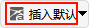

# 插入默认（快捷插入）
插入默认是常用对象的一键快捷创建方式，支持预先配置与即时使用，实现常用对象快速插入。

## 方式一：设置默认对象一键插入
单击  图标，弹出设置对话框，可选择需要设为默认的对象类型，如高级接近分析、卫星、地面站、舰船等。

设置完成后，下次直接单击  图标，即可一键插入已选定的默认对象。

## 方式二：插入对象窗口选择默认方式
在【插入对象】窗口中选定目标对象类型后，插入方式选择 **插入默认类型**，直接点击 <kbd>插入...</kbd> 按钮，即可使用系统默认参数完成对象添加。

