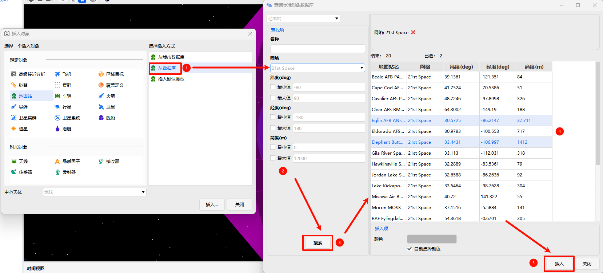

# 从数据库
数据库搜索与插入支持从标准对象数据库中批量筛选并导入对象，适合批量加载已有卫星库、恒星/行星等场景。

## 菜单栏快捷入口
在【插入】菜单栏中单击  图标，直接弹出 **【查询标准对象数据库】** 窗口，可快速进行对象搜索与插入。

## 插入对象窗口选择“从数据库”
在【插入对象】窗口中选定目标对象类型后，插入方式选择 **从数据库**，点击 <kbd>插入...</kbd> 按钮，同样会打开 **【查询标准对象数据库】** 窗口。

在该窗口中设置搜索参数后点击 <kbd>搜索</kbd>，在结果列表中选择所需对象，配置显示颜色后点击 <kbd>插入</kbd> 即可完成导入。

> **【查询标准对象数据库】** 窗口的详细筛选、搜索与配置操作，请参见 **【查询标准对象数据库】** 章节。