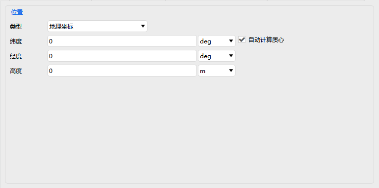
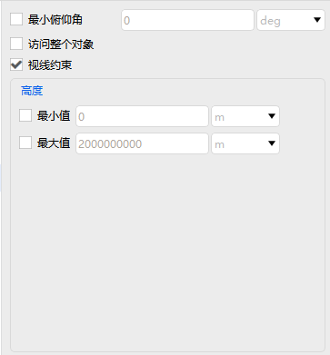

# 区域目标

区域目标属性设置包括：基本属性、可视化、约束。

### 基本属性

基本属性包括：边界、质心。

### 可视化

可视化显示设置包含是否显示、是否显示标签、是否显示中心点、是否显示边界点、是否填充、透明度设置、颜色设置、线型线宽设置。

### 约束

基本约束包括最小俯仰角设置、是否访问整个对象、是否设置视线约束、高度最小值和最大值设置。

时间约束详情见[飞机的属性设置](#飞机的属性设置)部分，这里不再赘述。