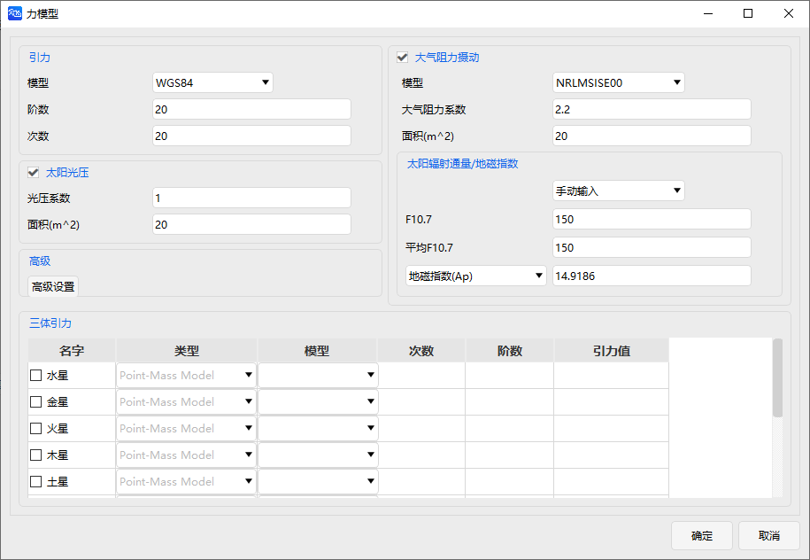
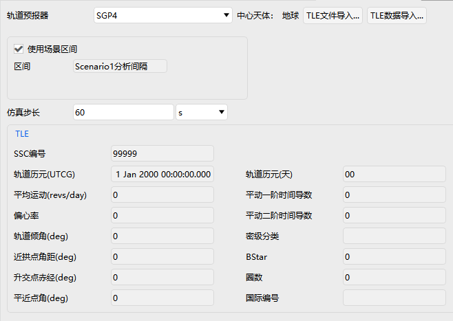
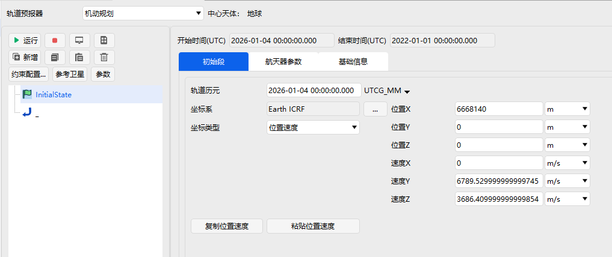
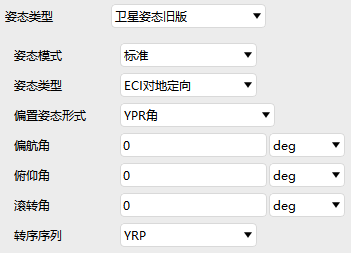
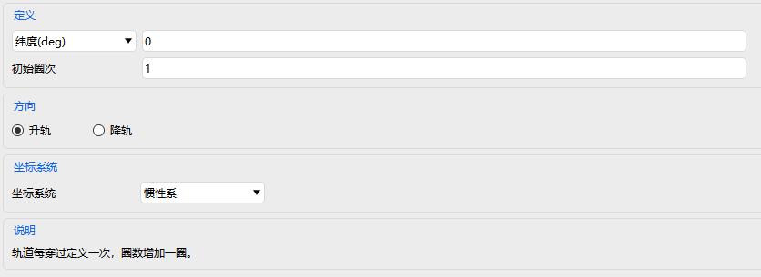

# 卫星

卫星属性设置包括：基本属性、二维视图、三维视图和约束。

### 基本属性

基本属性设置包含轨道、姿态、质量、轨道圈数、地面椭圆。

#### 轨道 

轨道设置中包括轨道预报器设置、坐标系设置、坐标类型设置、轨道生成向导、按相对状态生成等参数设置。

轨道预报器类型包括：二体、J2摄动、J4摄动、SGP4、HPOP、机动规划、STK星历、Vinti、偏差分析等类型。

二体、J2摄动、J4摄动是通过计算公式产生星历的解析传播器。二体公式是精确的（即该公式只考虑了，物体作为质点的影响，生成了围绕中心物体运动的已知解），但不是物体的实际受力环境的准确模型。J2摄动包括了质点效应和重力场中不对称性的主导效应（即重力场中的J2项，代表南北半球的扁率）。J4额外考虑了其次重要的扁率效应（J2之外的J2^2和J4项）这些传播子都没有模拟大气阻力、太阳辐射压力或三体重力，它们只解释了一个完整重力场模型中的几个项。

这些传播器通常用于早期研究（通常无法获得卫星数据，以生产更准确的星历）来进行趋势分析。J2摄动常用于短期分析（周），J4摄动常用于长期分析（月、年）。它们特别适用于对“理想的”维持轨道建模，而不必对维护机动本身建模。对于卫星，这些维护轨道可以使用轨道向导来构建。

由J2摄动和J4摄动传播子产生的解是基于开普勒平均元素的近似解。一般来说，施加在卫星上的力会导致开普勒平均元素随时间漂移（长期变化）和振荡（通常振幅很小）。特别是J2和J4项只引起半长轴、偏心率和倾角的周期性振荡，同时在近地点、赤经和平均异常幅角上的产生漂移。ATK的J2摄动和J4摄动传播器只模型元素的长期漂移（平均异常的漂移最好被视为卫星运动周期的变化）。许多理想的维持轨道在设计上都是利用J2引起的普遍的长期漂移来实现其任务的。

轨道预报器类型说明

| 类型         | 类别                | 核心原理与特点                                               | 典型用途                                                     |
| :----------- | :------------------ | :----------------------------------------------------------- | :----------------------------------------------------------- |
| **二体**     | 解析传播器          | 仅考虑中心天体作为质点的理想引力。公式精确、计算极快，但未考虑任何真实摄动力，长期预报误差大。 | 理论演示、初步轨道分析、教学、快速估算。                     |
| **J2摄动**   | 解析传播器          | 在二体基础上，增加地球扁率（J2项）的主导摄动影响。精度和速度介于二体与高精度模型之间。 | 对近地卫星进行中期、精度要求不高的轨道预报。                 |
| **J4摄动**   | 解析传播器          | 在J2模型基础上，进一步考虑J4等高阶扁率项。比J2模型更精确，但仍未考虑阻力、光压等。 | 需要比J2更高精度的近地轨道解析预报。                         |
| **SGP4**     | 简化解析/半解析模型 | 专为处理TLE数据设计，高效模拟近地及地球同步轨道的主要摄动（如阻力、地球引力场）。 | 最广泛应用于TLE数据的轨道预报，如卫星跟踪、碰撞预警、可见性分析。 |
| **HPOP**     | 高精度数值传播器    | 通过数值积分，可配置最完整精细的力学模型（完整重力场、大气、光压、日月引力等）。精度最高，计算量最大。 | 高精度任务分析，如航天器交会对接、精密定轨、科学研究。       |
| **机动规划** | 特殊用途模型        | 在基础传播器上叠加预设的机动（推力）事件，以模拟主动变轨过程。 | 任务规划和仿真，分析变轨策略及机动后的轨道状态。             |
| **STK星历**  | 数据导入/接口       | 允许直接导入外部生成的高精度星历数据文件，在软件中回放该轨迹。并非传播算法。 | 将高保真仿真结果作为“黄金标准”输入，用于对比验证或可视化。   |
| **Vinti**    | 解析传播器          | 一种特殊的解析解，同时考虑地球扁率（J2项）和地球旋转大气的综合影响。 | 特定学术研究或需同时考虑J2与大气旋转效应的解析场景。         |
| **偏差分析** | 分析工具            | 一种分析模式，通过比较两个不同传播模型的轨迹结果，评估模型偏差或误差范围。 | 模型验证、误差分析、理解不同力学模型假设的影响。             |

选择二体、J2摄动、J4摄动或Vinti模型后，必须设置卫星的开始时间，停止时间和步长。若勾选“使用场景区间”，则使用当前场景时段。然后选择一个坐标系统和坐标类型并输入轨道参数的值。

坐标系统可以设置为：ICRF、J2000、天体固连系、真赤道系、平赤道系、真赤道平春分点系、真黄道系、平黄道系、J2000历元平黄道系。

坐标类型可以设置为：位置速度、轨道根数、球坐标。

位置速度对应参数为位置XYZ和速度XYZ。

轨道根数提供了多种等效的参数组合选项，以满足不同场景下的使用需求。用户可根据具体应用灵活选择，可以选择为半长轴、偏心率、轨道倾角、升交点赤经、近地点角距、真近点角等。

描述轨道大小与形状的参数

| 参数组合                            | 物理意义与区别                                               | 适用场景与特点                                               |
| :---------------------------------- | :----------------------------------------------------------- | :----------------------------------------------------------- |
| 半长轴 (a) + 偏心率 (e)             | 标准理论参数。`a`决定轨道大小与周期；`e`决定轨道形状（0为圆，0~1为椭圆）。 | 最通用、最基础的组合，适用于所有理论推导和精确计算，是航天动力学的核心参数。 |
| 远拱点半径 (r_a) + 近拱点半径 (r_p) | 几何直观参数。直接表示航天器离中心天体最远和最近的距离。     | 非常直观，便于从几何角度理解轨道。常用于任务初步设计、轨道交会分析等场景。 |
| 远拱点高度 (h_a) + 近拱点高度 (h_p) | 工程实用参数。高度为半径减去天体参考面（如地球半径）的值。   | 直接给出离地面或海平面的实际高度，便于评估覆盖范围、燃料消耗和大气阻力风险。 |
| 周期 (T) + 偏心率 (e)               | 时间与形状参数。周期T是绕行一周的时间，由半长轴决定。        | 当时间特性是首要关注点时使用，例如设计地球同步卫星、侦察卫星等需要特定重访周期的任务。 |
| 平均运动 (n) + 偏心率 (e)           | 角速度与形状参数。平均运动n是平均角速度，与周期T互为倒数关系（n=2π/T）。 | 与“周期+偏心率”本质相同，是两行轨道根数(TLE)中的标准表达方式，便于快速计算卫星的平均位置。 |

描述轨道上位置的参数

| 参数选择           | 物理意义与区别                                               | 适用场景与特点                                               |
| :----------------- | :----------------------------------------------------------- | :----------------------------------------------------------- |
| 真近点角 (ν)       | 真实的角度。从近地点量起，到航天器当前位置的真实角度。       | 描述瞬时真实空间位置。直接用于轨道可视化、遥感对地指向等。其随时间变化不均匀（近地点快，远地点慢）。 |
| 偏近点角 (E)       | 辅助的几何角度。是一个将椭圆映射到辅助圆上的角度。           | 关键的中间计算变量。通过开普勒方程 `M = E - e sin E` 连接平近点角与真近点角，在轨道计算迭代中不可或缺。 |
| 平近点角 (M)       | 假想的平均角度。假设一个以平均角速度运动的假想点从近地点起算的角度。 | 轨道预报与星历计算的核心。它随时间均匀线性增长，是所有轨道外推计算的起点。TLE中提供的就是它。 |
| 纬度幅角 (u)       | 从升交点量起的角度。等于近地点角距(ω)与真近点角(ν)之和。     | 当近地点意义不大时使用（如圆轨道）。直接给出了航天器相对于赤道面的角度位置，概念更简洁。 |
| 过近地点时间 (T_p) | 一个时间戳。航天器最后一次通过近地点的时刻。                 | 与平近点角本质等价（给定T_p可算出任意时刻的M）。是另一种表达“初始位置”的常用时间基准。 |
| 过升交点时间       | 一个时间戳。航天器从南向北穿过赤道面（升交点）的时刻。       | 对地球轨道任务特别直观。便于分析卫星与地面站的可见性、计算太阳同步轨道的光照条件等。 |
| 升交点赤经 (Ω)     | 在惯性坐标系（如J2000）中，春分点方向到升交点方向的角度。    | 用于高精度的轨道动力学建模和长期演化计算，是描述轨道面在惯性空间中方向的经典参数。 |
| 升交点经度         | 考虑了岁差，相对于某一历元的平赤道的升交点经度。             | 在描述地球卫星轨道面相对于地球的长期平均方向时更常用，更贴近“地面轨迹”的概念。 |

球坐标对应参数为赤经、赤纬、半径、水平航迹角、方位角、速度。

除了坐标系统、坐标类型，HPOP模型还可以设置轨道模型中的受力模型、数值算法中的积分算法、协方差等参数。

受力模型参数设置包括引力设置、太阳光压设置、大气阻力摄动设置、太阳辐射通量/地磁指数设置、三体引力设置。

引力设置参数有：引力模型、阶数、次数。

太阳光压设置参数有：光压系数、光压面积。

大气阻力摄动设置参数有：大气模型、大气阻力系数、阻力面积。

太阳辐射通量/地磁指数设置参数有：F10.7、平均F10.7、地磁指数。

三体引力设置参数有：天体名字、类型、模型、阶数、次数、引力值等。

积分算法参数设置包含积分精度设置、是否固定步长输出星历。

SGP4模型需要导入TLE文件或直接导入TLE数据，进行TLE相应的参数设置。

STK星历模型可以设置星历文件等参数。详情见[火箭的属性设置](#火箭的属性设置)STK星历部分

机动规划模型可以新增，删除段，对段进行约束配置，添加参考航天器等。

轨道偏差分析模型参数设置界面与机动规划的界面一致。

按相对状态生成参数设置界面包括卫星类型卫星状态，相对参考卫星的状态（参考卫星VVLH坐标系）设置相对位置和相对速度、初始状态生成结果。

##### 姿态 

卫星姿态设置包括姿态类型选择以及对应参数设置。

姿态类型包含：对齐约束姿态、AttitudeEcfAligndVel、AttitudeEciAligndVel、固定姿态、固定于天体固定系姿态、固定于天体惯性系姿态、多段姿态、实时姿态、STK姿态、卫星姿态旧版、旋转姿态、目标指向姿态、轨道局部坐标系姿态、固连系VVLH姿态、惯性系VVLH姿态。

当姿态类型选择卫星姿态旧版时，对应参数设置

| 设置项       | 可选值                                                 |
| :----------- | :----------------------------------------------------- |
| 姿态模式     | 标准、多分段、STK文件                                  |
| 姿态类型     | ECI对地定向、ECF对地定向、ECI对速度定向、ECF对速度定向 |
| 偏置姿态形式 | 四元数、欧拉角、YPR角设置                              |

##### 质量

质量设置包括：总质量、质心位置、转动惯量等参数设置。

##### 轨道圈数

轨道圈数设置包括定义、方向、坐标系统以及说明。轨道定义包括纬度、经度、初始圈次的设置。轨道方向可以选择升轨或降轨。坐标系统可以选择惯性系或地固系。

##### 地面椭圆

地面椭圆设置详情见[飞机的属性设置](#飞机的属性设置)基本属性部分，这里不再赘述。

### 二维视图

二维视图显示设置添加了自定义模式，可以设置开始结束时间、是否显示、颜色设置、是否显示二维三维地面轨迹、是否显示轨道、是否显示标签。

其他设置与火箭一样，详情见[火箭的属性设置](#火箭的属性设置)二维视图部分，这里不再赘述。

### 三维视图

三维视图设置详情见[火箭的属性设置](#火箭的属性设置)三维视图部分，这里不再赘述。

### 约束

约束详情见[飞机的属性设置](#飞机的属性设置)约束部分，这里不再赘述。