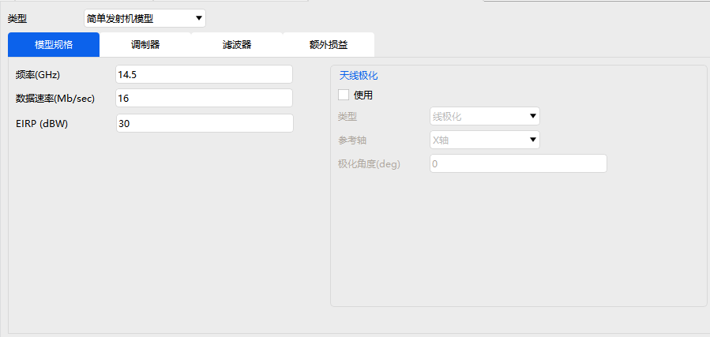
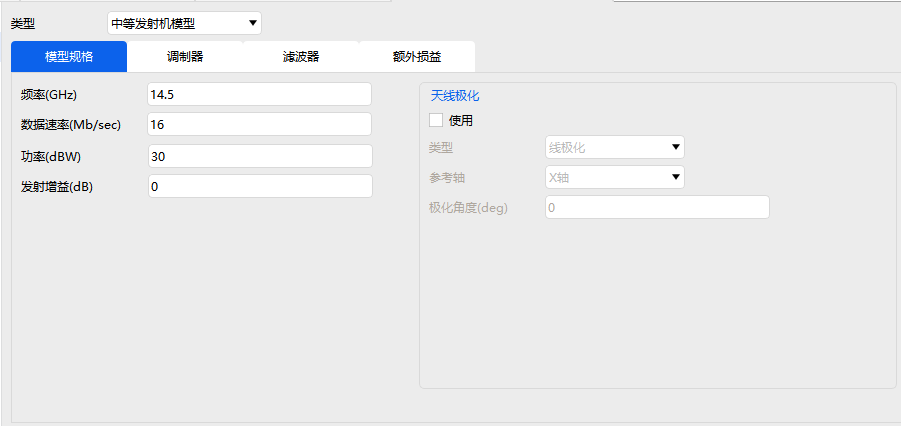

# 发射器

发射器属性设置包括：基本属性、约束和RF。

### 基本属性

定义设置中可以选择发射器的类型，发射器类型包括：

|   发射器类型   |
| :------------: |
| 简单发射机模型 |
| 中等发射机模型 |
| 复杂发射机模型 |
| 简单转发器模型 |
| 中等转发器模型 |
| 复杂转发器模型 |

简单、中等和复杂模型参数设置均包含模型规格、调制器、滤波器、额外损益等参数的设置，复杂模型还包含天线参数的设置。

### 约束

基本约束和时间约束详情见[飞机的属性设置](#飞机的属性设置)约束部分，这里不再赘述。

通信约束详情见[接收器飞机的属性设置](#接收器的属性设置)约束部分，这里不再赘述。

### RF

环境设置详情见[飞机的属性设置](#飞机的属性设置)RF部分，这里不再赘述。