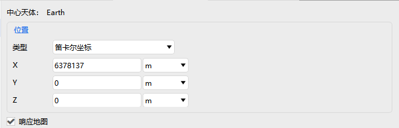

# 地面站

地面站属性设置包括：基本属性、二维视图、三维视图、约束和RF。

### 基本属性

基本属性位置设置包含类型设置以及对应参数设置，可以选择是否响应地图设置。

### 二维视图

二维视图包括：显示、距离，详情见[飞机的属性设置](#飞机的属性设置)二维视图部分，这里不再赘述。

### 三维视图

三维视图包括：模型、向量、姿态球、距离、数据显示，详情见[飞机的属性设置](#飞机的属性设置)三维视图部分，这里不再赘述。

### 约束

约束详情见[飞机的属性设置](#飞机的属性设置)约束部分，这里不再赘述。

### RF

环境设置详情见[飞机的属性设置](#飞机的属性设置)RF部分，这里不再赘述。