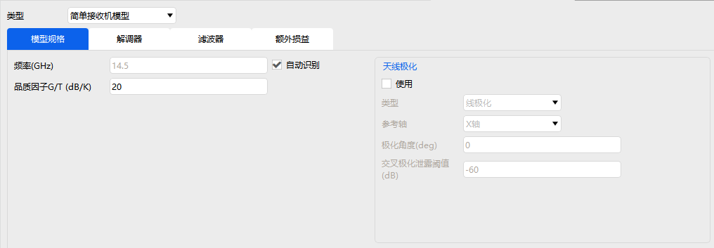
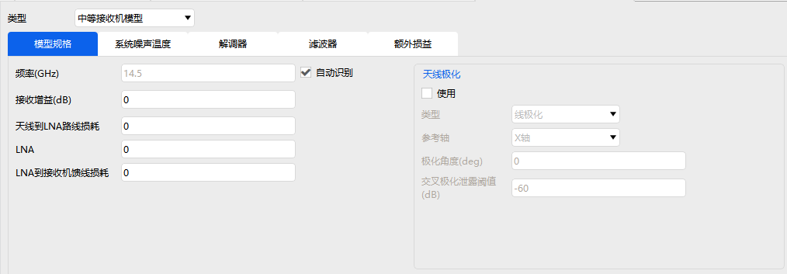

# 接收器

接收器属性设置包括：基本属性、约束和RF。

### 基本属性

定义设置中可以选择接收器的类型，接收器类型包括：

|   接收器类型   |
| :------------: |
| 简单接收机模型 |
| 中等接收机模型 |
| 复杂接收机模型 |

简单、中等和复杂模型参数设置均包含模型规格、调制器、滤波器、额外损益等参数的设置，中等模型还包含系统噪声温度的设置，复杂模型还包含天线和系统噪声温度的设置。

### 约束

基本约束和时间约束详情见[飞机的属性设置](#飞机的属性设置)约束部分，这里不再赘述。

通信约束支持频率、接收到的各向同性功率、通量密度、链路等效各向同性辐射功率、多普勒频移、C/No、接收机输入功率、C/N、误码率、链路裕量、Eb/No、极化相对角、天线性能品质因子等参数的设置。所有约束设置都支持“反向选择”。

### RF

环境设置详情见[飞机的属性设置](#飞机的属性设置)RF部分，这里不再赘述。