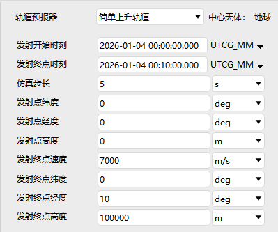
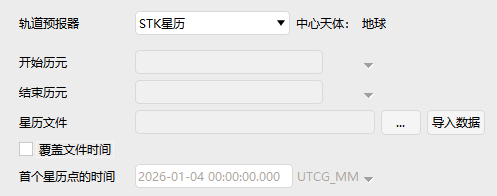
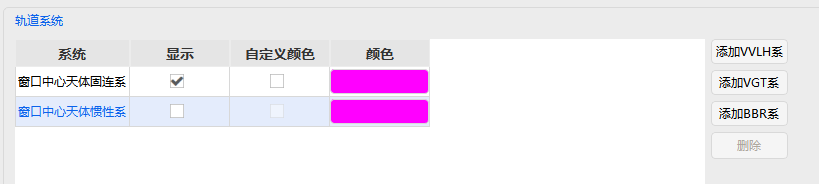

# 火箭
火箭属性设置包含**基本属性、二维视图、三维视图、约束、RF**五大模块，多用于发射弹道与上升段仿真。

---

## 基本属性
包括**弹道、姿态、地面椭圆**三部分。

### 弹道
支持两种轨道预报器：
- **简单上升轨道**
  - 发射开始/终点时刻、仿真步长
  - 发射点经纬度、高度
  - 发射终点速度、经纬度、高度
  

- **STK星历**
  - 开始/结束历元
  - 星历文件加载
  - 可选是否覆盖文件时间
  

### 姿态
提供三种姿态模式：
- **标准**：姿态类型 + 偏置姿态（四元数/欧拉角/YPR）
  
- **多分段**：按时间段设置多段姿态与四元数
  
- **STK文件**：导入外部姿态文件
  

### 地面椭圆
设置同 [飞机的属性设置](./飞机.md)，不再赘述。

---

## 二维视图
包含**显示、轨迹、等高线、距离、刈幅、地面椭圆**。

### 刈幅
可选择刈幅类型并配置显示：
- 地面仰角、飞行器半锥角、刈幅半幅宽
- 地面仰角包络、飞行器半锥角包络

其余项同 [飞机的属性设置](./飞机.md)。

---

## 三维视图
包含**模型、向量、姿态球、轨道系统、接近、等高线、距离、数据显示**。

### 轨道系统
- 选择坐标系统
- 是否显示、是否自定义颜色及颜色设置

其余项同 [飞机的属性设置](./飞机.md)。

---

## 约束
全部约束设置同 [飞机的属性设置](./飞机.md)。

---

## RF
环境设置同 [飞机的属性设置](./飞机.md)。