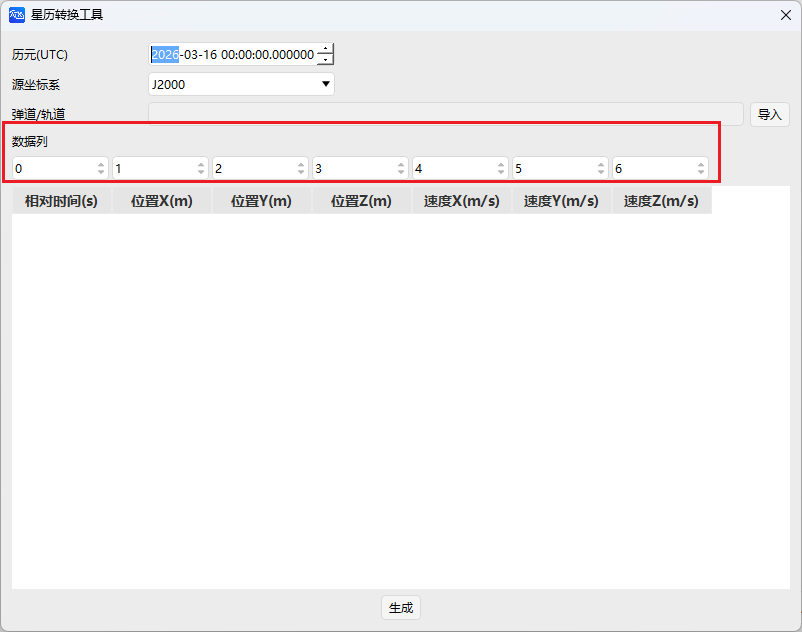

# 火箭
火箭属性设置包含**基本属性、二维视图、三维视图、约束、RF**五大模块，多用于发射弹道与上升段仿真。

---

## 基本属性
包括**弹道、姿态、地面椭圆**三部分。

### 弹道
支持两种轨道预报器：
- **简单上升轨道**
  - 发射开始/终点时刻、仿真步长
  - 发射点经纬度、高度
  - 发射终点速度、经纬度、高度
  

- **STK星历**
  - 开始/结束历元
  - 星历文件加载
  - 可选是否覆盖文件时间
  

姿态设置包含姿态模式类型选择，类型包括：标准、多分段、STK文件。

标准参数设置包括：姿态类型设置、偏置姿态形式及对应参数设置。

多分段数设置包括：开始时间、姿态类型设置、四元数参数设置。

STK文件参数设置包括：开始历元、结束历元、姿态文件选择。

星历转换工具设置：点击【导入数据】，进入页面。这里设置历元（UTC）、源坐标系、弹道/轨迹，并增加数据列功能，通过指定列号，将导入文件中的各列数据映射到对应的字段（相对时间、位置、速度），以解决文件列顺序混乱的问题。此外，星历转换工具支持参数自动保存，退出后重新打开时无需重复配置。

### 地面椭圆
设置同 [飞机的属性设置](./飞机.md)，不再赘述。

---

## 二维视图
包含**显示、轨迹、等高线、距离、刈幅、地面椭圆**。

### 刈幅
可选择刈幅类型并配置显示：
- 地面仰角、飞行器半锥角、刈幅半幅宽
- 地面仰角包络、飞行器半锥角包络

其余项同 [飞机的属性设置](./飞机.md)。

---

## 三维视图
包含**模型、向量、姿态球、轨道系统、接近、等高线、距离、数据显示**。

### 轨道系统
- 选择坐标系统
- 是否显示、是否自定义颜色及颜色设置

其余项同 [飞机的属性设置](./飞机.md)。

---

## 约束
全部约束设置同 [飞机的属性设置](./飞机.md)。

---

## RF
环境设置同 [飞机的属性设置](./飞机.md)。