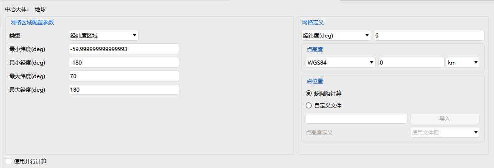
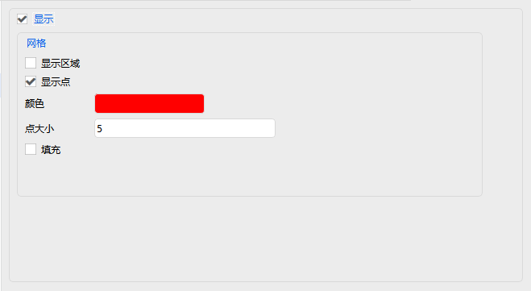

# 覆盖定义

覆盖定义属性设置包括：基本属性、可视化、约束。

### 基本属性

基本属性网格设置包括网格区域配置参数、网格定义、是否使用并行计算。

网格区域配置参数设置包括类型设置，以及对应类型的参数设置。

网格定义设置包括网格类型设置、点高度设置、点位置设置。

### 可视化

可视化显示设置包括是否显示、是否显示区域、是否显示点、颜色设置、点大小设置、是否填充。

### 约束

约束详情见[飞机的属性设置](#飞机的属性设置)部分，这里不再赘述。