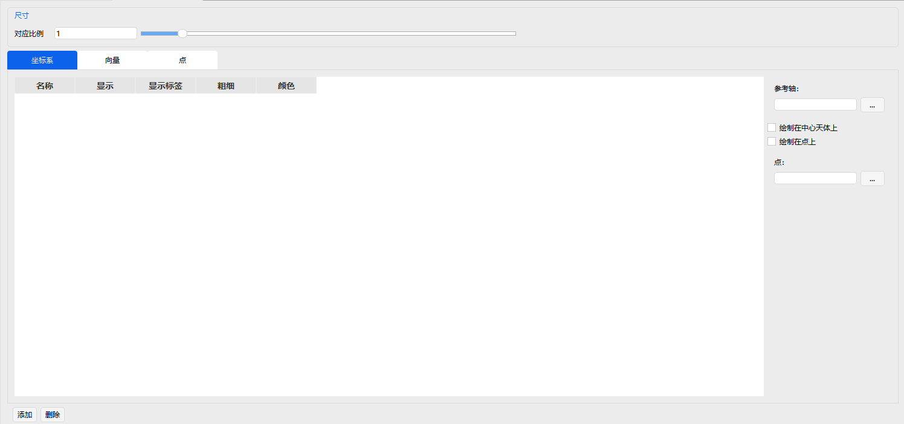
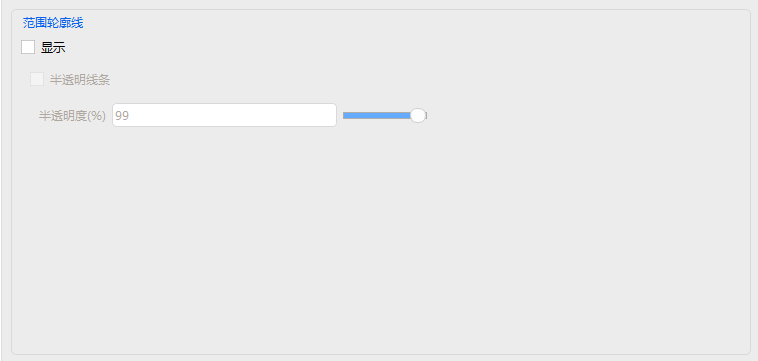
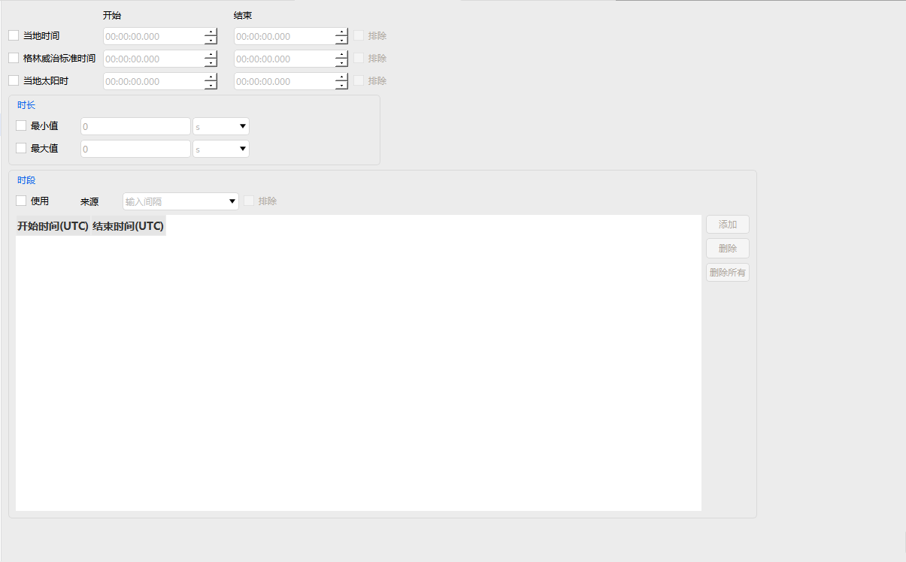
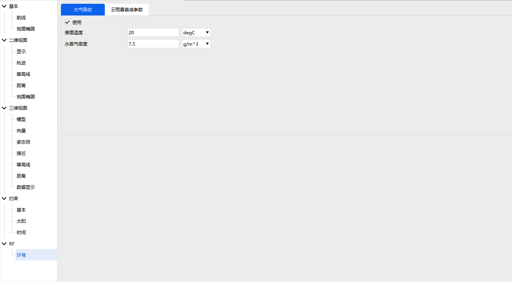

# 飞机

飞机属性设置包括：基本属性、二维视图、三维视图、约束和RF。

### 基本属性

基本属性包括：航线、地面椭圆。

### 二维视图

二维视图包括：显示、轨迹、等高线、距离、地面椭圆。

显示设置选项说明

| 设置分类     | 选项名称         | 说明                                               |
| :----------- | :--------------- | :------------------------------------------------- |
| **显示控制** | 是否显示         | 控制整个显示模块的开启与关闭。                     |
|              | 显示标签         | 控制是否为目标添加文字标签。                       |
|              | 显示二维地面轨迹 | 在地图平面上显示目标的历史运动轨迹。               |
|              | 显示三维轨道     | 在三维视图中显示目标的空间运行轨道。               |
|              | 保留轨迹         | 选择是否持续累积并显示历史轨迹，或仅显示实时位置。 |
| **视觉样式** | 颜色设置         | 设置目标、轨迹或标签的显示颜色。                   |
|              | 标识类型设置     | 选择代表目标的主要图形标识。                       |
|              | 线型设置         | 设置轨迹或连线的线条样式。                         |
|              | 线宽设置         | 设置轨迹或连线的线条粗细。                         |

轨迹设置包含轨迹类型设置，包括点、时间、所有、无四种类型。

等高线设置包含仰角轮廓线设置和仰角椭圆设置，距离设置包含范围轮廓线设置，仰角轮廓线和范围轮廓线均可以设置分级属性。

### 三维视图

三维视图包括：模型、向量、姿态球、接近、等高线、距离、数据显示。

模型设置包含是否显示、模型文件选择、Log比例、欧拉角设置、标签偏移量设置、平移补偿设置、点设置。

| 选项名称       | 说明                                                         |
| :------------- | :----------------------------------------------------------- |
| 是否显示       | 控制模型是否在三维视图中显示。                               |
| 模型文件选择   | 选择加载的3D模型文件，支持OpenSceneGraph(.ive)、3D Studio模型(.3ds)、Flight Studio Open Flight模型(.flt)、Autodesk模型(.fbk)等格式。 |
| Log比例        | 调节模型比例大小的滑动条，取值范围为-10.0~20.0。             |
| 欧拉角设置     | 设置模型的三个欧拉角(Euler1、Euler2、Euler3)，单位为度，并可设置旋转顺序。 |
| 标签偏移量设置 | 设置模型标签在X、Y、Z轴上的偏移量，单位为米。                |
| 平移补偿设置   | 设置模型在X、Y、Z轴上的平移补偿量，单位为米。                |
| 点设置         | 设置模型上关键点的显示属性。                                 |

向量设置包含向量尺寸的大小以及坐标系、向量和点的配置信息，包括是否显示、是否显示标签、粗细、颜色等相关信息。

姿态球设置包括姿态球是否显示、显示的颜色、零度颜色、线宽、零度线宽、参考坐标系、姿态球的比例大小以及投影等信息。

接近设置可以设置不确定区域信息，包括类型、是否显示、颜色、线宽、是否显示文字，文字内容等信息。

等高线设置包含仰角轮廓线设置，距离设置包含范围轮廓线设置。

数据显示可以设置对象对应的动态报告数据在三维视图上的显示信息，包括是否显示、显示位置、字体颜色等。

### 约束

基本约束包括方位角、方位角变化率、角变换率、仰角、仰角变化率、高度、距离、距离变化率、传播延时等信息。可设置每个约束的最小值、最大值和是否设置反向选择。基本约束也包括是否设置视线约束、是否设置地形约束。

太阳约束包括太阳仰角、太阳地平仰角、月球仰角等信息。可设置每个约束的最小值、最大值。太阳约束包括视线设置、附加中心天体遮挡设置。视线可设置太阳规避角和月球规避角。

时间约束包括时间类型及其开始结束时间设置、时长最小值、最大值设置、时段设置。

### RF

环境设置中包括大气吸收和云雨雾衰减参数的设置。

大气吸收可设置表面温度和水蒸气密度。

云雨雾衰减参数可设置雨天模型、云和雾模型。

雨天模型可设置表面温度。

云和雾模型可设置云层上限、云层厚度、云层温度、水密度。

