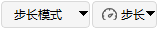
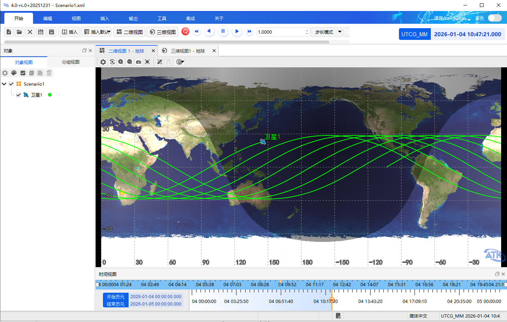

# 执行仿真

##  功能介绍

执行仿真，主要是用来观察想定场景二维、三维的动画演示效果，执行仿真可实时在界面查看二维和三维地图演示仿真结果。

### 执行仿真控件说明

（1）“模式”下拉框

快捷设置仿真模式，下拉框选项有：“步长模式”、“倍率模式”、“实时模式”。

当设置为“步长模式”时，“模式”下拉框右侧会出现“步长”下拉框，下拉框选项有：0.1、1、5、30、60、180、300、600。

当设置为“倍率模式”时，“模式”下拉框右侧会出现“速度”下拉框，下拉框选项有：“最大倍速”、“5 倍速”、“10 倍速”、“100倍速”、“500 倍速”。

当前默认模式为“步长模式”。

（2）仿真步长/速度输入框 

显示当前场景仿真步长或仿真速度，当前默认步长为 10 ，可手动输入修改。

仿真步长为 1 ，代表每秒仿真场景推进 1 分钟。

仿真速度为 1 ，代表每秒仿真场景推进 1 秒。

（3）仿真时间输入框 

显示当前场景仿真的时间，显示值是实时的时间数值，当前默认时间为场景初始时间。可手动输入修改仿真时间点。

（4）【开始】按钮

开始/继续仿真。开始后【暂停】按钮可点击。

（5）【暂停】按钮

暂停仿真。暂停后点击【开始】按钮继续仿真。

（6）【倒放】按钮

倒放仿真，设置仿真方向为时间逆向，即从当前时间向起始时间进行回放。

（7）【重置】按钮

重置仿真，重置进度为仿真起始时间。

（8）【加速】按钮

当仿真模式为“步长模式”时，点击此按钮则设置仿真步长为当前步长*2，可设置最大步长为 100000000 。

当仿真模式为“倍率模式”时，点击此按钮则设置仿真速度为当前速度*2，可设置最大速度为 10000 。

当仿真模式为“实时模式”时，点击此按钮则仿真速度+1 。

（9）【减速】按钮

当仿真模式为“步长模式”时，点击此按钮则设置仿真步长为当前步长/2，可设置最小步长为 1 。

当仿真模式为“倍率模式”时，点击此按钮则设置仿真速度为当前速度/2，可设置最小速度为 0.0001 。

当仿真模式为“实时模式”时，点击此按钮则仿真速度-1 。

（10）时间视图

仿真模式下时间视图，其展示了仿真场景的起止时间。鼠标按住黄色滑块可拖动进度，松开即设置为该进度。

关闭该窗口后还可以在“视图”菜单点击“时间视图”重新打开。

## 使用方法

###  操作步骤

（1）配置对象完成后，可查看仿真时间段结果，仿真起始时间为场景设置的开始时间。此时可在二维、三维地图查看仿真效果。

（2）在仿真过程中可进行倒放、暂停、继续、重置、加速、减速、手动输入速度、手动输入时间等操作。

（3）仿真过程中场景中各对象仅可修改轨迹颜色、传感器颜色等显示属性。

（4）仿真数据播放结束后，回放会自动停止，进度条不会停留在结束时间。点击“重置”将重新从头播放，也可点击“倒放”按钮从该位置倒序播放。