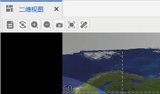
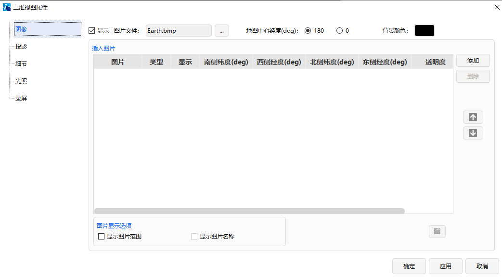

# 二维可视化  

## 功能介绍

二维可视化显示各个对象与地球平面的二维平面的关系。二维视图里面对象的相对关系清晰，在此视图下可直观分析一些相对位置的关系。

## 使用方法

###  二维工具栏操作

在菜单工具栏点击“视图”-【二维视图】。

二维工具栏有 7 个工具按钮：【二维视图属性】、【重置】、【放大】、【缩小】、【快照】、【快照属性】和【测量】。

（1）属性按钮：点击【属性】按钮，即可弹出二维属性视图对话框。在里面可以设置图像、投影、细节、光照等参数信息。

（2）重置按钮：点击【重置】按钮，二维视图即可回归默认视角。

（3）放大按钮：点击【放大】按钮，按钮呈现选中状态。然后按住鼠标左键选择地图中的区域，该区域就会被放大。

（4）缩小按钮：点击【缩小】按钮，按钮呈现选中状态。然后按住鼠标左键选择地图中的区域，该区域就会被放大。

（5）快照按钮：点击【快照】按钮，会弹出一个另存为的对话框。可以选择保存位置，文件名，保存类型等信息。

（6）快照属性按钮：点击【快照属性】按钮，可以设置二维视图快照属性信息。包括保存位置和文件格式。

（7）测量按钮：点击【测量】按钮，即可在二维视图下使用鼠标点击两点测量距离，测量的信息将显示在时间窗口的左下方。

### 二维视图界面的鼠标操作

（1）鼠标左键：按住鼠标左键可以二维视图的左右平移。

（2）鼠标中键：滚动鼠标中键可以实现二维地图的放大缩小。

（3）鼠标右键：点击鼠标右键可以调出二维视图属性和二维视图显示隐藏功能。