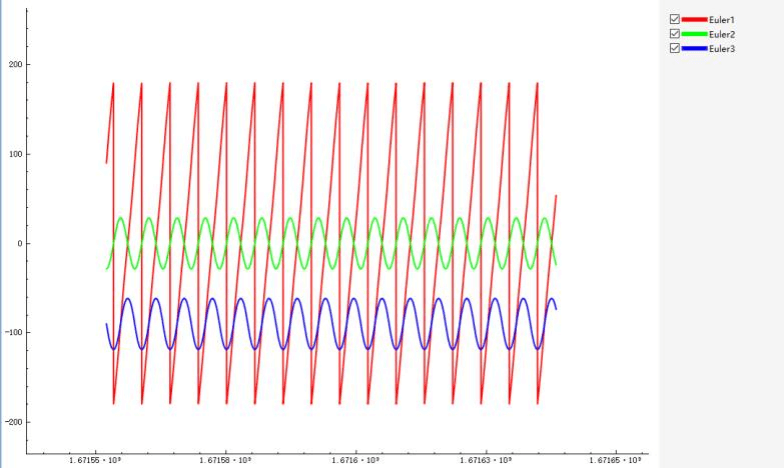

# 查看图文报告  

##  功能介绍

在工具栏的输出菜单下有三个子项：动态报告、数据报告、曲线图表、快捷报告。

动态报告是场景运行过程中实时显示的所选择对象的报告信息的动态展示。用户可以查看到选定对象在场景运行过程中的状态变化。

数据报告为选定对象在当前选定时间的所有数据信息的静态汇总。用户能够查看到选定对象在一定时间内的更改。

曲线图表为选定对象在选定时间的仿真期间所有数据信息汇总所绘制出来的曲线图表。仿真期间更新的图形，这些图形称为条状图，使用户能够查看选定元素在一段时间内的变化。

快捷报告为选定对象的在当前选定时间的所有数据信息的快捷显示方式。（快捷报告是特定文字报告的快速显示方式）

## 数据报告

（1）仿真运行完成，在对象栏里面选择任意对象，右键选择【数据报告】或者选择输出工具栏中的【数据报告】，即可弹出报告管理对话界面。

（2）当弹出实时数据框，左侧为对象选择区，右侧为报告类型选择区，“对象类型”下拉框选择某一对象类型再点击选中相应对象，“报告类型”下拉框选择【数据报告】并点击选中具体的报告内容。

（3）双击或点击“显示”—【生成】按钮即可查看相应对象的报告信息了。

## 曲线图表

（1）仿真运行完成，在对象栏里面选择任意对象，右键选择【曲线图标】或者选择输出工具栏中的【曲线图表】，即可弹出报告管理对话界面。

（2）当弹出实时数据框，左侧为对象选择区，右侧为报告类型选择区， “对象类型”下拉框选择某一对象类型再点击选中相应对象，“报告类型”下拉框选择【曲线图表】并点击选中具体的报告内容。

（3）在右侧显示框中，选择静态曲线或动态曲线，然后点击“显示” —【生成】按钮。

（4）弹出的样式报告，查看该样式的所有数据汇总所生成的曲线图表了。

## 快速输出报告

（1）仿真运行完成，在对象栏里面选择任意对象，右键选择数据报告或者选择输出工具栏中的文字报告 ，即可弹出报告管理对话界面。

（2）当弹出报告管理界面后，在左侧区域为对象选择区，选择生成数据的对象。

（3）在右侧的报告类型中选择报告，并在下方选择相应的报告样式。

（4）在窗口底部选择加入快捷报告。

（5）当设定好快捷报告后，后面再进行仿真运行，可以在输出窗口直接找到快捷报告按钮，点击该按钮即可快速查看对象的特定样式的文字报告。