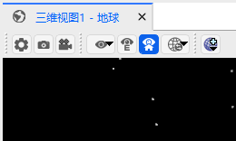

# 三维可视化  

## 功能介绍

用户可以使用 3D 图形增强 ATK 软件的体验。在动态 3D 图形环境中显示场景信息。三维可视化窗口通过显示空间、卫星、地面站、传感器投影和轨道的仿真 3D 视图，提供了复杂任务和轨道几何图形的直观视图。3D 界面使用 ATK 几何引擎精确验证的数据进行驱动。

三维可视化能够增强 ATK 软件的使用体验。用户能够在动态 3D 图形环境中直观的感受场景信息。它通过显示三维空间、地球天体和地面站、传感器投影、卫星等轨道轨迹的三维视图，提供了复杂任务和轨道几何图形的仿真直观视图。

## 使用方法

### 三维工具栏

菜单工具栏点击【视图】按钮，再点击【三维视图】。

三维窗口工具栏有 8 个工具按钮：【属性】、【快照】、【三维录屏】、【局部视点】、【固定视点】、【惯性视点】、【三维视图窗口中心天体】和【地形管理】。

（1）属性按钮：点击【属性】按钮，即可弹出二维属性视图对话框。在里面可以设置细节、光照、注释、星体等参数信息。

（2）快照按钮：点击【快照】按钮，会弹出一个另存为的对话框，可以选择保存位置，文件名，保存类型等信息。

（3）三维录屏按钮：点击【三维录屏】按钮，会弹出一个录屏的窗口，可以选择是否开启录制并对输出选项进行设置。

（4）局部视点按钮：点击【局部视点】按钮，默认为地球地惯系视点为主视点，仿真过程中可以选择切换到指定中心天体或相应配置的对象作为主视点。

（5）固定视点按钮：点击【固定视点】按钮，三维视图将以当前中心天体的固连系作为主视点。

（6）惯性视点按钮：点击【惯性视点】按钮，三维视图将以当前中心天体的国际天球惯性系作为主视点。

（7）三维视图窗口中心天体按钮：点击【三维视图窗口中心天体】按钮，可以选择指定天体作为背景显示在三维视图窗口。

（8）地形管理按钮：点击【地形管理】按钮，可以对所有中心天体的地形数据进行增加，删除和修改。

##  三维视图界面的鼠标操作

（1）鼠标左键：按住鼠标左键可以以现有的中心点为视点进行上下左右的旋转。

（2）鼠标中键：滚动鼠标中键可以实现视点中心的放大缩小。

（3）鼠标右键：按住鼠标右键可以实现快速放大缩小视点中心的对象。