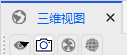
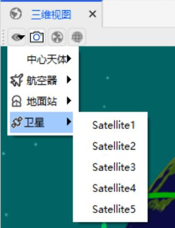

# 三维可视化  

## 功能介绍

用户可以使用 3D 图形增强 ATK 软件的体验。在动态 3D 图形环境中显示场景信息。三维可视化窗口通过显示空间、卫星、地面站、传感器投影和轨道的仿真 3D 视图，提供了复杂任务和轨道几何图形的直观视图。3D 界面使用 ATK 几何引擎精确验证的数据进行驱动。

三维可视化能够增强 ATK 软件的使用体验。用户能够在动态 3D 图形环境中直观的感受场景信息。它通过显示三维空间、地球天体和地面站、传感器投影、卫星等轨道轨迹的三维视图，提供了复杂任务和轨道几何图形的仿真直观视图。

## 使用方法

### 三维工具栏

菜单工具栏点击【视图】按钮，再点击【三维视图】。

三维窗口工具栏 3 个工具按钮，分别是选择视点按钮、拍照按钮、地惯视点按钮。

（1）选择视点按钮：点击【选择视点】按钮，默认为地球地惯系视点为主视点，仿真过程中可以选择切换到相应配置的对象作为主视点。

（2）拍照按钮：点击【拍照】按钮，即可弹出保存文件对话框，保存当前时刻的那帧图片。

（3）地惯视点按钮：点击【地惯视点】按钮，三维视图即可回归地惯视点。

###  三维视图界面的鼠标操作

（1）鼠标左键：按住鼠标左键可以以现有的中心点为视点可以进行上下左右的旋转。

（2）鼠标中键：滚动鼠标中键可以实现视点中心的放大缩小。

（3）鼠标右键：按住鼠标右键可以视线快速放大缩小视点中心的对象。

###  三维地形全局管理

菜单工具栏点击【视图】按钮，再点击【三维视图】。

点击三维窗口工具栏上的全局管理按钮打开三维地形全局管理界面。
.jpg)

ATK三维地形管理的高程和影像图层数据均支持TIFF数据（".tif"）、TMS数据（".xml"）以及ATK专有TDB数据（".tdb"）。

在三维地形全局管理界面中勾选地球的Earth_img_Base_TDB图层可以查看到高清的TDB格式的地球影像纹理。
.jpg)

在三维地形全局管理界面中取消勾选地球的Earth_img_Base_TDB图层则不显示TDB格式的地球影像纹理，仅显示下一层的tif格式基础地球影像纹理。
.jpg) 

假如需要添加图层，则按下图的步骤流程操作：

步骤1：选择“地球”选项；

步骤2：点击“添加”按钮；

步骤3：系统将会弹出地形添加对话框
.jpg)

步骤4：参照下图所示选择数据图层类型，

如需添加影像图层，则选择“影像”选择项；

如需添加高程图层，则选择“高程”选择项。
.jpg)

步骤5：选择具体的图层数据时，在弹出的选择文件对话框中参照下图所示选择格式，

如需添加TIFF类型的数据，则选择“.tif”选择项；

如需添加TMS类型的数据，则选择“.xml”选择项；

如需添加TDB类型的数据，则选择“.tdb”选择项；
.jpg)
.jpg)

添加的高程图层可以决定三维地形的高低起伏；而影像图层则给地形覆盖真实的影像纹理。

注意:图层在左侧的全局管理界面中顺序排在越下面，其三维影像的图层就显示在场景中的越上面，

下图中更清晰的19等级影像图层位于13等级的下面，则在场景中显示覆盖在13等级的上面。
.jpg)

下图中取消高程图层的勾选，则三维场景中对应地区就从高低起伏的真实地形变为一个纯平面地形。
.jpg)

如果需要删除掉图层，则按照下图所示选择对应图层，点击“删除”按钮，则从三维场景中彻底删除掉该图层。
.jpg)

